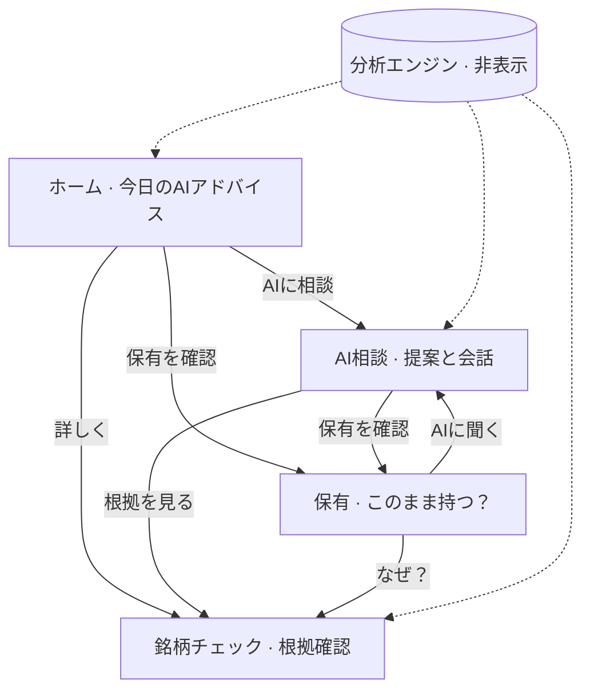

# AI Concierge First UX 再設計レポート

| 項目 | 内容 |
|------|------|
| ドキュメント | **AI_CONCIERGE_FIRST_UX_REDESIGN_REPORT.md** |
| バージョン | **UX2.0 — AI Concierge First** |
| 前提 | Beginner UX MVP（Phase A〜C）**完了承認済み** |
| 設計方針 | ユーザーが分析するアプリ **ではなく**、**AIコンシェルジュ → 分析エンジン → 提案** の流れを全モード共通の主軸とする |
| 監査ベースコミット | `b77deed` |
| ブランチ | `cursor/top3-maxdd-capital-audit` |
| 日付 | 2026-06-20 |
| スコープ | **設計監査のみ** — 新規分析機能の追加なし · UI/導線/タブ/設定の整理 |

### 親ドキュメント

| 版 | レポート |
|----|----------|
| UX1.0 | `APP_WIDE_BEGINNER_UX_AUDIT_REPORT.md` |
| UX1.1 | `APP_WIDE_BEGINNER_NAVIGATION_REPORT.md` |
| MVP 完了 | `BEGINNER_UX_MVP_COMPLETION_REPORT.md` |

---

## 0. 設計原則

### 0.1 主役は AI コンシェルジュ

```
┌─────────────────┐
│  AIコンシェルジュ │  ← ユーザーが最初に触れる「提案の窓口」
└────────┬────────┘
         │ 質問 · 今日の方針 · 提案カード
         ▼
┌─────────────────┐
│   分析エンジン    │  ← 材料 · 戦略 · レジーム · キュー（非表示の裏方）
└────────┬────────┘
         │ 構造化結果
         ▼
┌─────────────────┐
│     提 案        │  ← 買い候補 / 監視 / 保有 / 見送り · 次のアクション
└─────────────────┘
```

**禁止:** ホームに分析ダッシュボードを並べ、ユーザーに「自分で読んで判断させる」体験をデフォルトにすること。

**許可:** 銘柄チェック · 市場監視 · 配分などは **補助画面** — コンシェルジュからの深掘り導線でのみ主役化。

### 0.2 理想ジャーニー（全モード共通）

```
ホーム（今日のAIアドバイス）
    ↓
AIに相談（質問 · 提案 · 通知ダイジェスト）
    ↓
保有確認（このまま持つ？）
    ↓
銘柄チェック（根拠の補助確認 · 任意）
```

### 0.3 分類記号（本レポート）

| 記号 | 意味 |
|------|------|
| **残す** | 独立画面/タブとして維持 |
| **AI統合** | AI相談タブ/シート内に集約（タブ削除可） |
| **B非表示** | Beginner のみ非表示（CTA/スタックは可） |
| **S表示** | Standard タブ/メニューに表示 |
| **P表示** | Pro のみタブ/詳細設定に表示 |
| **削除候補** | タブまたはホーム常設から外す（コード削除は後フェーズ） |

---

## 1. 全画面監査

### 1.1 監査サマリー表

| # | 画面 | 現状 | 判定 | Beginner | Standard | Pro | 備考 |
|---|------|------|------|----------|----------|-----|------|
| 1 | **Home** | Beginner=アドバイス+CTA / Pro=CI+TradeQueue+多数カード | **残す**（再構成） | 残す | 残す | 残す | コンシェルジュ起点に統一 |
| 2 | **Portfolio** | Beginner=保有カード / Pro=分析+候補+露出 | **残す** | 残す | 残す | 残す | 「提案の実行確認」役 |
| 3 | **Stock Check**（材料分析） | Beginner=SummaryCard / Pro=Phase全文 | **残す**（補助） | 残す | 残す | 残す | 分析の**結果表示** · 入口はコンシェルジュ |
| 4 | **AI Concierge** | 専用タブ · チャット | **残す**（拡張） | 残す | 残す | 残す | **アプリのハブ**に格上げ |
| 5 | **Notifications**（AI通知） | 独立タブ · 保有/非保有通知一覧 | **AI統合** + S/Pタブ可 | B非表示 | S表示 | P表示 | Beginner→相談内ダイジェスト |
| 6 | **Settings** | 1画面に API〜Quant まで40+リンク | **残す**（4層分割） | 一般のみ | 一般+通知+AI | 全層 | ヘッダー/タブ化検討 |
| 7 | **Market Monitor** | Phase9 生テキスト · ウォッチリスト | **削除候補**（タブ） | B非表示 | B非表示 | P表示 | コンシェルジュ「市場の状況は？」 |
| 8 | **Allocation**（おすすめ配分） | 配分エンジン UI · Trust/Pro 分岐 | **削除候補**（タブ） | B非表示 | AI統合 | P表示 | 提案の一形態として相談内 |
| 9 | **Trade Queue**（ホーム内） | `AiTradeQueueSection` · 買い検討カード | **AI統合** | B非表示 | AI統合 | P表示 | ホーム常設をやめる |
| 10 | **Stock Detail** | 推奨 · テクニカル · リスクパネル | **残す**（スタック） | CTA経由 | CTA経由 | P表示 | 深掘り用 · タブ化しない |
| 11 | **Today Trading** | Phase8 売買候補レポート | **AI統合** | B非表示 | B非表示 | P表示 | 今日の提案=コンシェルジュ |
| 12 | **Screener** | 銘柄検索 | **残す** | B非表示 | スタック | P表示 | 探索は補助 |
| 13 | **History** | 売買履歴 | **残す** | B非表示 | S表示 | P表示 | 記録確認 |
| 14 | **Asset Management** | AI資産運用 Phase | **P表示** | B非表示 | B非表示 | P表示 | Pro 専門 |
| 15 | **Beginner Guide** | ガイド Markdown | **AI統合** | CTAのみ | B非表示 | P表示 | オンボーディングで代替済 |

### 1.2 画面別詳細

#### Home（`HomeScreen.tsx`）

| 現状セクション | 問題 | 再設計 |
|----------------|------|--------|
| `BeginnerTodayAdviceCard` | ✅ コンシェルジュ起点 | **維持** — 全モードのテンプレート |
| `CentralIntelligencePanel` | 分析ダッシュボード化 | **Standard/Pro から段階的に非表示** → 相談内サマリーへ |
| `AiTradeQueueSection` | ユーザーがキューを直接処理 | **AI統合** — 「今日の提案」として相談上部 |
| `BursaConciergeHomeCard` / `MaterialHomeCard` | ホームとタブの重複 | **削除候補**（ホーム常設） |
| `MarketRegimeCard` / `CrossAssetFlowCard` | 専門情報の前面露出 | **P表示**（折りたたみ or 相談コンテキスト） |
| `BuyingPowerCard` / 資本カード | 実務情報 | **Standard+** — コンパクト1行に |
| Beginner CTA「おすすめ配分」 | タブ外だが配分タブへ | **AI統合** — 「配分について相談」チップへ |

#### Portfolio（`PortfolioScreen.tsx`）

| 要素 | 判定 |
|------|------|
| `BeginnerPortfolioHoldingCard` | **残す** — 提案の保有側フィードバック |
| `PortfolioHoldingsCardsSection`（Pro） | **P表示** |
| `PortfolioAnalyticsSection` | **P表示** |
| `RealAccountExposurePanel` | **P表示** |
| 手動追加 · 配当 · 注文リスト CTA | **残す** — Standard+ は ghost、Beginner は「銘柄を追加」のみ |

#### Stock Check（`MaterialAnalysisScreen.tsx`）

| 要素 | 判定 |
|------|------|
| `BeginnerStockSummaryCard` | **残す** — 提案根拠の平易表示 |
| `BeginnerTodayAdviceCard` | **残す** |
| Phase13–24 ブロック | **B非表示**（実装済）/ **S=折りたたみ** / **P=全文** |
| 更新ボタン | **残す** — エンジン再実行（ユーザー操作は最小） |

#### AI Concierge（`ConciergeTabScreen` · `AiAssistantChat`）

| 要素 | 判定 |
|------|------|
| インラインチャット | **残す** — 主 UI |
| `BeginnerConciergeQuickActions` | **残す** |
| 追加: **今日の提案** strip | **新規 UI（整理）** — TradeQueue + 通知ダイジェスト |
| 追加: **根拠を見る** → 銘柄チェック | 導線追加（Phase D） |
| Pro: ダッシュボード折りたたみ | **P表示** — チャット下 |

#### Notifications（`AiNotificationsScreen.tsx`）

| 要素 | 判定 |
|------|------|
| 通知一覧 | Standard **タブ** / Beginner **AI統合**（未読バッジ+要約3件） |
| 通知音 Switch | **通知設定**へ移管 |
| 材料品質行 | **削除候補**（Beginner/Standard 非表示） — 相談が要約 |

#### Settings（`SettingsScreen.tsx`）

現状 **1 画面に API 入力 + Quant 検証 20+ 画面** — 初心者・Standard に過剰。§5 参照。

#### Market Monitor（`MarketMonitoringScreen.tsx`）

| 問題 | 判定 |
|------|------|
| Phase9 生レポート · ユーザーが自分で監視 | **削除候補（タブ）** |
| Pro 需要 | **P表示** — 「詳細市場監視」スタック |
| Standard | **AI統合** — 相談「今日のマレーシア市場は？」 |

#### Allocation（`AllocationPlanScreen.tsx`）

| 問題 | 判定 |
|------|------|
| 独立タブ · 配分エンジン UI が主役化 | **削除候補（タブ）** |
| 提案としての配分 | **AI統合** — 相談「おすすめ配分は？」→ カード回答 |
| Pro 手動調整 | **P表示** — スタック or Pro タブ1 |

#### Trade Queue（`AiTradeQueueSection.tsx` · ホーム常設）

| 問題 | 判定 |
|------|------|
| ホームで買い検討を直接操作 | **AI統合** — コンシェルジュ「今日の提案」 |
| `HeaderUrgencyBadge` | **残す** — 緊急のみ · Beginner は非表示検討 |
| Pro 全履歴 | **P表示** — 相談内「提案履歴」 |

#### Stock Detail（`StockDetailScreen.tsx`）

| 要素 | 判定 |
|------|------|
| 推奨 · テクニカル · XSentiment | **P表示** フル / **Standard** 推奨+サイズのみ |
| Beginner | **スタックのみ** — 銘柄チェック/保有から |
| タブ化 | **しない** |

---

## 2. 不要画面・統合候補

### 2.1 削除候補（タブまたはホーム常設から外す）

| 優先 | 対象 | 理由 | 代替 |
|------|------|------|------|
| **P0** | ホーム `AiTradeQueueSection` 常設 | 分析/執行キューをユーザー前面に | AI相談「今日の提案」 |
| **P0** | ホーム `CentralIntelligencePanel`（Standard） | CI ダッシュボードが主役を奪う | 相談内 1 段落サマリー |
| **P1** | タブ **おすすめ配分**（Standard） | 配分=提案の一種 | AI相談 + Pro スタック |
| **P1** | タブ **今日の売買**（Standard） | TodayTrading=提案重複 | AI相談 |
| **P2** | タブ **市場監視** | 生分析 · Standard には過剰 | AI相談 · Pro タブ |
| **P2** | タブ **銘柄検索**（Standard） | 探索は副次 | 保有追加 · 相談「銘柄を探して」 |
| **P3** | タブ **売買履歴**（Standard） | 記録は設定/ポートフォリオ下 | Pro タブ or 設定リンク |
| **P3** | ホーム `BursaMaterialHomeCard` 等 | タブと重複 | 銘柄チェックタブ |

**コード削除は行わない** — タブ非表示 · 導線変更 · 折りたたみで整理（UX2.0 方針）。

### 2.2 統合候補（AI相談へ）

| ソース | 統合先 UI | モード |
|--------|-----------|--------|
| Trade Queue | 「今日の AI 提案」カルーセル（最大3件） | Beginner / Standard |
| AI通知 未読 | 相談タブ上部バナー + 「通知を見る」 | Beginner |
| おすすめ配分 要約 | クイックアクション「配分を相談」→ インラインカード | Beginner / Standard |
| 市場監視 1 段落 | 相談コンテキスト / Pro only 詳細リンク | Standard- |
| Central Intelligence | 相談 system context（UI非表示） | 全モード |

### 2.3 残す（変更最小）

| 画面 | 理由 |
|------|------|
| Beginner 4 タブ | MVP 承認済み · ジャーニー適合 |
| 銘柄チェック | 提案根拠の**補助確認** — 設計上必要 |
| 保有銘柄 | 「このまま持つ？」— 提案のフィードバック |
| Stock Detail（スタック） | 深掘りは任意 · タブ増やさない |

---

## 3. AIコンシェルジュ中心導線

### 3.1 情報アーキテクチャ



### 3.2 モード別ホーム差分（目標）

| 要素 | Beginner | Standard | Pro |
|------|----------|----------|-----|
| 主カード | `BeginnerTodayAdviceCard` | 同左 + 1行サマリー拡張 | 同左 + 折りたたみ CI |
| 提案キュー | 非表示（相談内） | 相談内3件 | 相談内 + ホーム1行 |
| 市場/レジーム | 非表示 | 非表示 | 折りたたみ |
| CTA 主 | 相談 · 保有 · 銘柄チェック | 同左 | + 配分 · 履歴 |
| FAB | 非表示 | 非表示 | 任意（タブ優先） |

### 3.3 AI相談タブ拡張（UX2.0a）

| ゾーン | 内容 | データソース |
|--------|------|--------------|
| 上 | 未読通知バッジ（Beginner/Standard） | `BursaConcierge` |
| 上 | **今日の提案**（1〜3 cards） | `AiTradeQueue` · strategy bundle |
| 中 | クイックアクション 6 件 | 既存 |
| 下 | チャット | `AiAssistantChat` |
| Pro 下 | 折りたたみ: 戦略ダッシュボード | `AiSettings` dashboard |

---

## 4. モード別タブ再設計

### 4.1 確定タブ構成

#### Beginner（変更なし · MVP 承認）

| # | タブ | 表示名 |
|---|------|--------|
| 1 | Home | ホーム |
| 2 | Portfolio | 保有銘柄 |
| 3 | MaterialAnalysis | 銘柄チェック |
| 4 | ConciergeConsult | AI相談 |

#### Standard（**6 タブ** — ユーザー指定）

| # | タブ | 表示名 | 現状からの変更 |
|---|------|--------|----------------|
| 1 | Home | ホーム | ホーム slim 化 |
| 2 | Portfolio | 保有銘柄 | — |
| 3 | MaterialAnalysis | 銘柄チェック | — |
| 4 | ConciergeConsult | AI相談 | **拡張**（提案+通知） |
| 5 | AiNotifications | 通知 | **維持** |
| 6 | Settings | 設定 | **新規タブ化**（現状ヘッダーのみ） |

**Standard から外すタブ:** おすすめ配分 · 銘柄検索 · 今日の売買 · 売買履歴 → スタック/相談/設定リンク

#### Pro（全機能 · コンシェルジュ優先順）

| # | タブ | 表示名 | 順序意図 |
|---|------|--------|----------|
| 1 | Home | ホーム | 提案サマリー |
| 2 | ConciergeConsult | AI相談 | **2番目に昇格** |
| 3 | Portfolio | 保有銘柄 | |
| 4 | MaterialAnalysis | 材料分析 | Pro は「材料分析」表記可 |
| 5 | AiNotifications | AI通知 | |
| 6 | AllocationPlan | おすすめ配分 | |
| 7 | TodayTrading | 今日の売買 | |
| 8 | MarketMonitoring | 市場監視 | |
| 9 | Screener | 銘柄検索 | |
| 10 | AssetManagement | AI資産運用 | |
| 11 | History | 売買履歴 | |
| 12 | BeginnerGuide | 初心者ガイド | |
| — | Settings | 設定 | **タブ or ヘッダー**（Pro はヘッダー維持可） |

**Pro 変更要点:** `ConciergeConsult` を Home 直後に。分析系タブは後方配置。

### 4.2 `beginnerTabNavigatorConfig.ts` 変更案

```typescript
const STANDARD_TABS = [
  'Home', 'Portfolio', 'MaterialAnalysis', 'ConciergeConsult',
  'AiNotifications', 'Settings',  // Settings は MainTab 新規 or 設定専用 Stack
];

const PRO_TABS = [
  'Home', 'ConciergeConsult', 'Portfolio', 'MaterialAnalysis',
  'AiNotifications', 'AllocationPlan', 'TodayTrading', 'MarketMonitoring',
  'Screener', 'AssetManagement', 'History', 'BeginnerGuide',
];
```

---

## 5. 設定画面再設計

### 5.1 現状問題

`SettingsScreen.tsx` に **API キー入力 · 運用テスト · Quant 検証 20 画面** が同一 Card に列挙。Beginner/Standard ユーザーが「設定迷子」になる。

### 5.2 4 層分類

#### 一般設定（Beginner / Standard / Pro）

| 項目 | 現状 | 判定 |
|------|------|------|
| 表示モード 3 択 | ✅ 実装済 | **残す** |
| 練習モード | SettingsMenuRow | **残す** |
| 市場設定 | SettingsMenuRow | **残す** |
| 通貨設定 | SettingsMenuRow | **残す** |
| 更新頻度 | SettingsMenuRow | **残す** |
| リスク告知 / 個人利用 | PersonalUseBanner 等 | **残す** |
| 初心者ガイド | スタック | Beginner: ホーム CTA |

#### 通知（Standard / Pro · Beginner は簡略）

| 項目 | 判定 |
|------|------|
| 通知設定（`NotificationSettings`） | **残す** |
| AI通知音 | AI通知画面から **移管** |
| 自律監視 ON/OFF | **AI設定**へ |

#### AI 設定（Standard / Pro）

| 項目 | 判定 |
|------|------|
| AI戦略アシスタント（`AiSettings`） | **残す** |
| OpenAI / モック / 履歴 | **残す** |
| 自律監視 · 積極度 | **残す** |
| API設定ウィザード | Standard+ |
| API接続診断 | Standard+ |

#### 詳細設定 · 上級者（Pro のみ）

| 項目 | 判定 |
|------|------|
| APIキー管理（インライン入力） | **P表示** — 一般層から分離 |
| 実運用テスト · 実機監査 | **P表示** |
| Production Dashboard · 起動診断 | **P表示** |
| Forward/Historical/RealQuant 検証 | **P表示** |
| Portfolio Optimization 〜 MetaCapital（12 画面） | **P表示** — `SettingsAdvancedDisclosureSection` 配下 |
| データリセット · API 全削除 | **P表示** + 確認強化 |

### 5.3 Beginner 設定 UI（目標）

```
設定（Beginner）
├── 表示モード
├── 練習モード
├── 市場 · 通貨 · 更新頻度
├── 通知（簡略）
├── リスク告知 · 個人利用の説明
└── [詳細設定を表示] → Pro 切替促し or 折りたたみ
```

**Beginner から非表示:** API キー入力 · Quant 検証 · 診断 · X API 利用量 · 執行照合 · 12 Quant スタック

---

## 6. 実装優先順位

| 順位 | Phase | 内容 | 依存 | モード |
|------|-------|------|------|--------|
| **1** | UX2.0a | AI相談タブ: 今日の提案 strip + 通知ダイジェスト | Phase C | B/S/P |
| **2** | UX2.0b | ホーム slim 化: TradeQueue/CI/MaterialHome 常設除去 | 2.0a | S/P |
| **3** | UX2.0c | Standard 6 タブ（Settings タブ化 · 旧4タブ削除） | 2.0b | S |
| **4** | UX2.0d | Pro タブ順序変更（Concierge 2 番目） | 2.0c | P |
| **5** | UX2.0e | Settings 4 層分割 + モード別メニューフィルタ | 2.0c | B/S/P |
| **6** | UX2.0f | Standard 材料分析 Phase 折りたたみ | UX1.0i 踏襲 | S |
| **7** | UX2.0g | StockDetail / ManualOrder Beginner 平易化 | BEGINNER MVP 残 | B |
| **8** | UX2.0h | scrollToSymbol · オンボーディング再表示 | Phase D 残 | B |
| **9** | UX2.0i | 5 分ジャーニー smoke（コンシェルジュ起点） | 2.0a–e | B/S |

**推奨クリティカルパス:** UX2.0a → 2.0b → 2.0c → 2.0e

**非目標（UX2.0）:** 新分析エンジン · 新 Phase · 新 API 連携

---

## 7. 工数見積

| Phase | 内容 | 人日 |
|-------|------|------|
| UX2.0a | 相談タブ提案 strip + 通知統合 | 2.5 |
| UX2.0b | ホーム slim 化（Standard/Pro） | 1.5 |
| UX2.0c | Standard 6 タブ + Settings タブ | 2.0 |
| UX2.0d | Pro タブ順 · 非表示整理 | 1.0 |
| UX2.0e | Settings 4 層 + フィルタ | 3.0 |
| UX2.0f | Standard Phase 折りたたみ | 1.5 |
| UX2.0g | StockDetail/ManualOrder Beginner | 2.0 |
| UX2.0h | 導線 polish（scrollToSymbol 等） | 1.0 |
| UX2.0i | コンシェルジュ起点 smoke | 1.0 |
| **バッファ** | 実機 · タブアイコン · Settings タブ | 1.5 |
| **合計** | | **~17 人日** |

**注:** Beginner MVP（Phase A〜C ~12 人日相当）は完了済み。UX2.0 は **App-Wide 整理** 追加分。

---

## 8. リスク

| リスク | 緩和 |
|--------|------|
| Pro ユーザーが「分析タブが減った」と感じる | Pro はタブ削除せず **順序変更のみ** |
| Standard で配分タブ消失 | 相談クイックアクション + ホーム1行リンク |
| Settings タブ化で MainTab 型変更 | `Settings` を Tab.Screen 化 or 設定専用 Stack |
| TradeQueue 非表示で緊急性低下 | `HeaderUrgencyBadge` 維持 · 相談上部に緊急1件 |
| 分析エンジンと UI の責務混同 | エンジンは既存維持 · **表示だけ**コンシェルジュ経由 |

---

## 9. 結論

| 項目 | 判定 |
|------|------|
| アプリの主役 | **AIコンシェルジュ** — 分析画面は補助 |
| Beginner 4 タブ | **維持**（MVP 承認） |
| Standard 6 タブ | ホーム · 保有 · 銘柄チェック · **AI相談** · **通知** · **設定** |
| Pro | 全機能 · **Concierge を Home 直後** |
| 削除候補（タブ/常設） | 配分 · 今日の売買 · 市場監視（Standard）· ホーム TradeQueue/CI |
| 統合候補 | TradeQueue · 通知 · 配分要約 → **AI相談** |
| 次アクション | **UX2.0a**（相談タブ拡張）から着手 |

---

## 10. Git

| 項目 | 値 |
|------|-----|
| 監査ベースコミット | `b77deed` |
| 本レポート提出コミット | *(commit 後に記載)* |
| ブランチ | `cursor/top3-maxdd-capital-audit` |
| push 先 | `origin/cursor/top3-maxdd-capital-audit` |
| push 結果 | *(push 後に記載)* |

---

*提出: AI_CONCIERGE_FIRST_UX_REDESIGN_REPORT.md · 設計のみ · 新規分析機能なし*
