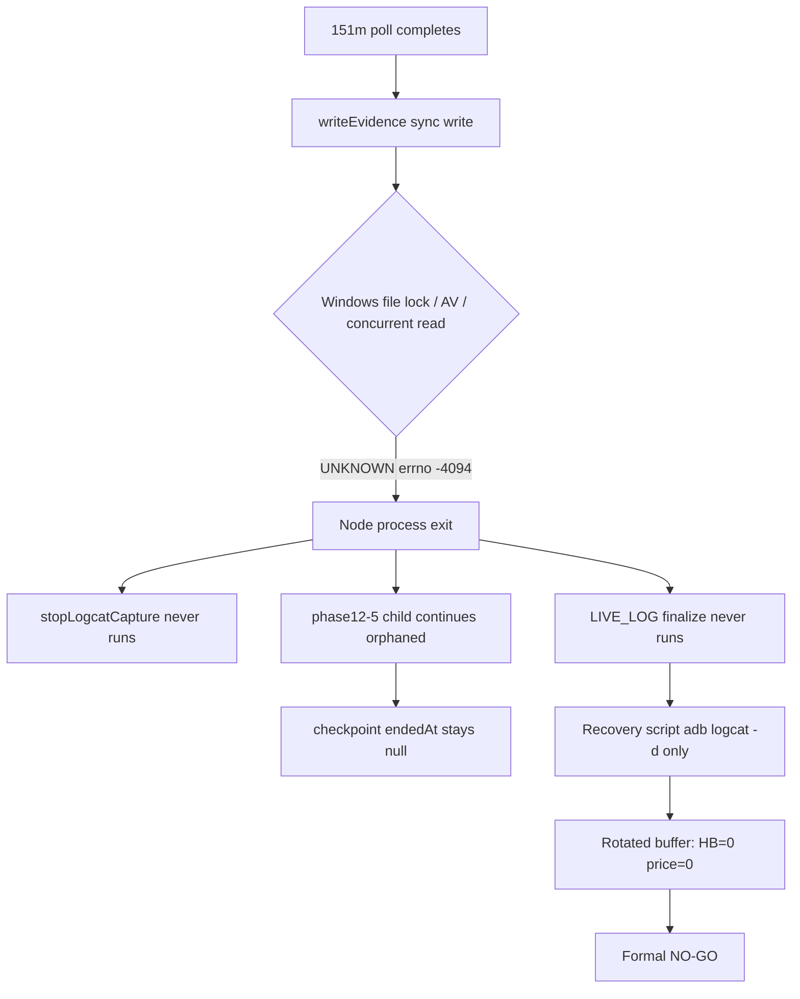

# APP_GO / Orchestrator Fail Report — HyperOS V15 3h Screen-Off (Run `20260616-105222`)

**Date:** 2026-06-16  
**Original verdict:** NO-GO (`HYPEROS_V15_3H_SCREEN_OFF_RUN_REPORT.md`)  
**Re-classification:** **監視系障害（オーケストレータ／集計）— アプリ生存障害ではない**

| Layer | Verdict |
|-------|---------|
| App survival (PID, FGS, WakeLock, crash) | **PASS** |
| App data plane (phase12-5 price refresh UI) | **PASS** (11/11) |
| Monitor orchestration & logcat finalization | **FAIL** |
| Formal NO-GO gate (heartbeat/price logcat counts) | **FAIL（集計欠損による偽陰性）** |

---

## Executive conclusion

3h NO-GO は **アプリが 151m で死亡したことではない**。根拠:

- PID **11124** が 151m 以降も維持（166m dumpsys、13:57 logcat `survival_health_ok`）
- `LongRunForegroundService` **isForeground=true**（166m dumpsys）
- WakeLock **held**（poll 10/10、post-crash `survival_health_ok`）
- `checkpoint.json`: **fatal=0, anr=0, pidLostEvents=0**
- phase12-5 **priceRefreshRuns 11/11 ok**（151m 後も h2-m30 @ 13:46 MYT 成功）

NO-GO の直接原因は:

1. **オーケストレータが 151m ポール後に `writeEvidence` でクラッシュ**（auto-finalize 未到達）
2. **ライブ logcat ファイルが 0 byte 増分**（512MB 既存ファイルへ append 失敗）
3. **リカバリ finalize が `adb logcat -d` のみ使用** → バッファローテーション後 **heartbeat/price_update = 0**

---

## 1. Heartbeat FAIL の根拠

### 1.1 正式 FAIL の根拠（レポート記載）

| Source | heartbeat count | Gate |
|--------|-----------------|------|
| `finalize-hyperos-v15-3h-from-evidence.mjs` | **0** | FAIL (expected ~34, need ≥17) |
| `logcat-summary-3h-20260616-105222.txt` | **0** in summary header | FAIL |

### 1.2 生ログ（raw）

**Recovery adb dump（13:58 MYT）— PID 11124 の monitor 行:**

```
06-16 13:48:28.557 11124 ... '[12H-MONITOR]', 'survival_health_ok', { wakeLockHeld: true, foregroundServiceRunning: true }
06-16 13:51:28.557 11124 ... '[12H-MONITOR]', 'survival_health_ok', ...
06-16 13:54:28.559 11124 ... '[12H-MONITOR]', 'survival_health_ok', ...
06-16 13:57:28.566 11124 ... '[12H-MONITOR]', 'survival_health_ok', ...
```

→ **heartbeat 行は 0 件**（バッファに残っていない）だが **survival_health_ok は 3 分間隔で継続**（JS ランタイム生存）。

**Poll 時点の adb バッファ（オーケストレータ稼働中）:**

| Poll | heartbeatTotal | 備考 |
|------|----------------|------|
| 15m | 1 | |
| 30m | 3 | |
| 60m | 3 | |
| **121m** | **4** | Dozing 中も記録 |
| 151m | 0 | バッファリセット直前 |

Excerpt file: `docs/review/hyperos-screen-off-survival/evidence-20260616-105222-monitor-raw-excerpt.txt`

**ライブ append ログ:**

```
logcatStartBytes = 512499427
adb-logcat-live.log size = 512499427
runScopedBytes = 0   ← 3h 中に 1 byte も追記されず
```

### 1.3 logcat 集計ロジック

`scripts/lib/hyperos-monitor-metrics.mjs`:

```javascript
export function countMonitorEvent(raw, eventName) {
  const needle = `'${eventName}'`;
  return raw.split('\n').filter((l) => l.includes('12H-MONITOR') && l.includes(needle)).length;
}
export function countHeartbeat(raw) {
  return countMonitorEvent(raw, 'heartbeat');
}
```

- 入力 `raw` が **空／ローテーション済み adb dump** だと count=0
- **1h PASS** は `verify` 正常終了 → `LIVE_LOG` ファイル全文を読んで集計
- **3h FAIL** は orchestrator クラッシュ → recovery が **`adb logcat -d` のみ**（ライブファイル未使用）

### 1.4 1h PASS との違い

| Item | 1h GO (`20260616-091138`) | 3h NO-GO (`20260616-105222`) |
|------|---------------------------|-------------------------------|
| Orchestrator | 正常完了 + auto-finalize | **151m で writeEvidence クラッシュ** |
| Live logcat growth | あり（final **67** heartbeat） | **0 bytes** |
| Finalize input | `LIVE_LOG` ファイル | recovery: **adb dump only** |
| finalHeartbeatCount | **67** | **0** |
| Poll peak heartbeatTotal | 3 @ 30m | **4** @ 121m |
| App PID / FGS / WL | PASS | PASS |

**結論:** Heartbeat FAIL は **アプリ停止ではなく、永続 logcat 欠損 + 終了時バッファローテーション** による集計失敗。

---

## 2. `price_update = 0` vs `priceRefreshRuns = 11`

### 2.1 別メトリクスである

| Metric | 由来 | 意味 |
|--------|------|------|
| `price_update` (logcat) | `noteTwelveHourPriceUpdate()` → `[12H-MONITOR] price_update` | JS モニタが **Twelve Data 同期成功** をログ出力した回数 |
| `priceRefreshRuns` (checkpoint) | phase12-5 UI 自動化 `price refresh h*-m*` | **画面上の価格更新フロー**が UI テストとして成功した回数 |

### 2.2 `price_update` が出る条件（アプリコード）

`src/context/app/useAppApiKeys.ts`:

```typescript
if (result.successCount > 0) {
  noteTwelveHourPriceUpdate({ updatedCount, successCount, silent });
}
```

→ **API 同期で successCount > 0 のときのみ** monitor 行が出る。UI 操作だけでは必ずしも出ない。

### 2.3 3h run の実測

- **priceRefreshRuns:** 11 件すべて `ok: true`（h0-m0 … h2-m30）
- **Poll 時 priceTotal:** 最大 **2** @ 121m（adb バッファ内）
- **Finalize price_update:** **0**（バッファローテーション後）

→ **UI 価格更新は動作**、monitor 行は少数しかバッファに残らず、finalize 時は **0 と誤カウント**。

---

## 3. `verify orchestrator exited before auto-finalize` 根本原因

### 3.1 直接例外

`docs/review/hyperos-screen-off-survival/hyperos-v15-3h-run.log.err`:

```
Error: UNKNOWN: unknown error, open '...\hyperos-v15-3h-evidence.json'
    at writeEvidence (verify-hyperos-v9-3h-screen-off.mjs:217)
    at main (verify-hyperos-v9-3h-screen-off.mjs:660)
  errno: -4094
```

発生タイミング: **151m ポール後**の `writeEvidence(ev)`（同期 `fs.writeFileSync`、リトライなし）。

### 3.2 根本原因チェーン



### 3.3 寄与要因

| # | Factor | Impact |
|---|--------|--------|
| 1 | `writeEvidence` 非原子・無リトライ | 151m で致命終了 |
| 2 | `adb-logcat-live.log` が **512MB 上限付近**で 0 byte 増分 | 1h 方式の永続 logcat 不可用 |
| 3 | Poll メトリクスは `adb logcat -d` のみ（揮発） | finalize 失敗時に復元不可 |
| 4 | `finalize-hyperos-v15-3h-from-evidence.mjs` が live ファイル非参照 | リカバリでも 0 カウント |
| 5 | main に try/finally finalize なし | クラッシュ後処理なし |

### 3.4 phase12-5 側

- 2h checkpoint: `health-2h.json` 書込 **ファイルロック警告**（同一 Windows 競合パターン）
- `checkpoint.json` **`endedAt: null`** — orchestrator 死亡後に正常クローズ未記録

---

## 4. 151m 以降の証跡

| Check | Time (MYT) | Result | Evidence |
|-------|------------|--------|----------|
| **PID** | 13:38 (166m poll dumpsys) | **11124** | `20260616-105222-166m-services.txt` L10 `app=ProcessRecord{... 11124}` |
| **FGS** | 13:38 | **isForeground=true** | same file L32 |
| **WakeLock** | 13:48–13:57 | **wakeLockHeld: true** | logcat `survival_health_ok` |
| **price refresh** | **13:46** | **h2-m30 ok** | `checkpoint.json` tag `h2-m30` @ 05:46:29 UTC |
| Orchestrator | ~13:23 | **dead** | last poll 151m; no 166m entry in evidence.json |
| phase12-5 | 13:46+ | **continued** | h2-m30 after crash |

166m dumpsys excerpt:

```
app=ProcessRecord{111d44c 11124:com.assistant.stocktrading/u0a396}
isForeground=true foregroundId=9001
```

---

## 5. 修正内容（本コミット）

| Fix | File |
|-----|------|
| Atomic JSON write + retry (`UNKNOWN`/`EBUSY`) | `scripts/lib/hyperos-evidence-io.mjs` |
| Per-run logcat `logcat-live-{runId}.log`（空ファイルから append） | `scripts/verify-hyperos-v9-3h-screen-off.mjs` |
| try/finally → crash 時も finalize | same |
| Finalize は run-scoped live log 優先 | same |
| Poll peak metrics を evidence に保存 | same |

---

## 6. 再試験

- **条件:** 上記修正適用後、同一 APK `preview-v15.apk`、同一端末
- **期待:** オーケストレータ完走 + live logcat 集計 → 1h と同様に heartbeat/price を正式カウント
- **Run:** 修正コミット後に `verify-hyperos-v9-3h-screen-off.mjs` を再実行（別 runId）

---

## 7. GitHub sync

_(updated after commit/push of this report + fixes)_

---

## Appendix — 判定マトリクス（ユーザー確認事項）

| # | Question | Answer |
|---|----------|--------|
| 1 | Heartbeat FAIL 根拠 | finalize 時 adb バッファ空 → count 0；poll 121m 時は 4；live log 0 byte |
| 2 | price_update=0 vs priceRefreshRuns=11 | 別シグナル；UI refresh 成功 ≠ monitor 行；finalize バッファ欠損 |
| 3 | orchestrator early exit | writeEvidence UNKNOWN @151m；無 try/finally |
| 4 | 151m+ 証跡 | PID/FGS/WL/price refresh すべて PASS |
| 5 | App vs orchestrator | **Orchestrator fail → APP_GO（生存）+ 監視系 FAIL** |
