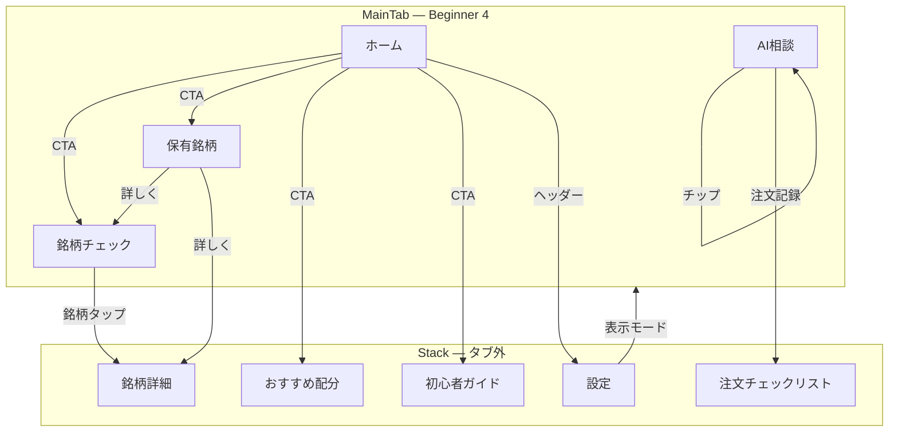
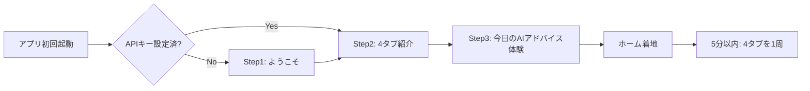
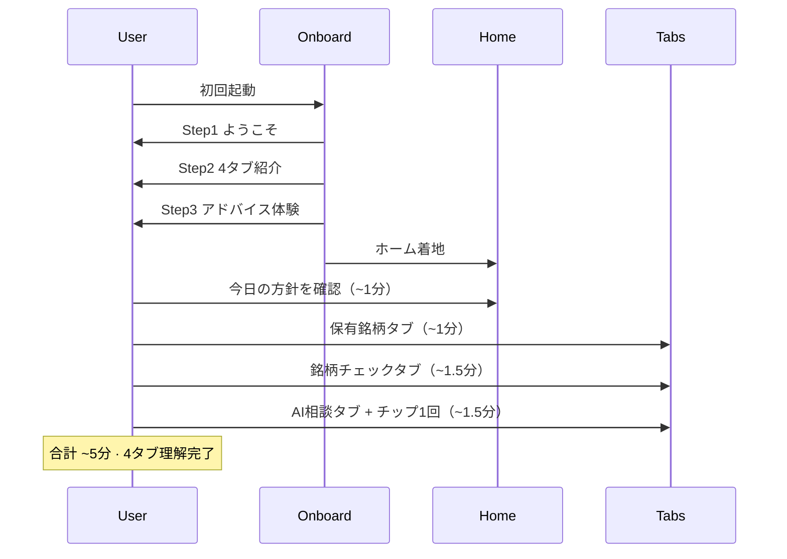

# APP_WIDE_BEGINNER_NAVIGATION_REPORT

## 概要

UX0.3 ホーム設計 · UX1.0 アプリ全体監査を踏まえ、**ナビゲーション / 導線** に特化した初心者向け再設計。投資初心者が初回起動から **5 分以内** に「このアプリで何をすればよいか」を理解できる導線を定義する。

| 項目 | 値 |
|------|-----|
| 監査日 | 2026-06-19 |
| ブランチ | `cursor/top3-maxdd-capital-audit` |
| 監査ベースコミット | `038fec5` |
| レポート提出コミット | *(作成・push 後に更新)* |
| スコープ | **設計のみ**（実装なし） |
| 親仕様 | UX0.3（`BEGINNER_MODE_HOME_SCREEN_REPORT.md`）· UX1.0（`APP_WIDE_BEGINNER_UX_AUDIT_REPORT.md`） |
| バージョン | **UX1.1 — Beginner Navigation** |

### 設計目標（UX1.0 からの変更）

| 目標 | UX1.0 | **UX1.1（本レポート）** |
|------|-------|-------------------------|
| 理解時間 | 起動後 **5 秒** | 初回起動から **5 分**（オンボーディング + 4 タブ導線） |
| タブ数 | **5**（おすすめ配分 · 初心者ガイド含む） | **4**（AI相談を専用タブ化） |
| 焦点 | 画面別情報量監査 | **ナビゲーション / 画面遷移 / 初回フロー** |
| Concierge | ホームカード · FAB · AI通知タブ | **第 4 タブ「AI相談」** + チャット前クイックアクション |
| Portfolio | AI判定 4 分類の一覧 | **「このまま持つ？」** を各保有の主質問に |

---

## 0. UX1.0 → UX1.1 変更サマリー

| # | UX1.0 | **UX1.1** |
|---|-------|-----------|
| タブ構成 | 5 タブ（配分 · ガイド含む） | **4 タブ** — 配分 · ガイドはホーム CTA / 設定へ |
| Concierge | シート / FAB / AI通知タブ | **専用タブ「AI相談」** |
| 理解基準 | 5 秒 3 問テスト | **5 分ジャーニー**（3 ステップオンボーディング + 4 タブ体験） |
| Portfolio | 保有一覧 + AI判定 | **「このまま持つ？」** ファーストビュー |
| Concierge UI | サンプル質問（advanced 寄り） | **クイックアクションチップ**（チャット開始前に常時表示） |
| Phase13–24 | Beginner 非表示 | **完全非表示**（折りたたみなし · Standard=折りたたみ · Pro=全文） |

---

## 1. 全タブ監査（11 タブ）

`MainTabNavigator.tsx` の現行 11 タブを、Beginner / Standard / Pro で分類する。

| # | タブ key | 表示名（現行） | Beginner | Standard | Pro | 備考 |
|---|----------|----------------|----------|----------|-----|------|
| 1 | Home | ホーム | ✅ **常時** | ✅ | ✅ | 第一タブ · 今日のAIアドバイス |
| 2 | Portfolio | 保有銘柄 | ✅ **常時** | ✅ | ✅ | 「このまま持つ？」中心 |
| 3 | MaterialAnalysis | 材料分析 → **銘柄チェック** | ✅ **常時** | ✅ | ✅ | UX0.3 表示名変更 |
| 4 | *(新設)* Concierge | **AI相談** | ✅ **常時** | ✅ | ✅ | 専用タブ · 旧 FAB 補助 |
| 5 | AllocationPlan | おすすめ配分 | ❌ タブ外 | ✅ | ✅ | Beginner → ホーム CTA |
| 6 | BeginnerGuide | 初心者ガイド | ❌ タブ外 | △ 任意 | ✅ | Beginner → ホーム CTA / 設定 |
| 7 | Screener | 銘柄検索 | ❌ | ✅ | ✅ | Standard 以降 |
| 8 | AiNotifications | AI通知 | ❌ | △ 要約 | ✅ | Beginner → AI相談に集約 |
| 9 | TodayTrading | 今日の売買 | ❌ | ✅ | ✅ | |
| 10 | History | 売買履歴 | ❌ | ✅ | ✅ | |
| 11 | AssetManagement | AI資産運用 | ❌ | ❌ | ✅ | Pro のみ |
| 12 | MarketMonitoring | 市場監視 | ❌ | ❌ | ✅ | Pro のみ |

### 1.1 Beginner 可視タブ（確定 · 4 のみ）

```typescript
const BEGINNER_VISIBLE_TABS: MainTabKey[] = [
  'Home',
  'Portfolio',
  'MaterialAnalysis', // 表示名: '銘柄チェック'
  'Concierge',        // 新設 · 表示名: 'AI相談'
];
```

### 1.2 タブ外だが Beginner から到達可能な画面

| 画面 | 到達経路（Beginner） | 理由 |
|------|----------------------|------|
| おすすめ配分 | ホーム `[おすすめ配分を見る]` · 設定 | 初日は不要 · 慣れた後に発見 |
| 初心者ガイド | ホーム `[はじめての使い方]` · 設定 | オンボーディングで要約済み |
| 設定 | 全画面ヘッダー `[設定]` | 表示モード切替 |
| 銘柄詳細 | 保有 / 銘柄チェック `[詳しく]` | スタック遷移 · タブ非追加 |
| 手動注文リスト | 設定 · AI相談「注文の記録」チップ | 執行時のみ |

### 1.3 現行 Concierge アクセス（コード実態）

| 経路 | ファイル | Beginner での扱い |
|------|----------|-------------------|
| FAB | `AiConciergeFab.tsx` | **非表示**（タブに集約） |
| シート | `AiConciergeSheet.tsx` → `AiAssistantChat` | タブ画面で同一 UI を埋め込み |
| ホームカード | `BursaConciergeHomeCard` | **非表示**（アドバイスカードに集約） |
| AI通知タブ | `AiNotificationsScreen` | **タブ非表示** · 要約は AI相談 digest |

**現状の課題:** Concierge はタブに存在せず、FAB / ホームカード / AI通知の 3 経路に分散。初心者は「AI に聞く場所」が見つからない。

---

## 2. タブ構成（タブ構成）

### 2.1 Beginner モード — 4 タブ

```
┌────────┬──────────┬────────────┬──────────┐
│ ホーム  │ 保有銘柄  │ 銘柄チェック │ AI相談   │
│  🏠    │   📋     │     ✓      │   💬    │
└────────┴──────────┴────────────┴──────────┘
```

| タブ | 役割（5 分理解での位置づけ） |
|------|------------------------------|
| **ホーム** | 「今日はどうすればいい？」の答え · 全体方針 |
| **保有銘柄** | 「持っている株はこのまま持つ？」の答え |
| **銘柄チェック** | 「なぜそう判断したか」の根拠 |
| **AI相談** | 「わからないことは AI に聞く」 |

### 2.2 Standard モード — 8 タブ

```
ホーム · 保有銘柄 · 銘柄チェック · AI相談 · おすすめ配分 · 銘柄検索 · 今日の売買 · 売買履歴
```

### 2.3 Pro モード — 11 タブ（現行維持）

現行 `MainTabNavigator` の全タブ + **AI相談**（`AiNotifications` は digest として AI相談 内または Pro 専用サブビュー）。

---

## 3. 画面遷移（画面遷移）

### 3.1 ナビゲーション階層



### 3.2 主要遷移ルール

| 起点 | 操作 | 遷移先 | 意図 |
|------|------|--------|------|
| ホーム | `[銘柄チェックで詳しく →]` | 銘柄チェックタブ | 根拠確認 |
| ホーム | `[保有を確認]` | 保有銘柄タブ | 保有の Yes/No |
| ホーム | `[おすすめ配分を見る]` | AllocationPlan（stack） | 任意 · 慣れ後 |
| ホーム | `[はじめての使い方]` | BeginnerGuide（stack） | オンボーディング再表示 |
| 保有銘柄 | `[このまま持つ？ → 詳しく]` | 銘柄チェック（該当銘柄 scroll） | 根拠へ |
| 保有銘柄 | `[AIに聞く]` | AI相談（銘柄コンテキスト seed） | 個別質問 |
| 銘柄チェック | 銘柄カードタップ | StockDetail 簡略版 | 深掘り最小限 |
| AI相談 | クイックチップタップ | 同一画面 · 即 ShortAnswer | 会話開始 |
| 設定 | 表示モード → 標準 | 8 タブに拡張 | 成長導線 |

### 3.3 FAB ポリシー

| モード | FAB |
|------|-----|
| **Beginner** | **非表示** — AI相談タブで代替 |
| Standard | 任意表示（タブと併用可） |
| Pro | 現行維持 |

---

## 4. 初回起動フロー（初回起動フロー）

### 4.1 フロー概要

初回起動から 5 分以内に「4 タブの使い分け」を理解させる **3 ステップオンボーディング** + ホーム着地。



### 4.2 オンボーディング 3 ステップ

#### Step 1 — ようこそ（~30 秒）

```
┌─ ようこそ ─────────────────────────────┐
│  このアプリは、株の「買う・持つ・見る」  │
│  を AI がやさしく整理してくれます。      │
│                                        │
│  急いで売買する必要はありません。        │
│                                        │
│  [次へ]                    [スキップ]  │
└────────────────────────────────────────┘
```

#### Step 2 — 4 タブ紹介（~60 秒）

```
┌─ 4つの画面 ────────────────────────────┐
│  🏠 ホーム     → 今日の方針              │
│  📋 保有銘柄   → このまま持つ？          │
│  ✓  銘柄チェック → なぜそう？            │
│  💬 AI相談     → わからないことは聞く    │
│                                        │
│  [次へ]                                │
└────────────────────────────────────────┘
```

#### Step 3 — 今日のAIアドバイス体験（~90 秒）

```
┌─ 今日のAIアドバイス（プレビュー）──────┐
│  ● Maybank      保有継続                │
│  ○ CIMB         監視                   │
│  — 新規購入     なし                    │
│  急いで売買する必要はありません          │
│                                        │
│  [ホームではじめる]                      │
└────────────────────────────────────────┘
```

**スキップ:** Step 1 からスキップ可能 → ホーム直接着地（`BeginnerOnboardingSeen` フラグ）。

### 4.3 初回起動シーケンス



---

## 5. 初心者導線（初心者導線）

### 5.1 5 分ジャーニーマップ

| 経過 | 画面 | ユーザーの問い | 得られる答え |
|------|------|----------------|--------------|
| 0:00 | オンボーディング | このアプリは何？ | 4 タブの役割 |
| 0:30 | ホーム | 今日は何をすればいい？ | 今日のAIアドバイス |
| 1:30 | 保有銘柄 | 持ってる株はどうする？ | このまま持つ？ Yes/No |
| 3:00 | 銘柄チェック | なぜそう言うの？ | AI判定 + 理由 3 行 |
| 4:30 | AI相談 | もっと聞きたい | クイックチップ → ShortAnswer |

### 5.2 日常利用導線（2 日目以降）

```
朝: ホーム（30秒）→ 方針把握
     ↓ 気になる銘柄あり
     保有銘柄 or 銘柄チェック
     ↓ わからない
     AI相談
```

### 5.3 ホーム CTA 配置（Beginner）

```
┌─ ホーム ───────────────────────── [設定] ┐
│ ┌─ 今日のAIアドバイス ──────────────┐  │
│ │ （UX0.3 同一）                     │  │
│ │ [銘柄チェックで詳しく →]           │  │
│ └────────────────────────────────────┘  │
│ 2 銘柄 · 総資産 RM 12,450（1行）        │
├────────────────────────────────────────┤
│ [保有を確認]     [AIに相談する]         │  ← 第2行 CTA
├────────────────────────────────────────┤
│ [おすすめ配分を見る]  [はじめての使い方]  │  ← 第3行 · 補助
└────────────────────────────────────────┘
```

**UX1.0 との差分:** おすすめ配分 · 初心者ガイドをタブから **ホーム第 3 行 CTA** へ移動。

---

## 6. 画面別再設計

### 6.1 ホーム（UX0.3 踏襲 + 導線強化）

UX0.3 `BeginnerTodayAdviceCard` を維持。追加は CTA 行のみ（§5.3）。

| 要素 | Beginner |
|------|----------|
| 今日のAIアドバイス | ✅ index 0 |
| 保有サマリー 1 行 | ✅ |
| CTA 2+2 | ✅ |
| BursaConciergeHomeCard | ❌ |
| CentralIntelligence · TradeQueue 等 | ❌ |

---

### 6.2 保有銘柄 — 「このまま持つ？」中心（本レポートの主変更）

#### 設計方針

保有銘柄画面の **第一質問** を「損益いくら？」ではなく **「このまま持つ？」** にする。損益は補助情報。

#### ワイヤーフレーム — Beginner

```
┌─ 保有銘柄 ─────────────────────────────┐
│ あなたの保有: 2 銘柄                    │
├────────────────────────────────────────┤
│ ┌─ 1155 Maybank ───────────────────┐  │
│ │ このまま持つ？                    │  │
│ │                                   │  │
│ │   ✅ はい、持ち続ける              │  │  ← AI判定 hold → 肯定
│ │   AI判定: 保有 · 信頼度: 普通      │  │
│ │                                   │  │
│ │ RM 9.20 · +RM 120                 │  │  ← 補助 · 小さく
│ │ [なぜ？ → 銘柄チェック]  [AIに聞く] │  │
│ └───────────────────────────────────┘  │
├────────────────────────────────────────┤
│ ┌─ 1295 Public Bank ──────────────┐  │
│ │ このまま持つ？                    │  │
│ │                                   │  │
│ │   ⚠️ 様子を見る（監視）            │  │  ← AI判定 monitor
│ │   AI判定: 監視 · 信頼度: 普通      │  │
│ │                                   │  │
│ │ RM 4.50 · -RM 30                  │  │
│ │ [なぜ？ → 銘柄チェック]  [AIに聞く] │  │
│ └───────────────────────────────────┘  │
├────────────────────────────────────────┤
│ [銘柄を追加]              [設定]       │
└────────────────────────────────────────┘
```

#### 「このまま持つ？」→ 表示マッピング

| AI判定（4分類） | 主表示（大きく） | 色 |
|----------------|------------------|-----|
| `hold` | **はい、持ち続ける** | 緑 |
| `monitor` | **様子を見る（監視）** | 黄 |
| `buy_candidate`（保有中は稀） | **追加は見送り · 保有は継続** | 青 |
| `pass` + 保有 | **売却を検討してもよい** | 橙 |
| 未保有 | カード非表示（保有画面） | — |

#### 非表示（Beginner）

- `PortfolioPriceSyncCard`（価格同期 UI）→ バックグラウンド同期 · ステータス 1 行のみ
- `RealAccountExposurePanel` · `PortfolioCandidateSection`
- `LazyPortfolioAnalytics` · 配当履歴 · すべて売却
- `TermHint`

#### 新規コンポーネント（案）

`BeginnerPortfolioHoldingCard.tsx` — 質問見出し + 判定回答 + 2 CTA

---

### 6.3 銘柄チェック（UX0.3 踏襲）

UX1.0 / UX0.3 の `BeginnerStockSummaryCard` を維持。タブ表示名 **銘柄チェック**（beginner のみ）。

**遷移:** 保有銘柄の `[なぜ？]` → `MaterialAnalysis` タブ + `scrollToSymbol` パラメータ。

---

### 6.4 AI相談 — クイックアクション先行（本レポートの主変更）

#### 設計方針

チャット入力の **前に** クイックアクションチップを常時表示。空状態でも「何を聞けばいいか」が即わかる。

#### 現状との差分

| 項目 | 現状（`AiAssistantChat.tsx`） | UX1.1 Beginner |
|------|-------------------------------|----------------|
| クイック質問 | `!isConcierge` 時のみ（埋め込みチャット） | **Concierge タブでも表示** |
| 文言 | `なぜ買い推奨？` 等（advanced 寄り） | 初心者向け 6 チップ |
| ダッシュボード | `ConciergeOneScreenDashboard` 等 | **非表示** |
| タイトル | `AIコンシェルジュ` | **AI相談** |
| 応答形式 | ShortAnswer（beginner 既存） | 維持 |

#### ワイヤーフレーム — Beginner（チャット開始前）

```
┌─ AI相談 ──────────────────────────────┐
│ わからないことは、気軽に聞いてください   │
├────────────────────────────────────────┤
│ よくある質問:                           │
│ ┌──────────────┐ ┌──────────────┐      │
│ │ 今日どうする？ │ │ 保有銘柄は？  │      │
│ └──────────────┘ └──────────────┘      │
│ ┌──────────────┐ ┌──────────────┐      │
│ │ 買い時？      │ │ 売るべき？    │      │
│ └──────────────┘ └──────────────┘      │
│ ┌──────────────┐ ┌──────────────┐      │
│ │ 急ぐ必要ある？│ │ 注文の記録    │      │
│ └──────────────┘ └──────────────┘      │
├────────────────────────────────────────┤
│ （チップタップ後）                       │
│ ┌─ ShortAnswer ─────────────────────┐  │
│ │ 結論: 急ぐ必要はありません          │  │
│ │ 理由: 1… 2… 3…                     │  │
│ │ 推奨: 保有を続けて様子見            │  │
│ └────────────────────────────────────┘  │
├────────────────────────────────────────┤
│ [質問を入力…                    🎤]  │
│ 参考情報です。最終判断はご自身で。       │
└────────────────────────────────────────┘
```

#### クイックアクションチップ定数（案）

```typescript
// src/constants/beginnerConciergeQuickActionsJa.ts
export const BEGINNER_CONCIERGE_QUICK_ACTIONS = [
  { id: 'today', label: '今日どうする？', seed: '今日は何か売買すべきですか？' },
  { id: 'holdings', label: '保有銘柄は？', seed: '今の保有銘柄の方針を教えてください' },
  { id: 'buy_timing', label: '買い時？', seed: '今、新しく株を買うべきタイミングですか？' },
  { id: 'sell', label: '売るべき？', seed: '保有銘柄を売るべきですか？' },
  { id: 'urgency', label: '急ぐ必要ある？', seed: '急いで行動する必要はありますか？' },
  { id: 'order_log', label: '注文の記録', seed: '注文の記録方法を教えてください' },
] as const;
```

#### AI相談タブ実装方針

- 新規 `ConciergeTabScreen.tsx` — `AiAssistantChat variant="concierge"` をフルスクリーン埋め込み
- `beginner` 時: `BeginnerConciergeQuickActions` をメッセージ 0 件時 + 常時上部に表示
- `AiConciergeFab` は `appUxMode === 'beginner'` で非表示

---

### 6.5 Phase13–24 完全非表示ポリシー

| モード | Phase13–24 | UI 挙動 |
|--------|------------|---------|
| **Beginner** | **完全非表示** | 折りたたみ・「詳細を見る」・データ存在も UI に出さない |
| **Standard** | 折りたたみ | 日本語見出し · デフォルト collapsed · 1 タップで展開 |
| **Pro** | 全文表示 | 現行 `StockMaterialCard` 維持 |

#### Beginner での実装ルール

```typescript
// appUxMode === 'beginner' のとき
// StockMaterialCard 内 Phase13–24 セクション: render null（条件分岐 · 非 mount）
// 「Phase 詳細」「もっと見る」リンク: 存在しない
// Standard への誘導: Settings のみ（画面内に Pro への導線を置かない）
```

**UX1.0 からの明確化:** UX1.0 は「非表示」と記載したが、折りたたみとの境界が曖昧だった。UX1.1 では **Beginner = DOM に存在しない** ことを設計要件とする。

---

## 7. 5 分理解テスト — プロトコル

### 7.1 共通ルール

| 項目 | 値 |
|------|-----|
| 被験者 | 投資経験 1 年未満 · n≥3 |
| 条件 | 新規インストール · `appUxMode=beginner` · 6 銘柄ポートフォリオ |
| 時間枠 | オンボーディング完了後 **5 分間** 自由操作 |
| 合格 | 下記 5 問中 **4 問以上正解** |

### 7.2 5 分終了時の質問

| # | 質問 | 想定正解 |
|---|------|----------|
| Q1 | 今日、急いで売買する必要がある？ | いいえ |
| Q2 | ホームは何のための画面？ | 今日の方針 / AIアドバイス |
| Q3 | 保有銘柄画面で一番大事なことは？ | このまま持つかどうか |
| Q4 | なぜ AI がそう判断したかはどこで見る？ | 銘柄チェック |
| Q5 | わからないときは？ | AI相談タブ |

### 7.3 UX1.0（5 秒）との関係

| テスト | 目的 | 関係 |
|--------|------|------|
| UX1.0 5 秒テスト | ホーム単体の即時理解 | **維持** — ホーム PASS は前提 |
| UX1.1 5 分テスト | アプリ全体の導線理解 | 本レポートの主 KPI |

---

## 8. 新規 / 変更コンポーネント

| コンポーネント | 画面 | 役割 |
|---------------|------|------|
| `BeginnerOnboardingFlow` | 初回起動 | 3 ステップオンボーディング |
| `ConciergeTabScreen` | AI相談タブ | フルスクリーン Concierge |
| `BeginnerConciergeQuickActions` | AI相談 | チャット前チップ 6 件 |
| `BeginnerPortfolioHoldingCard` | 保有銘柄 | 「このまま持つ？」カード |
| `beginnerTabNavigatorConfig.ts` | ナビ | 4/8/11 タブ可視性 |
| `beginnerConciergeQuickActionsJa.ts` | 定数 | チップ文言 · seed |

### 8.1 サービス変更

| サービス | 変更 |
|---------|------|
| `beginnerTabNavigatorConfig.ts` | UX1.0 の 5 タブ → **4 タブ** + Concierge 追加 |
| `AppUxModeProvider` | FAB 可視性 · オンボーディングフラグ |
| `beginnerMaterialSummaryBuilder.ts` | Phase13–24 の beginner 分岐を **完全 null** に強化 |

---

## 9. 実装優先順位

| 順位 | Phase | 内容 | 依存 |
|------|-------|------|------|
| **0** | — | Play Internal Testing 完了 | 既存 |
| **1** | UX1.0a | `appUxMode` 統合 | UX1.0 踏襲 |
| **2** | UX1.0b–c | TodayAdviceCard + 銘柄チェック | UX0.3 |
| **3** | **UX1.1a** | **4 タブ化 + ConciergeTabScreen** | UX1.0a |
| **4** | **UX1.1b** | **BeginnerOnboardingFlow（3 ステップ）** | UX1.1a |
| **5** | **UX1.1c** | **Portfolio「このまま持つ？」カード** | UX1.0b |
| **6** | **UX1.1d** | **BeginnerConciergeQuickActions** | UX1.1a |
| **7** | UX1.0d–g | Portfolio 簡略 · Settings · ManualOrder | 並行可 |
| **8** | **UX1.1e** | Phase13–24 完全非表示 enforcement | UX1.0c |
| **9** | **UX1.1f** | 5 分ジャーニー smoke + ホーム CTA 移行 | 全 Phase |
| **10** | UX1.0i | Standard 折りたたみ Phase | 後続 |

**推奨クリティカルパス:** UX1.0a → b → c → **UX1.1a → b → c → d** → smoke

---

## 10. 実装工数見積（実装工数）

### 10.1 UX1.0 ベース（踏襲）

| 区分 | 人日 |
|------|------|
| UX0–UX0.3 累計 | ~12.5 |
| UX1.0a–j（App-Wide） | ~18–22 |
| **UX1.0 小計** | **~18–22**（UX0 除く） |

### 10.2 UX1.1 追加分

| Phase | 内容 | 人日 |
|-------|------|------|
| UX1.1a | 4 タブ + ConciergeTabScreen + FAB 制御 | 2.0 |
| UX1.1b | BeginnerOnboardingFlow（3 ステップ） | 2.0 |
| UX1.1c | Portfolio「このまま持つ？」カード | 1.5 |
| UX1.1d | BeginnerConciergeQuickActions + 文言 | 1.0 |
| UX1.1e | Phase13–24 完全非表示 enforcement | 0.5 |
| UX1.1f | ホーム CTA 移行 · 5 分 smoke · 遷移 param | 1.5 |
| **バッファ** | オンボーディング実機調整 | 1.0 |
| **UX1.1 追計** | | **~9.5** |

### 10.3 合計

| 区分 | 人日 |
|------|------|
| UX1.0 ベース | ~18–22 |
| UX1.1 追加分 | ~8–10（バッファ込 ~9.5） |
| **App-Wide 実装合計** | **~27–32** |

**注:** UX1.1c は UX1.0d（Portfolio 簡略）と重複 ~0.5d。ネット追加分は **~8–9.5 人日**。

---

## 11. リスク

| リスク | 緩和 |
|--------|------|
| 4 タブで Concierge 発見性が下がる | オンボーディング Step2 で明示 · ホーム CTA |
| 「このまま持つ？」が助言と誤認 | 免責 · 「AI の整理」ラベル · 参考情報フッター |
| 5 分テストが長く合格率低い | オンボーディングスキップ可 · チップで誘導 |
| Concierge タブと AiNotifications 重複 | Beginner は digest のみ AI相談内 |
| UX1.0 の 5 タブ実装済み分の手戻り | `beginnerTabNavigatorConfig` を 4 タブに更新 |

---

## 12. 結論

| 項目 | 判定 |
|------|------|
| Beginner タブ数 | **4** — ホーム · 保有銘柄 · 銘柄チェック · AI相談 |
| 配分 · ガイド | タブ外 · ホーム CTA / 設定 |
| Portfolio 主質問 | **「このまま持つ？」** — 採用 |
| Concierge | **専用タブ + クイックアクション先行** — 採用 |
| Phase13–24 | Beginner **完全非表示** · Standard 折りたたみ · Pro 全文 |
| 理解目標 | **5 分**（オンボーディング + 4 タブ 1 周） |
| 次アクション | Play IT 後 UX1.0a → UX1.1a 着手 |

---

## 13. 関連レポート

| レポート | 関係 |
|----------|------|
| `BEGINNER_MODE_HOME_SCREEN_REPORT.md` | UX0.3 — 今日のAIアドバイス · 銘柄チェック |
| `APP_WIDE_BEGINNER_UX_AUDIT_REPORT.md` | UX1.0 — 画面別監査 · 5 秒テスト（§12 相互参照） |
| `BEGINNER_MODE_REFINEMENT_REPORT.md` | UX0.1 — 4 分類 |
| 本レポート | **UX1.1 — ナビゲーション / 導線の正** |

---

## 14. GitHub 同期結果

| 項目 | 値 |
|------|-----|
| 監査ベースコミット | `038fec5` |
| レポート提出コミット | *(作成・push 後に更新)* |
| ブランチ | `cursor/top3-maxdd-capital-audit` |
| Push | *(push 後に更新)* |
