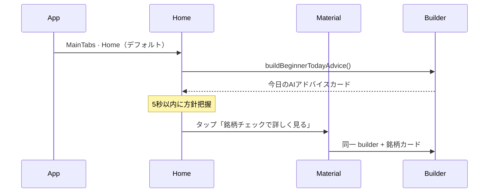

# BEGINNER_MODE_HOME_SCREEN_REPORT

## 概要

UX0.1 正式仕様候補への追加検討。**AI信頼度の初心者表現** · **ホーム最上部「今日のAIアドバイス」** · **理由3行（平易日本語）** · **材料分析タブ名** を設計監査した。

| 項目 | 値 |
|------|-----|
| 監査日 | 2026-06-19 |
| ブランチ | `cursor/top3-maxdd-capital-audit` |
| 親仕様 | `BEGINNER_MODE_REFINEMENT_REPORT.md`（**UX0.1 承認済 · 正式仕様候補**） |
| 監査ベースコミット | `624fccc`（UX0.2 提出済） |
| レポート提出コミット | *(作成・push 後に更新)* |
| スコープ | **設計のみ**（実装なし） |
| バージョン | **UX0.3**（UX0.2 への additive refinements） |

---

## 0. バージョン履歴

| 版 | 主な変更 | レポート |
|----|----------|----------|
| **UX0.1** | 4分類 · AI信頼度% · 材料分析「今日やること」 | `BEGINNER_MODE_REFINEMENT_REPORT.md` |
| **UX0.2** | % + 説明文 · ホーム「今日やること」 · 理由3行必須 | 本レポート §A（履歴） |
| **UX0.3** | **%→3段階** · **理由の平易化** · **「今日のAIアドバイス」** · **タブ名見直し** | **本レポート（正）** |

---

## 1. UX0.3 変更サマリー

| # | UX0.2 | **UX0.3（本レポート）** |
|---|-------|-------------------------|
| AI信頼度 | `63%` + 説明文 | **3段階ラベル**（高い / 普通 / 低い）+ 説明文（% は非表示） |
| ホーム最上部 | 「今日やること」 | **「今日のAIアドバイス」** — 起動直後の第一メッセージ |
| 理由3行 | 必須 · 投資用語混在可 | **必須 · 中学レベル日本語** — 用語変換ルール適用 |
| 材料分析タブ | `材料分析`（現行） | **「銘柄チェック」推奨**（初心者モード時のみ表示名変更） |

---

## 2. AI信頼度 — 3段階ラベル + 説明文

### 2.1 なぜ % をやめるか（UX0.3）

| UX0.2 の % 表示 | UX0.3 の改善 |
|-----------------|--------------|
| 63% が「正確さ」を連想 | **高い / 普通 / 低い** で直感把握 |
| 数値の大小比較で不安 | 3段階のみ · 過信を抑制 |
| Q3「信頼できる数字」が % を指す | Q3 正解を **AI判定 + 理由** へ誘導 |

**内部:** `confidencePct` は従来どおり算出 · **UI では非表示**（上級者モードのみ % 表示可）。

### 2.2 表示構造

```
AI信頼度  普通
━━━━━━━━━━━━━━━━━━━━  （バーは3段階幅 · 数値ラベルなし）
判断材料はやや不足しています
（参考 · 利益を保証しません）
```

**ルール:** 3段階ラベル + 説明文1行 · ラベル直下 · 12–14sp · `textMuted`

### 2.3 帯域マッピング（% → 3段階）

| 内部 pct | 表示ラベル | バー幅 | 色（案） |
|----------|------------|--------|----------|
| **70–100** | **高い** | 100% | 緑 |
| **45–69** | **普通** | 66% | 黄 |
| **0–44** | **低い** | 33% | 灰 |

**推定値:** ラベル末尾に `（推定）` · 説明文は一段控えめ（UX0.2 踏襲）。

**データ品質補正（任意）:** `dataQualityStars ≤ 2` かつ pct ≥ 70 → 表示は **普通** に1段ダウン（内部 pct は保持）。

### 2.4 説明文マトリクス（3段階 × 品質）

| 3段階 | データ品質 | 説明文（初心者向け） |
|-------|------------|---------------------|
| **高い** | ★★★ 以上 | **判断材料は十分あります** |
| **高い** | ★★ 以下 | **判断材料はそろっていますが、一部不足があります** |
| **普通** | 任意 | **判断材料はやや不足しています** |
| **低い** | 任意 | **判断材料が少ないため、参考程度にしてください** |

### 2.5 実装定数（案）

```typescript
// src/constants/beginnerAiTrustLevelJa.ts

export type BeginnerAiTrustLevel = 'high' | 'medium' | 'low';

export function resolveAiTrustLevelJa(input: {
  pct: number;
  isEstimated: boolean;
  dataQualityStars?: number; // 1–5
}): {
  level: BeginnerAiTrustLevel;
  labelJa: string;       // '高い' | '普通' | '低い'
  explainJa: string;     // 説明文1行
  barFillRatio: number;  // 1.0 | 0.66 | 0.33
} {
  let level: BeginnerAiTrustLevel =
    input.pct >= 70 ? 'high' : input.pct >= 45 ? 'medium' : 'low';

  if (level === 'high' && (input.dataQualityStars ?? 5) <= 2) {
    level = 'medium';
  }

  const labelBase = { high: '高い', medium: '普通', low: '低い' }[level];
  const labelJa = input.isEstimated ? `${labelBase}（推定）` : labelBase;

  // explainJa — resolveAiTrustExplainJa（UX0.2）と同一ロジック · level で分岐可
  // ...
}
```

### 2.6 UX上の位置づけ

| 要素 | 役割 |
|------|------|
| **AI判定（4分類）** | 「何をするか」 |
| **AI信頼度 3段階** | 「どれくらい確かか（言葉）」 — **初心者の主読み対象** |
| **説明文** | 3段階の意味を補足 |
| 理由3行 | 「なぜそう判断したか」 — 必須 · 平易化（§4） |

---

## 3. ホーム画面 — 「今日のAIアドバイス」カード

### 3.1 命名変更（UX0.2 → UX0.3）

| UX0.2 | UX0.3 | 理由 |
|-------|-------|------|
| 今日やること | **今日のAIアドバイス** | 「やること」= 売買義務と誤解されやすい |
| タスク一覧トーン | **AI が今日伝えたいこと** | 初心者の安心感 · 5秒理解で「急がなくていい」 |

**内部型名:** `BeginnerTodayAdviceCard`（builder: `beginnerTodayAdviceBuilder.ts`）— UX0.2 `TodayActions` から rename 推奨 · ロジックは同一。

**材料分析タブ内サブ見出し:** 同期カードも **「今日のAIアドバイス」** に統一（「今日やること」は廃止）。

### 3.2 なぜホームか（UX0.2 踏襲 · 強化）

| 観点 | 内容 |
|------|------|
| 起動直後 | **MainTabNavigator** 第一タブ = `Home` → **即「今日のAIアドバイス」表示** |
| 5秒理解 | アプリ全体の第一メッセージ = AI アドバイス |
| 誤解防止 | フッター「急いで売買する必要はありません」を **常時表示** |

**現状:** `HomeScreen.tsx` は Trust / Beginner（配分） / Default の3分岐。`MaterialAnalysisScreen.tsx` ページタイトル = `材料分析`（`MainTabNavigator` `TAB_TITLES.MaterialAnalysis`）。

**UX0.3 方針:** `conciergeUxMode === 'beginner'` のとき、**Trust / Default / 配分 beginner すべて** の ScrollView **index 0** に `BeginnerTodayAdviceCard` を挿入。

### 3.3 ホーム最上部ワイヤーフレーム

```
┌─ ホーム ─────────────────────────────────┐
│ 今日のポートフォリオ              [設定]  │
├──────────────────────────────────────────┤
│ ┌─ 今日のAIアドバイス ───────────────┐  │  ← 起動直後 · 最上部
│ │ 2026-06-19                          │  │
│ │                                     │  │
│ │ ● Maybank      保有継続             │  │
│ │ ● Public Bank  保有継続             │  │
│ │ ○ CIMB         監視                 │  │
│ │ — 新規購入     なし                  │  │
│ │                                     │  │
│ │ 急いで売買する必要はありません       │  │
│ │                                     │  │
│ │ [銘柄チェックで詳しく見る →]        │  │  ← タブ名 UX0.3 連動
│ └─────────────────────────────────────┘  │
├──────────────────────────────────────────┤
│ （以下 · 既存 Home コンテンツ）          │
│ · 保有サマリー / Concierge カード 等     │
└──────────────────────────────────────────┘
```

### 3.4 カード仕様

| 項目 | ルール |
|------|--------|
| 見出し | **今日のAIアドバイス**（固定） |
| 日付 | `YYYY-MM-DD` · 1行 |
| 本文 | 最大5行 · 銘柄 + 4分類一行要約 |
| 新規購入 | `buy_candidate` 0件 → `— 新規購入 なし` |
| フッター | **急いで売買する必要はありません**（必須） |
| CTA | `[銘柄チェックで詳しく見る →]` → `MaterialAnalysis` タブ |
| 理由3行 | **含めない**（情報過多 · 材料分析へ誘導） |
| 空状態 | スケルトン + 「AIアドバイスを取得中…」 |

### 3.5 データソース · 共有

| 項目 | 内容 |
|------|------|
| Builder | `beginnerTodayAdviceBuilder.ts`（UX0.1/0.2 builder 改名 · **単一ソース**） |
| 入力 | `BursaMaterialContext.report` · portfolio holdings · strategy bundle |
| ホーム | 要約版（最大 5 行 + 新規購入サマリー） |
| 銘柄チェック | 同一カード + 銘柄詳細カード群 |
| 更新 | material refresh · portfolio 変更 · focus 時 stale 再取得 |

**新規コンポーネント:** `src/components/beginner/BeginnerTodayAdviceCard.tsx`  
**配置:** `HomeScreen` ScrollView **index 0** · `MaterialAnalysisScreen` **index 0**

### 3.6 起動直後フロー



### 3.7 上級者モード

`conciergeUxMode === 'advanced'` → ホームに「今日のAIアドバイス」**非表示** · タブ名 `材料分析` 維持 · 現行 Home UI 維持。

---

## 4. 理由3行 — 平易日本語（必須）

### 4.1 要件

| 項目 | ルール |
|------|--------|
| 表示 | **AI判定 · AI信頼度とセットで必ず表示** |
| 行数 | **正確に最大3行**（1–3行可 · 0行不可） |
| 見出し | **「なぜそう判断したか」** |
| 語彙 | **中学レベル** — 投資専門用語 **禁止** |
| 空禁止 | Phase データ欠落時も **フォールバック文** を生成 |

### 4.2 用語変換ルール（sanitizeBeginnerLine 拡張）

**原則:** ソース（Phase / AI rationale）の専門語を **表示直前** に置換。置換後も1行40字目安。

| 禁止・回避語 | 平易な言い換え | 例（変換後） |
|--------------|----------------|--------------|
| 配当 | **お金の還元** / **会社からのお金** | 会社からのお金の還元は安定しています |
| 専門家評価 · アナリスト | **調査会社の見方** / **外の評価** | 外の評価は大きな悪い点はありません |
| 決算 · 業績 | **会社の成績発表** / **売上の結果** | 会社の成績は大きく悪くありません |
| 株価 · 時価 | **値段** / **今の値段** | 今の値段は大きく上下していません |
| PER · PBR · バリュエーション | **割高か割安か**（具体数値なし） | 今の値段は割高すぎません |
| ボラティリティ · 変動率 | **値段の上下** / **ブレ** | 値段の上下は小さめです |
| マクロ · 景気循環 | **全体の経済** / **国の景気** | 国の景気は大きく動いていません |
| セクター · 業種 | **同じ種類の会社** / **業界** | 同じ業界のニュースは落ち着いています |
| 利上げ · 金利 | **借りるお金のコスト** | 借りるコストのニュースは大きくありません |
| 為替 · FX | **外国のお金の値段** | 外国のお金の値段は大きく動いていません |
| 売上高 · 利益率 | **売上** / **儲け** | 儲けは大きく減っていません |
| 買い候補 · reduce 等 | **検討リスト** / **減らす sign** | （理由行では使わず、AI判定側のみ） |
| Reddit · API · Phase | **ネットの話題** / **公開情報** | 公開情報に大きな悪い話は少ないです |

**禁止パターン:** 英字略語 · `%` 単独 · 銘柄コードのみの行 · 「〜すべき」「必ず」等の断定助言。

### 4.3 銘柄カード（UX0.3 刷新）

```
┌─────────────────────────────────────────┐
│ 1155  Maybank                            │
│ AI判定: 保有          AI信頼度: 普通     │
│ 判断材料はやや不足しています              │
├─────────────────────────────────────────┤
│ なぜそう判断したか                        │
│  1. 会社からのお金の還元は安定しています  │
│  2. 外の評価に大きな悪い点はありません    │
│  3. 国の景気は横ばいで急な変化は少ない    │
├─────────────────────────────────────────┤
│ 気をつける点（最大3行）                   │  ← 「リスク」→ 平易化（任意 UX0.3）
│  …                                       │
│ 次にすること                              │  ← 「次のアクション」→ 平易化
│  …                                       │
└─────────────────────────────────────────┘
```

**UX0.3 追加（任意 · 推奨）:** 見出し **リスク → 気をつける点** · **次のアクション → 次にすること**（同一セクション · 文言のみ）。

### 4.4 理由生成ロジック（案）

**優先順位で top 3 を抽出** → **`sanitizeBeginnerPlainJa()` 通過**（§4.2 辞書 + 40字 truncate）:

| 優先 | ソース | 変換例 |
|------|--------|--------|
| 1 | Phase 正向評価 | 配当安定 → お金の還元は安定 |
| 2 | Hybrid / AI rationaleJa | 1文要約 → 辞書置換 |
| 3 | Macro / News 要約 | 景気横ばい → 国の景気は横ばい |
| 4 | **フォールバック** | 下記固定3文から充足 |

**フォールバック文（平易 · 固定プール）:**

1. `公開情報を見ても、大きな悪い話は今のところ少ないです`
2. `値段とニュースに大きな変化は限られています`
3. `急いで売買する必要はありません`

```typescript
const BEGINNER_JARGON_REPLACEMENTS: [RegExp, string][] = [
  [/配当/g, 'お金の還元'],
  [/専門家評価|アナリスト/g, '外の評価'],
  [/決算|業績/g, '会社の成績'],
  [/株価|時価/g, '値段'],
  [/ボラティリティ|変動率/g, '値段の上下'],
  [/マクロ|景気循環/g, '国の景気'],
  [/為替/g, '外国のお金の値段'],
  // ...
];

export function sanitizeBeginnerPlainJa(line: string): string {
  let s = line;
  for (const [re, rep] of BEGINNER_JARGON_REPLACEMENTS) {
    s = s.replace(re, rep);
  }
  return s.slice(0, 48).trim();
}
```

### 4.5 バリデーション（実装時）

| チェック | 失敗時 |
|----------|--------|
| `reasons.length === 3` | CI / unit test FAIL |
| 各 line 非空 | フォールバック再生成 |
| 禁止語残存 | 辞書再適用 · 未解決はフォールバック行に差替 |
| 読みやすさ | 48字上限 · 句点で終わる |

### 4.6 今日のAIアドバイスとの関係

- **今日のAIアドバイス:** ポートフォリオ全体の **方針一覧**
- **なぜそう判断したか:** 銘柄ごとの **根拠**（必須 · 平易化）
- ホームカードには理由3行は **含めない** → CTA で銘柄チェックへ

---

## 5. 材料分析タブ — 初心者向け表示名

### 5.1 現状

| 場所 | 現行ラベル |
|------|------------|
| `MainTabNavigator.tsx` `TAB_TITLES.MaterialAnalysis` | **材料分析** |
| `MaterialAnalysisScreen.tsx` `pageTitle` | **材料分析** |
| `BursaMaterialHomeCard` link | 材料分析を見る |

**問題:** 「材料分析」= 化学・料理と混同 · 投資初心者に **何をする画面か** が伝わりにくい。

### 5.2 候補一覧

| 候補 | メリット | デメリット |
|------|----------|------------|
| **銘柄チェック** | 短い · 動作が想像しやすい · チェックリスト連想 | 「銘柄」がやや専門的（許容範囲） |
| **AIの見立て** | AI ブランドと一致 · 判断感 | やや抽象 · タブ幅に注意 |
| **株の調べ方** | 最も平易 | 長い · ガイド記事と混同 |
| **今日の銘柄** | ホームと連動感 | 履歴銘柄とのズレ |
| **AIレポート** | レポート感 | 堅い · PDF 連想 |
| 材料分析（現行） | 実装済 · Phase 用語一致 | 初心者に不親切 |

### 5.3 推奨

| 項目 | 推奨 |
|------|------|
| **タブバー · ページタイトル** | **銘柄チェック** |
| **根拠** | (1) 5秒理解で「チェックする画面」と即理解 (2) 売買を連想させない (3) 4文字+中黒なしでタブに収まる (4) CTA「銘柄チェックで詳しく見る」と **語彙統一** |

**第2候補:** `AIの見立て` — ホーム「AIアドバイス」とトーン統一したい場合の代替。

### 5.4 実装方針（設計）

| モード | タブ表示名 | ページタイトル |
|--------|------------|----------------|
| `conciergeUxMode === 'beginner'` | **銘柄チェック** | **銘柄チェック** |
| `advanced` / その他 | **材料分析** | **材料分析** |

**定数案:**

```typescript
// src/constants/beginnerTabLabelsJa.ts
export const MATERIAL_TAB_BEGINNER_JA = '銘柄チェック';
export const MATERIAL_TAB_DEFAULT_JA = '材料分析';
export const MATERIAL_CTA_FROM_HOME_JA = '銘柄チェックで詳しく見る';
```

**スコープ外（UX0.3）:** 画面内セクション見出し `【銘柄別材料分析】` は **変更しない**（上級者向け内部構造 · 折りたたみ可は UX1）。

---

## 6. UX0.3 正式仕様 — 初心者モード要素一覧

| 順 | 画面 | 要素 | 必須 |
|----|------|------|------|
| 1 | **ホーム** | **今日のAIアドバイス** | ✅ |
| 2 | 銘柄チェック | 今日のAIアドバイス（同期） | ✅ |
| 3 | 銘柄チェック · 銘柄 | AI判定（4分類） | ✅ |
| 4 | 銘柄 | AI信頼度 **3段階** | ✅ |
| 5 | 銘柄 | 信頼度説明文 | ✅ |
| 6 | 銘柄 | **なぜそう判断したか（3行 · 平易）** | ✅ |
| 7 | 銘柄 | 気をつける点3行 | ✅ |
| 8 | 銘柄 | 次にすること | ✅ |
| 9 | タブ | 表示名 **銘柄チェック** | ✅（beginner のみ） |
| — | 全画面 | Phase13–24 詳細 | ❌ 非表示 |

---

## 7. 5 秒理解 — ホーム起点テスト（デスクレビュー · UX0.3 更新）

**タスク:** ホーム UX0.3 モックを 5 秒提示 → 3 問

| 質問 | 想定正解 |
|------|----------|
| Q1 今日新規購入する？ | いいえ |
| Q2 Maybank は？ | 持ち続ける |
| Q3 一番信頼できるのは？ | **AI判定（保有）** または **理由**（% 正解は **無効化**） |

| 条件 | Q1–Q3 | 判定 |
|------|-------|------|
| UX0.2（% 表示 · 今日やること） | 3/3 · Q3=% | PASS · Q3 が数値過信 |
| **UX0.3（3段階 · AIアドバイス）** | **3/3 · Q3=判定/理由** | **PASS+** · 過信リスク低減 |

---

## 8. 実装工数（UX0.2 → UX0.3 追加分）

| 項目 | 追加工数 |
|------|----------|
| `beginnerAiTrustLevelJa.ts`（% UI 削除 · 3段階） | 0.35d |
| `sanitizeBeginnerPlainJa` + 辞書 + テスト | 0.5d |
| `BeginnerTodayAdviceCard` rename + 文言 | 0.25d |
| `HomeScreen` / `MaterialAnalysisScreen` 統合 | 0.25d |
| タブ表示名 `beginnerTabLabelsJa` | 0.15d |
| **UX0.3 追計** | **~1.5d** |
| **UX0.1–UX5 累計** | **~12.5 人日**（旧 11 + 1.5） |

**依存:** Play Internal Testing 完了後 · UX1 着手時に **UX0.3 を正式仕様** として実装（UX0.2 は本レポート §A 参照）。

---

## 9. リスク

| リスク | 緩和 |
|--------|------|
| 3段階だけでは粒度不足 | 説明文2段構成 · 上級者は % 表示 |
| 辞書置換の不自然さ | フォールバック文 · 実機 UX5 で読みやすさ検証 |
| タブ名変更で既存ユーザ混乱 | beginner のみ · advanced は `材料分析` |
| 「AIアドバイス」= 投資助言 | 免責フッター · Settings 注釈 |
| ホーム + 銘柄チェックでカード二重 | 同一 builder · 見た目同一 |

---

## 10. 結論

| 項目 | 判定 |
|------|------|
| AI信頼度 3段階 | **採用** — 高い/普通/低い + 説明文 |
| ホーム「今日のAIアドバイス」 | **採用** — 起動直後の第一メッセージ |
| 理由3行 平易化 | **採用** — 辞書ルール + フォールバック |
| タブ名 銘柄チェック | **採用推奨** — beginner モード限定 |
| 正式仕様 | **UX0.3 = UX0.2 + 本レポート** |

---

## 11. 関連レポート

| レポート | 関係 |
|----------|------|
| `BEGINNER_MODE_UX_REDESIGN_REPORT.md` | UX0 基盤 |
| `BEGINNER_MODE_REFINEMENT_REPORT.md` | UX0.1（4分類 · % · 材料分析） |
| 本レポート §A | **UX0.2 履歴**（% + 説明文 · 今日やること · 理由必須） |
| 本レポート §1–10 | **UX0.3 正** |

---

## A. UX0.2 履歴（参照用 ·  superseded by UX0.3）

UX0.2 で採用済み · UX0.3 で **置換または発展** した項目:

| UX0.2 項目 | UX0.3 での扱い |
|------------|----------------|
| AI信頼度 `63%` + 説明文 | → **3段階ラベル**（§2）· % UI 廃止 |
| ホーム「今日やること」 | → **「今日のAIアドバイス」**（§3） |
| 理由3行必須 | → **維持 + 平易化ルール**（§4） |
| 材料分析タブ名 | → **銘柄チェック**（§5） |

UX0.2 提出コミット: `bbf2415` · hash 更新: `624fccc`

---

## 12. GitHub 同期結果

| 項目 | 値 |
|------|-----|
| 監査ベースコミット | `624fccc` |
| レポート提出コミット | *(作成・push 後に更新)* |
| ブランチ | `cursor/top3-maxdd-capital-audit` |
| Push | *(未実施 — 本レポート作成待ち)* |
