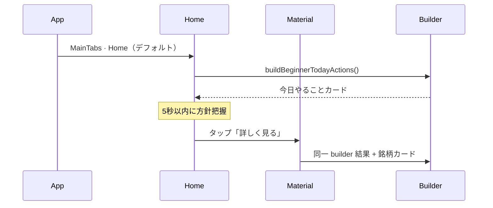

# BEGINNER_MODE_HOME_SCREEN_REPORT

## 概要

UX0.1 正式仕様候補への追加検討。**AI信頼度の説明文** · **ホーム最上部「今日やること」** · **理由3行必須** を設計監査した。

| 項目 | 値 |
|------|-----|
| 監査日 | 2026-06-19 |
| ブランチ | `cursor/top3-maxdd-capital-audit` |
| 親仕様 | `BEGINNER_MODE_REFINEMENT_REPORT.md`（**UX0.1 承認済 · 正式仕様候補**） |
| 監査ベースコミット | `93433f5` |
| レポート提出コミット | `bbf2415` |
| スコープ | **設計のみ**（実装なし） |
| バージョン | **UX0.2**（UX0.1 への additive refinements） |

---

## 1. UX0.2 変更サマリー

| # | UX0.1 | **UX0.2（本レポート）** |
|---|-------|-------------------------|
| AI信頼度 | `63%` のみ | **% + 初心者向け説明文**（必須） |
| 今日やること | 材料分析タブ最上部 | **ホーム画面最上部** + 材料分析にも同期 |
| 理由 | 3行（推奨） | **3行必須** — 空時はプレースホルダ禁止 · フォールバック文生成 |

---

## 2. AI信頼度 (%) + 初心者向け説明文

### 2.1 表示構造

```
AI信頼度  63%
━━━━━━━━━━━━━━━━━━━━  63%
判断材料はやや不足しています
（参考値 · 利益を保証しません）
```

**ルール:** 説明文は **常に1行** · AI信頼度の **直下** · 12–14sp · `textMuted`

### 2.2 説明文マトリクス（案）

| AI信頼度 | データ品質 | 説明文（初心者向け） |
|----------|------------|---------------------|
| **70–100%** | ★★★ 以上 | **判断材料は十分あります** |
| **70–100%** | ★★ 以下 | **判断材料はそろっていますが、一部不足があります** |
| **45–69%** | 任意 | **判断材料はやや不足しています** |
| **0–44%** | 任意 | **判断材料が少ないため、参考程度にしてください** |
| 推定値 | 任意 | 上記 + 末尾 `（推定）` を % 行に表示 · 説明文は一段控えめ |

### 2.3 実装定数（案）

```typescript
// src/constants/beginnerAiTrustExplainJa.ts

export function resolveAiTrustExplainJa(input: {
  pct: number;
  isEstimated: boolean;
  dataQualityStars?: number; // 1–5
}): string {
  const { pct, isEstimated, dataQualityStars } = input;
  if (pct >= 70 && (dataQualityStars ?? 5) >= 3) {
    return '判断材料は十分あります';
  }
  if (pct >= 70) {
    return '判断材料はそろっていますが、一部不足があります';
  }
  if (pct >= 45) {
    return '判断材料はやや不足しています';
  }
  return '判断材料が少ないため、参考程度にしてください';
}
```

### 2.4 UX上の位置づけ

| 要素 | 役割 |
|------|------|
| **AI判定（4分類）** | 「何をするか」 |
| **AI信頼度 %** | 「どれくらい確かか（数値）」 |
| **説明文** | 「数値の意味を言葉で」 — **初心者の主読み対象** |
| 理由3行 | 「なぜそう判断したか」 — 必須（§4） |

---

## 3. ホーム画面 — 「今日やること」カード

### 3.1 なぜホームか

| UX0.1（材料分析のみ） | UX0.2（ホーム追加） |
|----------------------|---------------------|
| タブ到達に1タップ以上 | **起動直後（Home タブ）で即確認** |
| 保有者の日常導線とずれる | ポートフォリオ保有者の **第一画面 = 今日の方針** |
| 5秒理解テストは材料分析起点 | **アプリ全体の5秒理解** をホームで完結 |

**MainTabNavigator:** 第一タブ = `Home`（`HomeScreen.tsx`）→ 起動デフォルトでホーム表示。

### 3.2 現状ホームとの関係

`HomeScreen.tsx` には **3 分岐** がある:

| 分岐 | 条件 | 現状 |
|------|------|------|
| Trust | `investmentDisplayMode === 'trust'` | Trust 専用 UI |
| Beginner（配分） | `investmentDisplayMode === 'beginner'` | 「今日のおすすめ」→ 配分プラン誘導のみ |
| Default | pro / その他 | Concierge · Material · Trade Queue 等 |

**UX0.2 方針:** `conciergeUxMode === 'beginner'`（UX0.1 アプリ UX）のとき、**Trust / Default / 配分 beginner すべて** の先頭に `BeginnerTodayActionsCard` を挿入（Trust 配分フローはその下に維持）。

### 3.3 ホーム最上部ワイヤーフレーム

```
┌─ ホーム ─────────────────────────────────┐
│ 今日のポートフォリオ              [設定]  │
├──────────────────────────────────────────┤
│ ┌─ 今日やること ─────────────────────┐  │
│ │ 2026-06-19                          │  │
│ │ ● Maybank      保有継続             │  │
│ │ ● Public Bank  保有継続             │  │
│ │ ○ CIMB         監視                 │  │
│ │ — 新規購入     なし                  │  │
│ │ 急いで売買する必要はありません       │  │
│ │ [材料分析で詳しく見る →]            │  │
│ └─────────────────────────────────────┘  │
├──────────────────────────────────────────┤
│ （以下 · 既存 Home コンテンツ）          │
│ · 保有サマリー / Concierge カード 等     │
└──────────────────────────────────────────┘
```

### 3.4 データソース · 共有

| 項目 | 内容 |
|------|------|
| Builder | `beginnerTodayActionsBuilder.ts`（UX0.1 案 · **単一ソース**） |
| 入力 | `BursaMaterialContext.report` · portfolio holdings · strategy bundle |
| ホーム | 要約版（最大 5 行 + 新規購入サマリー） |
| 材料分析 | 同一カード + 銘柄詳細カード群 |
| 更新 | material refresh · portfolio 変更 · focus 時 stale 再取得 |

**新規コンポーネント:** `src/components/beginner/BeginnerTodayActionsCard.tsx`  
**配置:** `HomeScreen` ScrollView **index 0** · `MaterialAnalysisScreen` **index 0**

### 3.5 起動直後フロー



### 3.6 上級者モード

`conciergeUxMode === 'advanced'` → ホームに「今日やること」**非表示** · 現行 Home UI 維持。

---

## 4. 理由3行 — 必須表示

### 4.1 要件

| 項目 | ルール |
|------|--------|
| 表示 | **AI判定 · AI信頼度とセットで必ず表示** |
| 行数 | **正確に最大3行**（1–3行可 · 0行不可） |
| 見出し | **「なぜそう判断したか」**（UX0.1「理由」から改名） |
| 空禁止 | Phase データ欠落時も **フォールバック文** を生成 |

### 4.2 銘柄カード（刷新）

```
┌─────────────────────────────────────────┐
│ 1155  Maybank                            │
│ AI判定: 保有          AI信頼度: 63%       │
│ 判断材料はやや不足しています              │
├─────────────────────────────────────────┤
│ なぜそう判断したか                        │  ← 必須見出し
│  1. 配当が安定しており、長期保有向き      │
│  2. 専門家評価は中立で大きな悪材料なし    │
│  3. 景気は横ばいで急変リスクは限定的      │
├─────────────────────────────────────────┤
│ リスク（最大3行）                         │
│  …                                       │
│ 次のアクション                            │
│  …                                       │
└─────────────────────────────────────────┘
```

### 4.3 理由生成ロジック（案）

**優先順位で top 3 を抽出**（`beginnerMaterialSummaryBuilder.ts` 拡張）:

| 優先 | ソース | 例 |
|------|--------|-----|
| 1 | Phase 正向評価（配当 · 専門家 · 決算） | 配当が安定… |
| 2 | Hybrid / AI rationaleJa（1文要約） | AI分析では… |
| 3 | Macro / News 要約 | 景気は横ばい… |
| 4 | **フォールバック**（必須） | `データが限られているため、大きな材料は見つかっていません` |

```typescript
export function buildMandatoryReasonLines(input: {
  phaseHighlights: string[]; // 既存 enricher から
  aiRationaleJa?: string;
  minLines?: number; // default 3
}): [string, string, string] {
  const pool = [
    ...input.phaseHighlights,
    input.aiRationaleJa?.trim(),
  ].filter(Boolean) as string[];

  const fallbacks = [
    '公開情報をもとに、大きな悪材料は今のところ少ないです',
    '株価とニュースに大きな変化は限定的です',
    '急いで売買する必要はありません',
  ];

  const lines: string[] = [];
  for (const s of pool) {
    if (lines.length >= 3) break;
    lines.push(sanitizeBeginnerLine(s));
  }
  for (const fb of fallbacks) {
    if (lines.length >= 3) break;
    if (!lines.includes(fb)) lines.push(fb);
  }
  while (lines.length < 3) lines.push(fallbacks[lines.length % fallbacks.length]);
  return [lines[0], lines[1], lines[2]];
}
```

### 4.4 バリデーション（実装時）

| チェック | 失敗時 |
|----------|--------|
| `reasons.length === 3` | CI / unit test FAIL |
| 各 line 非空 | フォールバック再生成 |
| Jargon フィルタ | `sanitizeBeginnerLines`（既存） |

### 4.5 今日やることとの関係

- **今日やること:** ポートフォリオ全体の **アクション一覧**
- **なぜそう判断したか:** 銘柄ごとの **根拠**（必須）
- ホームカードには理由3行は **含めない**（情報過多）→ 「詳しく見る」で材料分析へ

---

## 5. UX0.2 正式仕様 — 初心者モード要素一覧

| 順 | 画面 | 要素 | 必須 |
|----|------|------|------|
| 1 | **ホーム** | 今日やること | ✅ |
| 2 | 材料分析 | 今日やること（同期） | ✅ |
| 3 | 材料分析 · 銘柄 | AI判定（4分類） | ✅ |
| 4 | 銘柄 | AI信頼度 % | ✅ |
| 5 | 銘柄 | 信頼度説明文 | ✅ |
| 6 | 銘柄 | **なぜそう判断したか（3行）** | ✅ |
| 7 | 銘柄 | リスク3行 | ✅ |
| 8 | 銘柄 | 次のアクション | ✅ |
| — | 全画面 | Phase13–24 詳細 | ❌ 非表示 |

---

## 6. 5 秒理解 — ホーム起点テスト（デスクレビュー）

**タスク:** ホーム UX0.2 モックを 5 秒提示 → 3 問

| 質問 | 想定正解 |
|------|----------|
| Q1 今日新規購入する？ | いいえ |
| Q2 Maybank は？ | 持ち続ける |
| Q3 なぜその判断？ | 理由は材料分析へ（ホームではアクションのみ） |

| 条件 | Q1–Q3 | 判定 |
|------|-------|------|
| UX0.1（材料分析のみ） | 3/3（材料分析到達後） | PASS · 到達コストあり |
| **UX0.2（ホーム起点）** | **3/3（起動直後）** | **PASS+** · 到達コスト **ゼロ** |

---

## 7. 実装工数（UX0.1 → UX0.2 追加分）

| 項目 | 追加工数 |
|------|----------|
| `beginnerAiTrustExplainJa.ts` | 0.25d |
| `buildMandatoryReasonLines` + テスト | 0.5d |
| `BeginnerTodayActionsCard` コンポーネント | 0.5d（UX0.1 から共有） |
| `HomeScreen` 統合 · focus refresh | 0.75d |
| 材料分析との builder 共通化 | 0.25d |
| **UX0.2 追計** | **~2.25d** |
| **UX0.1–UX5 累計** | **~11 人日**（旧 9 + 2.25） |

**依存:** Play Internal Testing 完了後 · UX1 着手時に UX0.2 を **正式仕様** として実装。

---

## 8. リスク

| リスク | 緩和 |
|--------|------|
| ホーム + 材料分析でカード二重 | 同一 builder · 見た目同一 |
| 理由フォールバックが generic | Phase 優先抽出 · 品質監査 |
| `investmentDisplayMode` と `conciergeUxMode` 二系統 | UX1 で Settings 統合 · ホームは **conciergeUxMode** 優先 |
| データ未ロード時ホーム空白 | スケルトン + 「分析を取得中…」 |

---

## 9. 結論

| 項目 | 判定 |
|------|------|
| 信頼度説明文 | **採用** — 2段階マトリクス（%/品質） |
| ホーム「今日やること」 | **採用** — 起動直後5秒理解の核心 |
| 理由3行必須 | **採用** — 「なぜそう判断したか」見出し · フォールバック必須 |
| 正式仕様 | **UX0.2 = UX0.1 + 本レポート** |

---

## 10. 関連レポート

| レポート | 関係 |
|----------|------|
| `BEGINNER_MODE_UX_REDESIGN_REPORT.md` | UX0 基盤 |
| `BEGINNER_MODE_REFINEMENT_REPORT.md` | UX0.1（4分類 · % · 材料分析今日やること） |
| 本レポート | **UX0.2** — ホーム · 説明文 · 理由必須 |

---

## 11. GitHub 同期結果

| 項目 | 値 |
|------|-----|
| 監査ベースコミット | `93433f5` |
| レポート提出コミット | `bbf2415` |
| ブランチ | `cursor/top3-maxdd-capital-audit` |
| Push | *(未実施 — 本レポート作成待ち)* |
