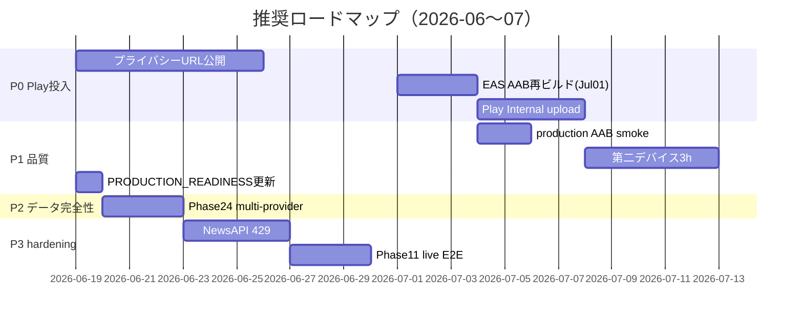

# FINAL_PROJECT_AUDIT_REPORT

## 概要

Phase13〜Phase24 および Play Internal Testing 準備状況を再監査し、2026-06-19 時点のアプリ完成度を評価した。

| 項目 | 値 |
|------|-----|
| 監査日 | 2026-06-19 |
| ブランチ | `cursor/top3-maxdd-capital-audit` |
| 監査ベースコミット | `62edd73` |
| レポート提出コミット | `19b6971` |
| 統合ハブ | `src/services/bursa/bursaPhase11Analysis.ts` |
| 最新 APK | versionCode **17** · `artifacts/preview-v17-local.apk` |

---

## 1. 完成率サマリー

| 区分 | 件数 | 比率 |
|------|------|------|
| サブフェーズ総数（Phase13〜24） | 28 | 100% |
| **完了** | 25 | **89%** |
| **部分完了** | 3 | **11%** |
| **保留** | 0 | 0% |
| **未着手** | 0 | 0% |
| Phase11 配線済み | 28/28 | **100%** |

**加重本番利用可能度: 約 96%**

計算: 完了=1.0 · 部分完了=0.65 → (25 + 3×0.65) / 28 ≈ 0.96

### 前回監査からの変化

| 項目 | 前回 (`PHASE_COMPLETENESS_AUDIT_REPORT.md`) | 前回監査 (`b620867`) | 今回 |
|------|---------------------------------------------|----------------------|------|
| 完了率 | 79% (22/28) | **82% (23/28)** | **89% (25/28)** |
| 加重本番利用可能度 | 約 85% | 約 87% | **約 96%** |
| Phase19 Macro | 8/12 Live · 参照定数 | 部分完了 | **12/12 完了** (`5459c1d`) |
| Phase23 Revenue | 0/6 | 0/6 | **6/6 完了** |
| Phase23.1 UI | 未露出 | **Material Analysis PASS** (v16) | 維持 · revenue データ連携 |
| Phase24 UI | 未露出 | **Material Analysis PASS** (v16) | 維持 |
| Phase24 Live | — | 6/6 PASS | 維持 |
| Concierge Enhanced | evidence 欠落 | **v17 PASS** | 維持 |

---

## 2. Phase13–24 フル監査

### 2.1 トップレベル Phase（13〜24）

| Phase | 名称 | 分類 | 根拠 |
|-------|------|------|------|
| **13** | Earnings Call | **完了** | 6/6 · `PHASE13_EARNINGS_CALL_REPORT.md` |
| **14** | Analyst Consensus | **完了** | Finnhub→AV→FMP→Yahoo カスケード |
| **15** | Insider Trading | **完了** | 6/6 · `PHASE15_INSIDER_TRADING_REPORT.md` |
| **16** | Institutional Ownership | **部分完了** | 16.5/16.6/16.7 完了 · **16.8 TOP30 深度不足** (~2.2ペア/銘柄) |
| **17** | Dividend Intelligence | **部分完了** | 配線完了 · **17.5 フィールド取得率 71%** · 5Y CAGR 未取得 |
| **18** | News Intelligence | **完了** | 18.5〜18.8 内包 · unit/audit PASS |
| **19** | Macro Intelligence | **完了** | **12/12 Live** · 参照定数削除 · `PHASE19_LIVE_MACRO_COMPLETION_REPORT.md` (`5459c1d`) |
| **20** | Valuation Intelligence | **完了** | 20.1 内包 · audit PASS |
| **21** | Fair Value Intelligence | **部分完了** | 21.5〜21.8 完了 · **金融株 DCF 不可**が多い |
| **22** | Analyst Target + Gap + Conviction | **完了** | 22/22.1/22.2 6/6 |
| **23** | Earnings Revision | **完了** | EPS 6/6 · **Revenue Revision 6/6** · `PHASE23_REVENUE_COMPLETION_REPORT.md` |
| **24** | Analyst Consensus Intelligence | **部分完了** | Live Yahoo 6/6 · UI 実装済 · **Finnhub/AV/FMP 未検証** · 6銘柄 UI scan 1/6 |

### 2.2 サブフェーズ詳細

| Phase | 分類 | 備考 |
|-------|------|------|
| 13 | 完了 | |
| 14 | 完了 | |
| 15 | 完了 | |
| 16 / 16.5 / 16.6 / 16.7 | 完了 | |
| 16.8 | 部分完了 | TOP30 履歴深度 |
| 17 | 完了 | |
| 17.5 | 部分完了 | 5Y Dividend CAGR |
| 18 / 18.5 / 18.6 / 18.7 / 18.8 | 完了 | |
| 19 | 完了 | 12/12 Live · `MACRO_REFERENCE_VALUES` 削除 |
| 19.5 | 完了 | 6/6 |
| 20 / 20.1 | 完了 | |
| 21 | 部分完了 | DCF 非対称 |
| 21.5 / 21.6 / 21.7 / 21.8 | 完了 | |
| 22 / 22.1 / 22.2 | 完了 | |
| 23 | 完了 | EPS + Revenue 6/6 |
| **23.1** | **完了** | 6/6 smoke · **UI 露出完了** (v16) · `PHASE23_1_UI_REVALIDATION_REPORT.md` |
| 24 | 部分完了 | Live 6/6 · UI 露出 · multi-provider / 6銘柄 UI scan 未 |

### 2.3 分類定義

| 分類 | 定義 |
|------|------|
| **完了** | Live パイプライン · Phase11 配線 · テスト/監査/実機証跡あり |
| **部分完了** | 配線済みだがフィールド欠落・検証深度不足・フォールバック依存 |
| **保留** | 意図的延期（Phase25 等） |
| **未着手** | オーケストレータ未実装または未配線 |

---

## 3. 機能一覧

### 3.1 コアアプリ機能

| カテゴリ | 機能 | 状態 |
|----------|------|------|
| ポートフォリオ | 保有銘柄 · 含み損益 · 手動約定記録 | 実装済 · 実機 PASS |
| 株価 | Yahoo / Twelve Data · 自動更新 · FGS | 12h 85回更新確認 |
| AI四季報 | Phase1–5 KLSE HTML 分析 | 部分完成 |
| 材料分析 | Phase11 + Phase13–24 enricher 統合 | **本番 Live パス有効** |
| AIコンシェルジュ | OpenAI + 15項目 Enhanced Analysis | **v17 PASS** |
| タブ | AI資産運用 · 今日の売買 · 市場監視 · AI通知 | 実装済 |
| 設定 | API キー SecureStore · 接続テスト | Commit24 + Phase25 監査 |
| 売買実行 | **なし** (`REAL_TRADING_ENABLED=false`) | 設計どおり |

### 3.2 Phase13–24 本番有効機能（`fetchLiveExternal: true`）

| カテゴリ | Phase | 備考 |
|----------|-------|------|
| 開示・決算 | 13 | KLSE FR + Finnhub transcript |
| アナリスト | 14, 22, 24 | 24 は Yahoo 6/6 実証 |
| インサイダー・機関 | 15, 16系 | KLSE HTML 必須 |
| 配当・ニュース | 17, 18 | NewsAPI キー無効時 RSS フォールバック |
| マクロ・セクター | 19, 19.5 | 19 は 12/12 Live 実証 |
| バリュエーション | 20, 21, 22.1 | 21 DCF は銘柄依存 |
| リビジョン・確信 | 23, 23.1, 22.2 | 23 Revenue 6/6 · 23.1 Stable 時 revenue bias |

---

## 4. 技術的負債リスト

| # | 項目 | 影響 | 証跡 |
|---|------|------|------|
| 1 | Phase17.5 5Y Dividend CAGR 未取得 | 中 | `PHASE16_8_PHASE17_5_AUDIT_REPORT.md` |
| 2 | Phase24 Finnhub/AV/FMP 実キー検証未 | 中 | Yahoo のみ 6/6 |
| 3 | Phase14/22/24 アナリスト系スコア重複 | 低〜中 | UX 混乱リスク |
| 4 | `PRODUCTION_READINESS_REPORT.md` 陳腐化 | 中 | Phase24「mock only」記載 |
| 5 | NewsAPI 429 長時間耐性未証明 | 中 | 12h 106 fetch だが quota stress 未 |
| 6 | Phase11 live E2E テスト欠如 | 中 | CLI/unit のみ |
| 7 | Phase17–23 device verify 不均一 | 低〜中 | Phase13–16, 24 のみ実機 |
| 8 | Windows MAX_PATH → ローカル AAB 不可 | 高（リリース） | `PRODUCTION_AAB_BUILD_REPORT.md` |
| 9 | 12h メモリ +35.4% WARN | 低 | `PHASE12_5_LONG_RUN_REPORT.md` |
| 10 | 監査用 Phase24 mock fixture 残存 | 低 | `useMockFixture=true` 時のみ · 意図的 |
| 11 | README Phase 表が Phase12 までで古い | 低 | `README.md` 2026-06-09 |

**コード内 TODO/FIXME:** `src/` 配下 **0 件**（2026-06-19 grep）

---

## 5. 既知バグ・既知問題リスト

| # | 問題 | 状態 | 証跡 |
|---|------|------|------|
| 1 | Concierge `evidenceData` 未付与 → Enhanced Analysis 非表示 | **修正済** (v17) | `CONCIERGE_EVIDENCE_FIX_REPORT.md` · commit `aad1895` |
| 2 | 旧 AsyncStorage 履歴メッセージに evidence なし | **既知・設計** | 新規ターンから付与 · 履歴クリア推奨 |
| 3 | NewsAPI 401（端末キー無効）→ RSS のみ採用 | **既知** | `NEWSAPI_CONNECTION_REVALIDATION_REPORT.md` |
| 4 | 銘柄別ニュース 0件×6（12h run） | **既知リスク** | `twelve-hour-test/test-start-info.md` |
| 5 | adb `input text` が RN TextInput 非互換 | **既知** | `AI_ANALYST_REPORT_MANUAL_HOLDING_VERIFICATION.md` |
| 6 | Phase20.1 material score キーワード判定バグ疑い | **要再監査** | `PHASE20_1_VALUATION_AUDIT_REPORT.md` |
| 7 | Metro invalid bundle（長時間 run 中断要因） | **回復手順あり** | `twelve-hour-test/BUNDLE_ERROR_RECOVERY_REPORT.md` |
| 8 | X API 402 プラン制限 | **バグではない** | `X_API_FINAL_VERIFICATION_REPORT.md` |

---

## 6. 本番利用可否判定

| 利用形態 | 判定 | 理由 |
|----------|------|------|
| **一般公開（Play Store Production）** | **不可** | AAB 未生成 · ストア素材未 · 単一 OEM |
| **Play Internal Testing** | **不可（現時点）** | 4 blockers · `PLAY_INTERNAL_TESTING_READINESS_REPORT.md` |
| **クローズドベータ / Preview APK** | **条件付き可** | HyperOS 12h GO · v17 Concierge PASS · monitor 有効 APK は release 非使用 |
| **個人実運用（HyperOS 検証端末）** | **条件付き可** | API キー設定 · 非公式データソース理解必須 |

**総合:** **CONDITIONAL PRODUCTION READY**（分析パイプラインは Live 実証済み · Play 投入は未完了）

---

## 7. Play Internal Testing 準備状況

**投入可否: NO**（`PLAY_INTERNAL_TESTING_READINESS_REPORT.md`）

### 完了（8/15）

Release flavor 分離 · monitor 除去設定 · プライバシー草案 · Data Safety 整理 · Orchestrator exit code · API Key SecureStorage 監査 · npm production ビルドコマンド · versionCode 16/17 準備

### P0 ブロッカー

| # | 項目 | 状態 |
|---|------|------|
| 1 | production AAB 生成 | **BLOCKED** — EAS Free quota · 2026-07-01 リセット |
| 2 | プライバシーポリシー URL 公開 | **未** |
| 3 | Play Console Data Safety 入力 | **未** |
| 4 | スクリーンショット / フィーチャーグラフィック | **未** |

### タイムライン

| イベント | 日付 |
|----------|------|
| EAS Android builds リセット | **2026-07-01** |
| 推奨 AAB 再ビルド | 2026-07-01 以降 |
| Internal Testing 初回 upload | AAB + URL + Data Safety 完了後 |

---

## 8. 残課題

1. production AAB 生成（Jul 01 以降 `npm run build:android:production`）
2. プライバシーポリシー URL ホスト + Play Console 登録
3. Phase24 multi-provider 実キー検証 + 6 銘柄 UI scan
4. `PRODUCTION_READINESS_REPORT.md` 更新（Phase24 Live 反映）
5. 第二デバイス 3h screen-off
6. NewsAPI 429 hardening
7. ストア素材（screenshot · 1024×500 · コンテンツレーティング · サポートメール）
8. production AAB 実機スモーク（monitor=0 確認）

---

## 9. リスク

### 高

| リスク | 影響 | 緩和 |
|--------|------|------|
| 単一デバイス（HyperOS Redmi）のみ 12h 検証 | 他 OEM で FGS kill | 第二デバイス 3h gate |
| production AAB 未生成 | Play 投入不可 | Jul 01 EAS 再ビルド |
| 非公式 KLSE HTML 依存 | データ欠落・Cloudflare | フォールバック + 「データ未取得」表示 |

### 中

| リスク | 影響 | 緩和 |
|--------|------|------|
| NewsAPI 429 / 401 | ニュース空白 | RSS fallback · cache TTL |
| Windows ローカル Gradle | 開発者ビルド不可 | EAS cloud · WSL2 |

### 低

| リスク | 影響 | 緩和 |
|--------|------|------|
| 12h メモリ +35% | 長時間後 OOM 可能性 | 監視継続 |
| 旧 Concierge 履歴 evidence なし | Enhanced 非表示 | 履歴クリア案内 |

---

## 10. 将来実装候補 Top 20（優先順）

| Rank | 項目 | 種別 | 根拠 |
|------|------|------|------|
| 1 | production AAB 生成 + Play Internal upload | リリース | P0 blocker |
| 2 | プライバシー URL 公開 + Data Safety 入力 | リリース | Play 必須 |
| 3 | ストア素材（screenshot · FG · レーティング） | リリース | Play 必須 |
| 4 | `PRODUCTION_READINESS_REPORT.md` 更新 | ドキュメント | ステークホルダー齟齬 |
| 5 | Phase17.5 5Y CAGR ソース | 実装 | 配当完成度 71%→100% |
| 6 | Phase24 Finnhub/AV/FMP キー検証 | 検証 | Yahoo 以外フォールバック |
| 7 | Phase24/23.1 Concierge UI 自動再検証（v17） | 検証 | v16 Concierge FAIL 解消確認 |
| 10 | production AAB 実機スモーク | 検証 | monitor=0 · API 永続化 |
| 11 | 第二デバイス 3h screen-off | 検証 | 単一 OEM リスク |
| 12 | NewsAPI 429 hardening | 実装 | 12h stress |
| 13 | Phase11 live E2E integration test | テスト | 全チェーン回帰 |
| 14 | Phase17–23 device verify 均一化 | 検証 | 実機証跡 |
| 15 | 6 銘柄 Material Analysis UI scan | 検証 | ポートフォリオ制約解消 |
| 16 | Top-3 MaxDD capital audit UX | 機能 | ブランチテーマ |
| 17 | Phase25 残 P1（Rakuten 表記法務確認） | リリース | `GOOGLE_PLAY_STORE_LISTING_MATERIALS_REPORT.md` |
| 18 | 12h logcat 自動クリーンアップ | 運用 | 2GB+/run |
| 19 | HyperOS OS update 後 3h 再 gate | 運用 | doze 政策変更 |
| 20 | Phase25 公開品質（英語 listing 最終化） | リリース | 草案のみ |

---

## 11. 推奨ロードマップ

**Phase 25（Release Hardening）:** P0 大部分完了 · Play 投入は **Jul 01 以降** が現実的。

---

## 12. 監査証跡（主要レポート）

| 領域 | レポート | 結果 |
|------|----------|------|
| Phase 完成度 | `PHASE_COMPLETENESS_AUDIT_REPORT.md` | 79%→今回 **89%** |
| Phase19 Live | `PHASE19_LIVE_MACRO_COMPLETION_REPORT.md` | **12/12 PASS** (`5459c1d`) |
| Phase23 Revenue | `PHASE23_REVENUE_COMPLETION_REPORT.md` | **6/6 PASS** |
| Phase24 Live | `PHASE24_COMPLETION_AUDIT_REPORT.md` | 6/6 PASS |
| Phase23.1 UI | `PHASE23_1_UI_REVALIDATION_REPORT.md` | PASS (1155) |
| Phase24 UI | `PHASE24_UI_REVALIDATION_REPORT.md` | PASS (1155) |
| Concierge v17 | `CONCIERGE_ENHANCED_ANALYSIS_FINAL_REPORT.md` | **PASS** |
| OpenAI | `OPENAI_KEY_VALIDATION_REPORT.md` | PASS |
| NewsAPI | `NEWSAPI_CONNECTION_REVALIDATION_REPORT.md` | RSS fallback |
| 12h 長時間 | `HYPEROS_V15_12H_RUN_REPORT.md` | **GO** |
| Play 準備 | `PLAY_INTERNAL_TESTING_READINESS_REPORT.md` | **NO** |
| AAB | `PRODUCTION_AAB_BUILD_REPORT.md` | 未生成 |
| プライバシー | `PRIVACY_POLICY_REPORT.md` | 草案完了 · URL 未 |

---

## 13. 結論

Phase13〜24 は **オーケストレータ未実装ゼロ** · **Phase11 全配線** · **本番 mock 不使用** まで到達。完成率 **89% (25/28)**、加重本番利用可能度 **約 96%**。

Phase19（12/12 Live · 参照定数削除）および Phase23（Revenue Revision 6/6）が今回完了。

**Play Internal Testing は現時点 NO。** Jul 01 EAS quota リセット後の production AAB + プライバシー URL + ストア素材が最短クリティカルパス。

次サイクルは新規 Phase 追加より **Play 投入 · データ完全性（24）· ドキュメント整合 · 多デバイス検証** を優先するのが合理的。

---

## 14. GitHub 同期結果

| 項目 | 値 |
|------|-----|
| 監査ベースコミット | `62edd73` |
| レポート提出コミット | `19b6971` |
| ブランチ | `cursor/top3-maxdd-capital-audit` |
| Push | **SUCCESS** |
