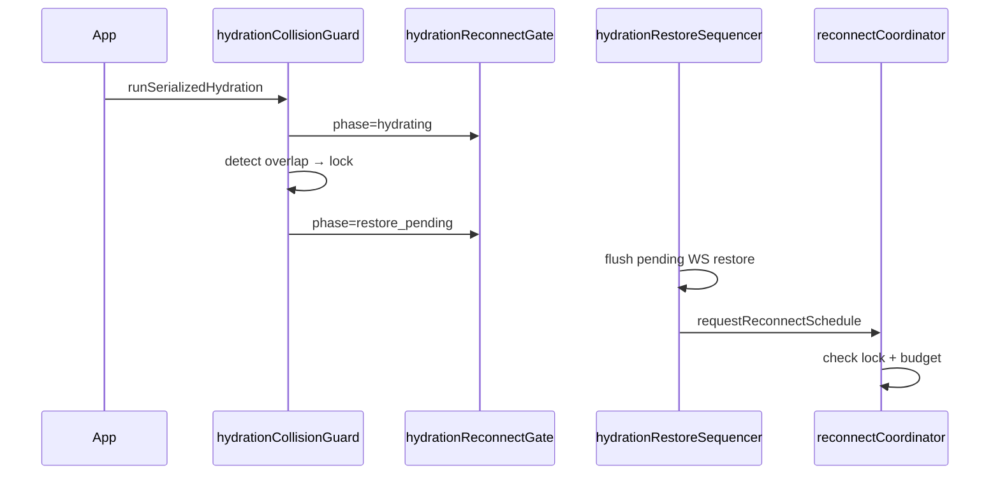

# Hydration Restore Sequence

## Phases

| Phase | Reconnect allowed |
|-------|-------------------|
| idle | yes |
| hydrating | **no** |
| restore_pending | after lock clear |
| reconnect_scheduled | yes (coordinated) |

## API

- `scheduleDelayedWebsocketRestore` — defers if lock/hydrating
- `noteHydrationSequenceStart/End` — wired in `runSerializedHydration`
