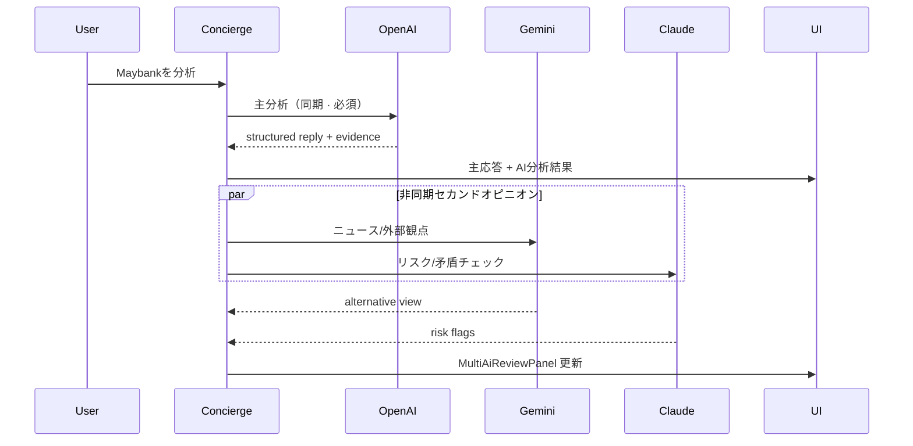

# MULTI_AI_REVIEW_DESIGN_REPORT

## 概要

OpenAI 単独判断に加え、Gemini / Claude をセカンドオピニオンとして使う **Multi-AI Review Layer** の実装前設計監査。

| 項目 | 値 |
|------|-----|
| 監査日 | 2026-06-19 |
| ブランチ | `cursor/top3-maxdd-capital-audit` |
| 監査ベースコミット | `74db83f` |
| レポート提出コミット | `9c49f59` |
| スコープ | **設計のみ**（実装なし） |
| 前提 | Phase19 / Phase23 完了承認済み · 新規分析 Phase 追加なし |

### 役割分担（ユーザー設計案）

| プロバイダ | 役割 |
|------------|------|
| **OpenAI** | 主分析 · ユーザー向け説明 · 構造化 JSON 応答 |
| **Gemini** | ニュース / 外部情報 / 代替観点 |
| **Claude** | リスク · 矛盾 · 過信チェック |

---

## 1. 現状監査

### 1.1 OpenAI 統合状況 — **実装済（単一プロバイダ）**

| レイヤ | ファイル | 用途 | API |
|--------|----------|------|-----|
| **Concierge 主チャット** | `src/services/aiStrategyService.ts` | ユーザー質問 · 分析モード · Enhanced Analysis 根拠 | `POST /v1/responses` · `gpt-4o-mini` |
| **OpenAI 第二評価者** | `src/services/aiSecondEvaluatorService.ts` | 保有銘柄 batch · buy/reduce/hold/watch + confidence | 同一 Responses API |
| **戦略ハイブリッド融合** | `src/services/strategyHybridEnhancement.ts` | ルールスコア × OpenAI 第二評価 | 上記 batch 結果 |
| **AI Trade Queue** | `src/services/aiTradeQueueService.ts` | 売買候補キュー生成 | OpenAI |
| **接続テスト** | `src/services/openAiConnectionTest.ts` · `apiHealth.ts` | 設定画面疎通確認 | models/responses |
| **API キー** | `src/services/aiApiKey.ts` · `safeApiKey.ts` | SecureStore `sta.secret.ai_api_key` | — |

**Concierge 主経路フロー:**

```
ユーザー入力
  → buildAiStrategyContext()
  → sendAiStrategyChat() / callAiApi()
  → OpenAI Responses API
  → parseAiApiJsonContent()
  → createAssistantChatMessage + evidenceData
  → ConciergeEnhancedAnalysisBlock（Phase 統合 UI）
```

**第二評価経路（名称は second opinion だが OpenAI 単独）:**

```
ConciergeSymbolEvidence[]
  → buildEnrichedAiSecondEvaluatorInputs()（ニュース · X · RSI 強化）
  → fetchAiSecondEvaluatorBatch()
  → OpenAI（同一キー · 同一モデル）
  → hybridStrategyScoreFusion
  → portfolioAiEvaluation / AiActionCenterPanel
```

**実機検証状況:** v17 APK で OpenAI HTTP 200 · `hasEvidence: true` · Enhanced Analysis PASS（`CONCIERGE_ENHANCED_ANALYSIS_FINAL_REPORT.md`）

### 1.2 Gemini API 統合 — **未実装**

| 確認項目 | 結果 |
|----------|------|
| `src/` 内 Gemini / Google AI 参照 | **0 件** |
| `generativelanguage.googleapis.com` | **なし** |
| API キー保存 | **なし** |
| 接続テスト | **なし** |

### 1.3 Claude API 統合 — **未実装**

| 確認項目 | 結果 |
|----------|------|
| `src/` 内 Anthropic / Claude 参照 | **0 件**（secret scan スクリプトの env パターンのみ） |
| `api.anthropic.com` | **なし** |
| API キー保存 | **なし** |
| 接続テスト | **なし** |

### 1.4 API キー保存 UI — **OpenAI のみ（AI 用途）**

**設定画面:** `src/screens/SettingsScreen.tsx` · `src/config/apiProviders.ts`

| Provider ID | UI ラベル | AI Review 用途 |
|-------------|-----------|----------------|
| `openai` | OpenAI API | **使用中** |
| `twelve_data` | Twelve Data | 株価（非 AI） |
| `newsapi` | NewsAPI | ニュース（非 AI） |
| `x` | X API | SNS（非 AI） |
| `reddit` | Reddit API | SNS（非 AI） |
| `alpha_vantage` | Alpha Vantage | データ（非 AI） |
| `finnhub` | Finnhub | データ（非 AI） |
| `polygon` | Polygon.io | データ（非 AI） |
| `fmp` | FMP | データ（非 AI） |
| **`gemini`** | — | **未登録** |
| **`claude`** | — | **未登録** |

**レガシー:** `AiSettingsScreen.tsx` に OpenAI 専用入力欄あり（`AI_SETTINGS.apiKeyLabel` = 「AI APIキー」）。新 Settings の `openai` provider と二重経路。

**SecureStore キー:** `src/constants/secretStorage.ts` — `aiApiKey` のみ AI 用。Gemini / Claude 用 `SecretKeyId` **なし**。

### 1.5 既存「第二評価」と 3AI 構想の関係

| 項目 | 現状 | 3AI 構想との差 |
|------|------|----------------|
| 名称 | `aiSecondEvaluatorService` · 「OpenAI 第二評価者」 | 同一 OpenAI を 2 回使う構造に近い |
| 入力 | ニュース · X · RSI · 保有 | Gemini 向け入力と **重複可能** |
| 出力 | action + confidence + rationaleJa | Claude 向け risk/contradiction チェック **未分離** |
| UI | `AiActionCenterPanel` · `batchSource: openai` | 3 プロバイダ比較 UI **なし** |

**結論:** 「第二評価」の **概念とパイプライン骨格は存在**するが、**プロバイダは OpenAI のみ**。3AI 化には adapter 層の追加と UI 拡張が必要。

---

## 2. 未実装箇所一覧

| # | 領域 | 未実装内容 | 優先度 |
|---|------|------------|--------|
| 1 | **Provider Adapter** | Gemini API クライアント（generateContent） | P0 |
| 2 | **Provider Adapter** | Claude API クライアント（Messages API） | P0 |
| 3 | **Orchestrator** | Multi-AI 並列 dispatch · timeout · partial success | P0 |
| 4 | **Types** | `MultiAiReviewResult` · per-provider status | P0 |
| 5 | **API Keys** | `gemini` · `claude` を `apiProviders` + SecureStore 追加 | P0 |
| 6 | **Connection Test** | Gemini / Claude 疎通（Settings） | P1 |
| 7 | **Prompt 設計** | 役割別 system prompt（Gemini=外部観点 · Claude=リスク） | P0 |
| 8 | **Concierge 統合** | 主応答後の 3AI レビュー fetch | P1 |
| 9 | **UI — 比較表示** | 3AI 比較パネル（新規コンポーネント） | P1 |
| 10 | **UI — Action Center** | `batchSource` を multi-ai に拡張 | P2 |
| 11 | **Enhanced Analysis** | Phase データ + 3AI サマリー統合 | P2 |
| 12 | **Cost / Rate Limit** | 3 並列呼び出しの pause · circuit breaker | P1 |
| 13 | **Privacy / Play** | Data Safety 第三者 AI 追記 | P1 |
| 14 | **Feature Flag** | `EXPO_PUBLIC_MULTI_AI_REVIEW=1` 等 | P1 |
| 15 | **Tests** | adapter unit · orchestrator mock · device smoke | P2 |

---

## 3. API キー設計

### 3.1 新規 Provider 定義（案）

```typescript
// src/config/apiProviders.ts 追加案
{
  id: 'gemini',
  label: 'Google Gemini API',
  secretKeyId: 'geminiApiKey',  // 新規 SecretKeyId
  placeholder: 'AIza...',
  helpText: 'gemini-2.0-flash で疎通確認します',
},
{
  id: 'claude',
  label: 'Anthropic Claude API',
  secretKeyId: 'claudeApiKey',
  placeholder: 'sk-ant-...',
  helpText: 'claude-3-5-haiku で疎通確認します',
}
```

### 3.2 SecureStore 拡張

| SecretKeyId | Storage key | 用途 |
|-------------|-------------|------|
| `geminiApiKey` | `sta.secret.gemini_api_key` | Multi-AI · 外部観点 |
| `claudeApiKey` | `sta.secret.claude_api_key` | Multi-AI · リスク監査 |

**移行:** 既存 `aiApiKey`（OpenAI）は **変更なし**。レガシー `AiSettingsScreen` は Settings 統合後に deprecate 検討。

### 3.3 接続テスト（案）

| Provider | エンドポイント | 成功条件 |
|----------|----------------|----------|
| Gemini | `POST generativelanguage.googleapis.com/v1beta/models/gemini-2.0-flash:generateContent` | HTTP 200 · candidates[0] |
| Claude | `POST api.anthropic.com/v1/messages` | HTTP 200 · content block |

### 3.4 キー未設定時の挙動

| 状態 | 挙動 |
|------|------|
| OpenAI のみ | **現状維持**（単独分析） |
| OpenAI + Gemini | 2AI 比較（Claude スロットは「未設定」表示） |
| 全キーあり | 3AI フルレビュー |
| いずれも未設定 | mock / instant FAQ（現状どおり） |

**原則:** OpenAI が主分析のため **OpenAI 未設定時は Multi-AI 全体をスキップ**。

---

## 4. UI 設計

### 4.1 3AI 比較の推奨表示位置（優先順）

| Rank | 画面 / コンポーネント | 理由 | 表示タイミング |
|------|----------------------|------|----------------|
| **1** | **Concierge チャット — `AI分析結果` 直下** | ユーザーが銘柄分析を求めた直後 · Enhanced Analysis と同じ文脈 | `conversationMode=analysis` かつ OpenAI 成功後 |
| **2** | **新規 `MultiAiReviewPanel`**（Concierge 内折りたたみ） | 3 列比較 · 役割ラベル · 一致/不一致バッジ | 上記と同時 |
| **3** | **AiActionCenterPanel** | ポートフォリオ batch 第二評価の拡張先 | 戦略バンドル読込時 |
| **4** | **設定 — Multi-AI セクション** | キー · 接続テスト · 有効/無効トグル | 常時 |

**非推奨（初期）:** 材料分析タブ · 全タブ常時表示（コスト · レイテンシ大）

### 4.2 Concierge 内 UI ワイヤ（案）

```
┌─ AIコンシェルジュ ─────────────────────────┐
│ [OpenAI 主応答テキスト]                      │
│                                              │
│ ▼ AI分析結果（既存 Enhanced Analysis）       │
│   1. 銘柄名 … Phase24/23.1 …                │
│                                              │
│ ▼ 3AIレビュー（新規 · 折りたたみ）           │
│   ┌──────────┬──────────┬──────────┐        │
│   │ OpenAI   │ Gemini   │ Claude   │        │
│   │ 主分析   │ 外部観点 │ リスク   │        │
│   │ BUY 62%  │ NEUTRAL  │ ⚠過信   │        │
│   │ …理由    │ …ニュース│ …矛盾点  │        │
│   └──────────┴──────────┴──────────┘        │
│   総合: 2/3 一致 · Claude がリスク指摘       │
└──────────────────────────────────────────────┘
```

### 4.3 表示ルール

| 要素 | ルール |
|------|--------|
| 主文案 | **常に OpenAI**（ユーザー向け説明の単一ソース） |
| Gemini / Claude | **参考枠** · 「セカンドオピニオン」ラベル必須 |
| 不一致 | 黄色バッジ · Claude リスク指摘を優先表示 |
| ローディング | 主応答後に非同期 · 「Gemini/Claude レビュー取得中…」 |
| 失敗 | プロバイダ単位で「取得失敗（401）」· 他は表示継続 |

### 4.4 Settings UI 追加（案）

既存 `SettingsScreen` API キー一覧に **Gemini** · **Claude** を追加。セクション見出し:

> **Multi-AI Review（任意）** — OpenAI 分析のセカンドオピニオン。未設定でも OpenAI 単独で動作します。

---

## 5. アーキテクチャ設計

### 5.1 新規モジュール（案）

```
src/services/multiAi/
  multiAiReviewOrchestrator.ts   # 並列 dispatch · merge
  multiAiReviewTypes.ts          # MultiAiReviewBundle
  providers/
    openAiPrimaryAdapter.ts      # 既存 callAiApi ラップ
    geminiReviewAdapter.ts       # 外部観点 prompt
    claudeReviewAdapter.ts       # リスク監査 prompt
  multiAiReviewPrompts.ts        # 役割別 template
  multiAiReviewConsensus.ts      # 一致度 · 過信検出
```

### 5.2 オーケストレーション



### 5.3 入力コンテキスト共有

| プロバイダ | 共有 context | 追加 emphasis |
|------------|--------------|-----------------|
| OpenAI | フル `AiStrategyContextPayload` | ユーザー説明 · JSON schema |
| Gemini | ニュース headlines · X summary · macro snippet | 「OpenAI 結論と異なる観点を述べよ」 |
| Claude | OpenAI 結論 + evidence 要約 | 「過信 · 矛盾 · データ欠落を指摘」 |

**PII / コスト:** Gemini / Claude には **OpenAI 出力要約 + 銘柄 evidence サブセット** を渡し、フル 24KB payload の再送を避ける。

### 5.4 既存コードとの統合点

| 既存 | 統合方針 |
|------|----------|
| `aiSecondEvaluatorService.ts` | Phase 2 で orchestrator 経由に置換 · OpenAI-only path を adapter に |
| `strategyHybridEnhancement.ts` | `hybridSecondEvaluator.source` を `multi_ai` に拡張 |
| `ConciergeEnhancedAnalysisBlock.tsx` | 直下に `MultiAiReviewPanel`  sibling 追加 |
| `conciergeEvidenceCache` | `multiAiReview` をターン単位キャッシュ |

---

## 6. 実装ステップ（推奨順）

| Phase | 内容 | 成果物 | 依存 |
|-------|------|--------|------|
| **M0** | 本設計監査 · feature flag 定義 | 本レポート | — |
| **M1** | API キー · SecureStore · Settings UI · 接続テスト | gemini/claude provider | — |
| **M2** | Gemini / Claude adapter + unit test | `providers/*.ts` | M1 |
| **M3** | `multiAiReviewOrchestrator` · 並列 fetch · partial fail | orchestrator + types | M2 |
| **M4** | Concierge analysis モード hook（OpenAI 成功後 async） | `useMultiAiReview` | M3 |
| **M5** | `MultiAiReviewPanel` UI · Concierge 統合 | コンポーネント | M4 |
| **M6** | Action Center batch 拡張（任意） | hybrid source `multi_ai` | M5 |
| **M7** | device smoke · レポート · Play Data Safety 追記 | smoke report | M5 |

**Play Internal Testing との関係:** M1–M5 は Play 投入 **後** または feature flag OFF で並行開発可能。Data Safety は M7 で OpenAI に加え Gemini / Claude 送信を追記。

---

## 7. リスク

### 7.1 高

| リスク | 影響 | 緩和 |
|--------|------|------|
| **API コスト 3 倍化** | 分析 1 回あたり 3 プロバイダ課金 | 非同期 · 分析モードのみ · キャッシュ TTL · ユーザー opt-in |
| **レイテンシ増** | Concierge UX 悪化 | 主応答は OpenAI のみ同期 · 3AI は progressive 表示 |
| **Play Data Safety 不整合** | 審査リジェクト | ポリシー · Data Safety に Gemini / Anthropic 追記 |
| **同一データ 3 社送信** | プライバシー懸念 | サブセット context · ポリシー明記 · opt-in |

### 7.2 中

| リスク | 影響 | 緩和 |
|--------|------|------|
| 3 プロバイダ判断不一致 | ユーザー混乱 | 一致度 UI · 「参考」ラベル · Claude リスク優先 |
| OpenAI 第二評価との重複 | 保守コスト | 第二評価を multi-ai orchestrator に統合 |
| モデル API 変更 | adapter 破損 | モデル名を constants に集約 · 接続テスト |
| 429 / quota | 部分失敗 | プロバイダ別 circuit breaker（既存 `isCircuitOpen` パターン） |

### 7.3 低

| リスク | 影響 | 緩和 |
|--------|------|------|
| AiSettings / Settings 二重 UI | キー保存先混乱 | M1 で Settings 一本化 |
| mock fallback 増加 | Enhanced 非表示 | evidence 付与ロジック維持（v17 修正済） |

---

## 8. 推奨モデル（初期）

| プロバイダ | モデル（案） | 理由 |
|------------|--------------|------|
| OpenAI | `gpt-4o-mini`（現状維持） | 実機 PASS · コスト |
| Gemini | `gemini-2.0-flash` | 低コスト · ニュース長文向け |
| Claude | `claude-3-5-haiku-20241022` | 低コスト · 監査向け |

---

## 9. 成功基準（実装後）

| 項目 | 基準 |
|------|------|
| OpenAI 主分析 | 現状維持 · 回帰なし |
| Gemini レビュー | 分析モードで alternative view 取得 · UI 表示 |
| Claude レビュー | risk flag ≥1 または「問題なし」明示 |
| キー UI | Settings に Gemini / Claude 保存 · 接続テスト PASS |
| 部分失敗 | 1 プロバイダ失敗でも他 2 件表示 |
| コスト gate | feature flag OFF 時は OpenAI のみ（現状） |

---

## 10. 結論

| 確認事項 | 結果 |
|----------|------|
| 1. OpenAI 統合 | **完了** — Concierge · 第二評価 · Trade Queue · 接続テスト |
| 2. Gemini 統合 | **なし** |
| 3. Claude 統合 | **なし** |
| 4. キー UI（Gemini / Claude） | **なし** — OpenAI のみ |
| 5. 3AI 表示位置 | **Concierge `AI分析結果` 直下** を第一候補 · Action Center は第二 |

**設計判断:** 既存 `aiSecondEvaluatorService` のパイプラインを **Multi-AI Orchestrator** に発展させ、OpenAI 主応答の **非同期セカンドオピニオン**として Gemini / Claude を追加するのが最小侵襲。Play Internal Testing 完了後 **M1（キー UI）→ M5（Concierge パネル）** を推奨。

---

## 11. GitHub 同期結果

| 項目 | 値 |
|------|-----|
| 監査ベースコミット | `74db83f` |
| レポート提出コミット | `9c49f59` |
| ブランチ | `cursor/top3-maxdd-capital-audit` |
| Push | **SUCCESS** |
