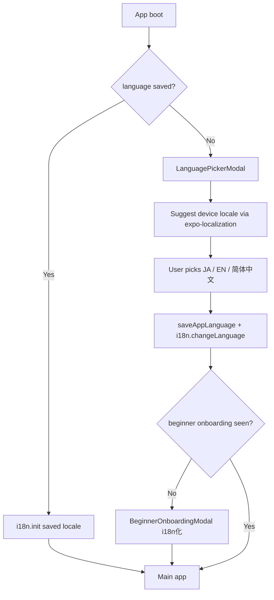

# Multi-Language (i18n) Design Audit Report

**監査日:** 2026-06-21  
**ブランチ:** `cursor/top3-maxdd-capital-audit`  
**HEAD（監査時）:** `6e4b1ed`  
**対象言語:** 日本語（デフォルト）· English · 简体中文  
**スコープ:** 設計監査のみ（**実装 · UI 変更 · 新機能追加なし**）

---

## 1. エグゼクティブサマリー

| 項目 | 結論 |
|------|------|
| **現状** | i18n ライブラリ **未導入** · UI 文言は **日本語ハードコード主体** |
| **AI 応答** | システムプロンプト · ヒント類は **日本語固定**（`*_JA` 定数 · `buildConciergeChatInstructions`） |
| **推奨スタック** | **expo-localization** + **i18next** + **react-i18next** |
| **デフォルト言語** | **ja**（要件どおり） |
| **AI 言語方針** | **UI 言語に追随**（EN UI → EN 応答 · zh UI → 简体中文応答） |
| **Play IT MVP 工数** | **約 15–22 人日**（Standard 6 タブ + Settings + Rakuten Import + ナビ + エラー + AI プロンプト切替） |
| **フル UI 工数** | **約 45–65 人日**（forwardValidation / Pro 監査パネル除く） |

---

## 2. ハードコード監査

### 2.1 計測方法

`src/**/*.tsx` を対象に、Unicode 範囲 `\u3040–\u9FFF`（ひらがな · カタカナ · CJK）を含む **行** を ripgrep 相当スクリプトで集計（2026-06-21）。

| 指標 | 件数 |
|------|------|
| **日本語を含む TS/TSX ファイル数** | **1,195** |
| **日本語を含む行数（総計）** | **11,645** |
| **うち forwardValidation 系** | **1,358 行**（Pro / 研究向け · **i18n Phase 3 以降推奨**） |
| **Play IT 除外後（forwardValidation 除く）** | **~10,287 行** |

> 「ハードコード箇所数」は **行ベース**。1 行に複数 UI 文字列が含まれる場合あり。  
> 完全な **ユニーク UI 文字列数** は 2,500–4,000 件規模と推定（constants 集約分含む）。

### 2.2 ディレクトリ別内訳

| バケット | 日本語行数 | i18n 優先度 |
|----------|-----------|-------------|
| `src/constants/` | **2,088** | 高（集約済み · 移行効率良） |
| `src/screens/` | **1,358** | 高 |
| `src/components/` | **1,095** | 高 |
| `src/services/`（forwardValidation 除く） | **~3,633** | 中（ユーザー向け error / toast のみ Phase 1） |
| `src/navigation/` | **74** | **最高**（全画面共通） |
| `src/services/rakutenImport/` + Import UI | **207** | 高（Play 直近機能） |
| Concierge / AI プロンプト関連 | **~457** | 高（UI + **AI 言語追随**） |
| forwardValidation + Forward*Panel | **1,358** | 低（Pro · 後回し） |
| その他 services / utils | **~4,991** | 低〜中 |

### 2.3 ユーザー指定カテゴリ別（Play IT コア）

| カテゴリ | 主要ファイル | 日本語行（概算） | 備考 |
|----------|-------------|-----------------|------|
| **ナビゲーション** | `beginnerTabNavigatorConfig.ts` · `MainTabNavigator.tsx` · `RootNavigator.tsx` | **74** | タブ名 · Stack title |
| **Home** | `HomeScreen.tsx` + beginner cards | **37+** | 数値 `toLocaleString('ja-JP')` 多数 |
| **Portfolio** | `PortfolioScreen.tsx` · `HoldingCard.tsx` | **28+** | カード · 損益ラベル |
| **Stock Check** | `MaterialAnalysisScreen.tsx` | **79** | Standard タブ名「銘柄チェック」 |
| **AI Concierge** | `AiAssistantChat.tsx` · `ConciergeTabScreen.tsx` · `constants/aiStrategy.ts` | **37+2+80** | UI + ステータス文言 |
| **Settings** | `SettingsScreen.tsx` · `AiSettingsScreen.tsx` · sub-settings | **397+** | UX モード UI と同パターンで言語追加可 |
| **Rakuten Import** | 3 screens + `rakutenImport/*` + `ConciergeImportActionCard` | **207** | 確認文 · エラー · NL パーサー出力 |
| **エラーメッセージ** | services 横断 | **~616 行**（error/失敗/エラー キーワード含む行） | うちユーザー表示 ~200–300 件推定 |

**Play IT コア 13 ファイル直接合計:** **~556 行**（最小スコープの下限）

### 2.4 既存の文言集約パターン（移行資産）

| パターン | 例 | i18n 移行 |
|----------|-----|-----------|
| `*Ja.ts` / `*_JA` 定数 | `appUxMode.ts` · `aiStrategy.ts` · `disclaimers.ts` | **キー化しやすい** |
| インライン JSX 文字列 | 各 Screen | `t('key')` へ置換 |
| `toLocaleString('ja-JP')` | Home · Portfolio · Rakuten Import | `Intl` + locale 引数 |
| AI プロンプト `*_PROMPT_JA` | `aiPersonalityGuard.ts` · `aiContextBuilder.ts` | ロケール別 instructions ブロック |
| Beginner やさしい日本語 | `sanitizeBeginnerPlainJa.ts` | **ja 専用** · en/zh は別 simplifier またはスキップ |

### 2.5 現状 i18n インフラ

| 項目 | 状態 |
|------|------|
| `i18next` / `react-i18next` | **未インストール** |
| `expo-localization` | **未インストール** |
| `@sta/app_language` 等の storage key | **なし** |
| 言語設定 UI | **なし** |
| 参考実装 | `AppUxModeContext` + `@sta/app_ux_mode_v1`（**言語設定の設計テンプレート**） |

---

## 3. i18n ライブラリ選定

### 3.1 候補比較

| ライブラリ | 役割 | メリット | デメリット | 判定 |
|-----------|------|----------|-----------|------|
| **expo-localization** | 端末ロケール取得 · 通貨/日付の地域 | Expo SDK 54 公式 · 軽量 | **翻訳管理は不可** | ✅ 採用（補助） |
| **i18next** | 翻訳リソース · 複数形 · 補間 · fallback | エコシステム最大 · RN 実績 | 初期設定必要 | ✅ 採用（コア） |
| **react-i18next** | `useTranslation` · Suspense | React 標準パターン | Provider 必須 | ✅ 採用（UI 層） |

### 3.2 推奨構成

```
expo-localization  →  初回起動時の「端末言語の提案」
        ↓
    i18next        →  ja / en / zh-Hans リソース · fallback: ja
        ↓
 react-i18next     →  Screen / Component
```

**採用理由:**

1. **expo-localization のみ**では JSON 管理 · 動的切替 · AI 連携が不足  
2. **i18next + react-i18next** は React Native / Expo コミュニティ標準  
3. 既存 `AppUxModeContext` と同様に **Context + AsyncStorage** で永続化可能  
4. AI instructions は i18next の `language` 変更イベントで **プロンプトブロック差替**可能

**非推薦:** 自前 Dictionary · Expo のみ · ICU MessageFormat 単体

### 3.3 依存追加（実装時 · 参考）

```json
{
  "expo-localization": "~16.x",
  "i18next": "^24.x",
  "react-i18next": "^15.x"
}
```

`app.json` plugins に `expo-localization` を追加（実装フェーズ）。

---

## 4. i18n 構成（提案）

### 4.1 ディレクトリ

```
src/i18n/
  index.ts                 # initI18n(), changeAppLanguage()
  config.ts                # supportedLocales, defaultLocale: 'ja'
  storage.ts               # load/save AppLanguage → AsyncStorage
  resources/
    ja/
      common.json
      navigation.json
      home.json
      portfolio.json
      stockCheck.json
      concierge.json
      settings.json
      rakutenImport.json
      errors.json
      aiPrompts.json       # AI instructions（サーバー送信 · UI非表示）
    en/   …（同上）
    zh-Hans/ …（同上）
  types.d.ts               # i18next 型安全キー（任意 · Phase 2）
```

### 4.2 翻訳キー構造（命名規約）

**形式:** `{namespace}.{section}.{element}`

```json
// ja/navigation.json
{
  "tab": {
    "home": "ホーム",
    "portfolio": "保有銘柄",
    "stockCheck": "銘柄チェック",
    "aiConsult": "AI相談",
    "settings": "設定"
  },
  "stack": {
    "rakutenImportConfirm": "取引内容の確認"
  }
}
```

```json
// ja/errors.json
{
  "network": {
    "timeout": "通信がタイムアウトしました。",
    "offline": "ネットワークに接続できません。"
  },
  "rakutenImport": {
    "ocrNoApiKey": "OpenAI APIキーが設定されていません。"
  }
}
```

```json
// ja/aiPrompts.json（UI 非表示 · OpenAI instructions 用）
{
  "concierge": {
    "responseLanguageRule": "Always respond in Japanese. Match the user's UI language.",
    "systemCore": "…"
  }
}
```

### 4.3 コード利用例（設計 · 未実装）

```tsx
// Screen
const { t } = useTranslation('home');
<Text>{t('summary.holdingsCount', { count: holdings.length })}</Text>

// 動的タブ名（beginnerTabNavigatorConfig 置換）
tabTitleForAppUxMode(mode, route) → t(`navigation:tab.${routeKey}`)
```

### 4.4 数値 · 日付

| 現状 | 移行 |
|------|------|
| `toLocaleString('ja-JP')` 直書き | `formatCurrency(amount, i18n.language)` ユーティリティ |
| `formatDateTimeJa.ts` | `formatDateTime(iso, locale)` に一般化 |

**locale マップ:**

| App language | Intl locale | OpenAI 応答言語 |
|--------------|-------------|----------------|
| `ja` | `ja-JP` | Japanese |
| `en` | `en-MY` または `en-US` | English |
| `zh-Hans` | `zh-CN` | Simplified Chinese |

---

## 5. 翻訳対象分類（実装フェーズ計画）

| Phase | 対象 | ファイル規模 | 備考 |
|-------|------|-------------|------|
| **P0** | i18n init · storage · Provider | 新規 ~10 ファイル | インフラ |
| **P1** | ナビゲーション | 74 行 | 全画面即効 |
| **P1** | Home · Portfolio · Stock Check · Concierge UI · Settings | ~550 行 | Play IT スクショ整合 |
| **P1** | Rakuten Import UI + user-facing errors | ~207 + α | OCR / NL 確認文 |
| **P1** | 共通 errors（toast / Alert） | ~200 件 | `errors.json` |
| **P2** | AI prompts（concierge · material · beginner） | ~457 行 | §6 言語追随 |
| **P2** | constants/*Ja 一括移行 | ~2,088 行 | キー化 |
| **P3** | 残 screens / components | ~2,000+ 行 | Pro タブ · 副次画面 |
| **P4** | forwardValidation / 監査パネル | 1,358 行 | **任意 · 英語のみでも可** |

**Play Internal Testing 公開時の最小:** **P0 + P1 + P2（Concierge プロンプトのみ）**

---

## 6. 初回言語選択フロー（設計）

### 6.1 タイミング

| 条件 | 動作 |
|------|------|
| `@sta/app_language_v1` **未保存** | 初回言語モーダル表示 |
| 保存済み | スキップ · 保存言語で `i18n.changeLanguage()` |
| デフォルト | **`ja`**（端末 locale 自動適用は **しない** · 提案のみ） |

### 6.2 UX フロー



### 6.3 LanguagePickerModal（新規 · 設計）

| 要素 | 内容 |
|------|------|
| タイトル | 3 言語で表示（言語名はネイティブ表記） |
| 選択肢 | 日本語 · English · 简体中文 |
| 提案 | `expo-localization.getLocales()[0]` が en/zh/ja なら「おすすめ」バッジ |
| Primary CTA | 「続ける / Continue / 继续」 |
| Skip | **なし**（初回は必須選択 · 1 タップ） |
| testID | `language-picker-modal` |

### 6.4 永続化

| Key | 値 |
|-----|-----|
| Storage | `@sta/app_language_v1` |
| Type | `'ja' \| 'en' \| 'zh-Hans'` |
| Context | `AppLanguageContext`（`AppUxModeContext` と同構造） |

---

## 7. 設定画面からの変更（設計）

### 7.1 配置

**SettingsScreen** → 新セクション **「言語 / Language / 语言」**（UX モードセクションの **直上または直下**）

| UI 要素 | 仕様 |
|---------|------|
| 表示 | 3 行リスト · 現在選択にチェック（UX モード UI と同一パターン） |
| 変更時 | `changeAppLanguage(locale)` → AsyncStorage → `i18n.changeLanguage()` |
| 確認ダイアログ | **不要**（即時反映） |
| AI への影響 | 次回 Concierge 送信から新 instructions（§8） |
| タブ再描画 | `MainTabNavigator` key={language} または navigation reset |

### 7.2 設定変更フロー

```
Settings → Language row tap
  → saveAppLanguage('en')
  → i18n.changeLanguage('en')
  → event: APP_LANGUAGE_CHANGED（AI context rebuild）
  → Tab labels / Stack titles 再レンダー
```

---

## 8. AI コンシェルジュ応答言語（設計）

### 8.1 方針（要件）

| UI 言語 | AI 応答言語 |
|---------|------------|
| 日本語 | **日本語** |
| English | **English** |
| 简体中文 | **简体中文** |

**原則:** ユーザーが別言語で入力しても、**応答は UI 言語に合わせる**（混在防止）。  
例外: ユーザーが明示「日本語で答えて」と要求した場合のみそのターン限り override（Phase 2 以降）。

### 8.2 現状（監査）

| 箇所 | 状態 |
|------|------|
| `buildConciergeChatInstructions()` | `AI_*_PROMPT_JA` のみ連結 |
| `aiContextBuilder.ts` | `conversationModeHintJa` · `modeLabelJa` 固定 |
| `buildEphemeralApiUserPayload()` | `ephemeralNotice` 日本語固定 |
| `naturalLanguageTransactionParser` | 確認文日本語生成 |
| OpenAI user payload | `question` はユーザー入力言語のまま |

### 8.3 設計変更点（実装時）

**1. Instructions ロケール切替**

```typescript
// 設計案
function buildConciergeChatInstructions(
  explanationLevel: AiExplanationLevel,
  analysisMode?: AiAnalysisMode,
  locale: AppLanguage = 'ja',
): string {
  return [
    tAiPrompt(locale, 'concierge.systemCore'),
    buildAnalysisModeInstructions(mode, locale),
    RESPONSE_LANGUAGE_RULE[locale],  // ★ 最重要
    tAiPrompt(locale, 'concierge.specificityBlock'),
    AI_NO_USER_LEARNING_POLICY,      // 英語固定でも可（内部ポリシー）
  ].join('\n\n');
}

const RESPONSE_LANGUAGE_RULE = {
  ja: 'すべての回答は日本語で記述すること。UI言語は日本語。',
  en: 'Write all responses in English. UI language is English.',
  'zh-Hans': '所有回答必须使用简体中文。UI语言为简体中文。',
};
```

**2. Context payload**

| フィールド | 変更 |
|-----------|------|
| `conversationModeHintJa` | → `conversationModeHint`（locale 別） |
| `modeLabelJa` | → `modeLabel` |
| `ephemeralNotice` | locale 別 JSON |

**3. 材料分析 · NL Import · OCR 確認**

| 機能 | 対応 |
|------|------|
| Material analysis AI | instructions に `RESPONSE_LANGUAGE_RULE` 追加 |
| Rakuten NL parser 確認文 | `t('rakutenImport.confirm.deposit', { amount })` |
| OCR error messages | 既存 `errors.json` |

**4. Beginner やさしい文言**

| locale | 方針 |
|--------|------|
| ja | 現行 `sanitizeBeginnerPlainJa` 維持 |
| en | 短い Plain English（新規 `sanitizeBeginnerPlainEn`） |
| zh-Hans | 简体平易化（新規 · または Phase 2 で ja/en のみ） |

### 8.4 テスト観点（実装後）

- [ ] EN UI → Concierge 返答が英語のみ  
- [ ] zh UI → 简体中文のみ  
- [ ] 設定途中変更 → 次メッセージから言語切替  
- [ ] Import 確認カードの言語整合  

---

## 9. 工数見積

| フェーズ | 内容 | 人日 | カレンダー目安 |
|--------|------|------|---------------|
| **P0 インフラ** | expo-localization · i18next · Provider · storage · LanguagePicker | **3–5** | 1 週 |
| **P1 Play IT UI** | Nav · Home · Portfolio · Stock Check · Concierge UI · Settings · Rakuten Import · errors | **10–14** | 2–3 週 |
| **P2 AI 言語追随** | instructions ロケール化 · context builder · NL/OCR 確認文 | **4–6** | 1 週 |
| **P3 残 UI** | 副次 screens · constants 移行 · 日付/通貨 util | **15–22** | 3–4 週 |
| **P4 Pro/監査** | forwardValidation パネル | **8–12** | 任意 |
| **翻訳作業** | en · zh-Hans 原稿（開発外注 / Owner） | **5–8** | 並行 |
| **QA** | 3 言語 × Standard モード smoke | **3–5** | 1 週 |

| スコープ | 合計人日 |
|----------|---------|
| **Play IT 最小（P0+P1+P2）** | **17–25 人日** |
| **一般公開 UI（P0–P3）** | **35–52 人日** + 翻訳 |
| **フル（P4 含む）** | **45–65 人日** + 翻訳 |

**1 人開発想定:** Play IT 対応 **約 4–5 週** · フル UI **約 10–14 週**

---

## 10. リスク

| # | リスク | 影響 | 緩和 |
|---|--------|------|------|
| R1 | **AI 応答品質**（en/zh の金融用語） | 高 | プロンプトに glossary 添付 · 用語集 JSON |
| R2 | **scope creep**（1.1 万行 · 1195 ファイル） | 高 | Phase 厳守 · forwardValidation 除外 |
| R3 | **Play スクショ言語** | 中 | 掲載言語（EN）と UI デフォルト（ja）の差を Store 説明で明記 |
| R4 | **toLocaleString 散在** | 中 | 早期に `formatCurrency` ユーティリティ |
| R5 | **zh-Hans 翻訳コスト** | 中 | Phase 1 は ja/en のみ · zh は Phase 1.5 |
| R6 | **タブ名変更時の navigation state** | 低 | language を navigator key に |
| R7 | **既存 E2E / device scripts** | 中 | 日本語 testID 維持 · ラベルは locale 別 snapshot |
| R8 | **Beginner モード二重メンテ** | 中 | en/zh は Standard 同等文案で開始可 |

---

## 11. 推奨ロードマップ

| 順序 | マイルストーン | 完了条件 |
|------|---------------|----------|
| 1 | P0 インフラ + LanguagePicker + Settings 言語 | 3 言語切替 · 永続化 |
| 2 | P1 Play IT 6 画面 + Nav + Import | スクショ言語版取得可能 |
| 3 | P2 AI 言語追随 | EN/zh UI で AI 応答一致 smoke PASS |
| 4 | Play Internal Testing（i18n 無関係 · 並行可） | 現行 ja UI のまま IT 投入可 |
| 5 | P3 残 UI | Open Beta 前 |

> **Play IT 投入は i18n 完了を待たない**（`PLAY_CONSOLE_SUBMISSION_PACKAGE.md` 方針と整合）。  
> i18n は **Open Beta / Production 前** の必須項目として計画。

---

## 12. GitHub commit hash · push 結果

| 項目 | 値 |
|------|-----|
| **Commit** | `1c280dc` — Add multi-language i18n design audit report. |
| **Branch** | `cursor/top3-maxdd-capital-audit` |
| **Push** | **success** — `6e4b1ed..1c280dc` → `origin/cursor/top3-maxdd-capital-audit` |

---

## 13. 参照

| ファイル | 用途 |
|----------|------|
| `src/navigation/beginnerTabNavigatorConfig.ts` | タブラベル |
| `src/context/AppUxModeContext.tsx` | 設定永続化テンプレート |
| `src/services/aiPersonalityGuard.ts` | AI instructions 組立 |
| `src/services/aiContextBuilder.ts` | Concierge context |
| `src/components/beginner/BeginnerOnboardingModal.tsx` | 初回 UX テンプレート |
| `docs/review/GOOGLE_PLAY_STORE_LISTING_MATERIALS_REPORT.md` | 現状「日本語中心」記載 |

---

**本レポートは設計監査のみ。実装 · UI 変更 · 依存追加は別タスクで承認後に実施。**
