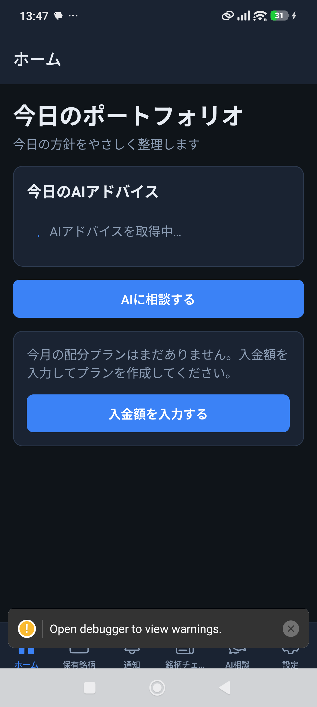
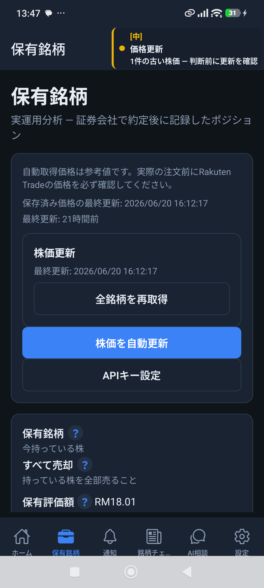
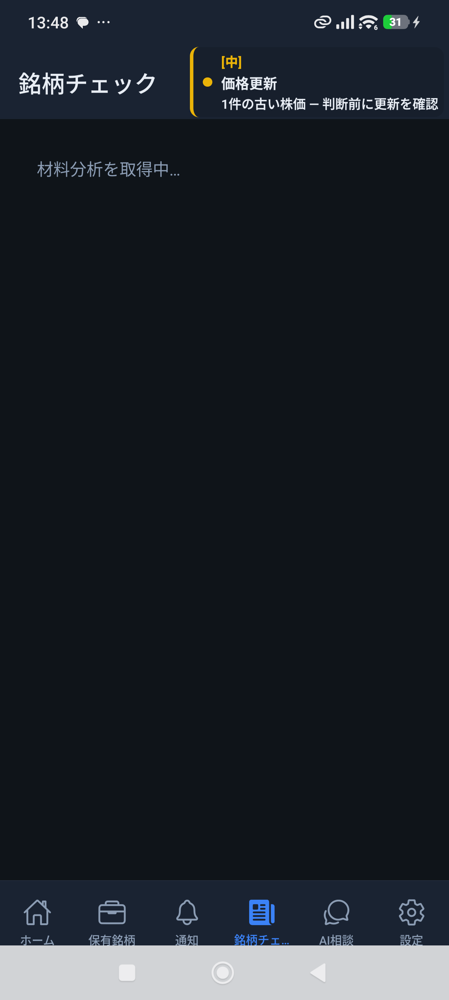
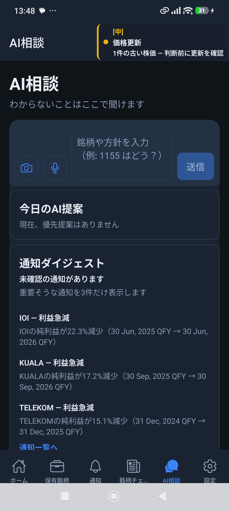
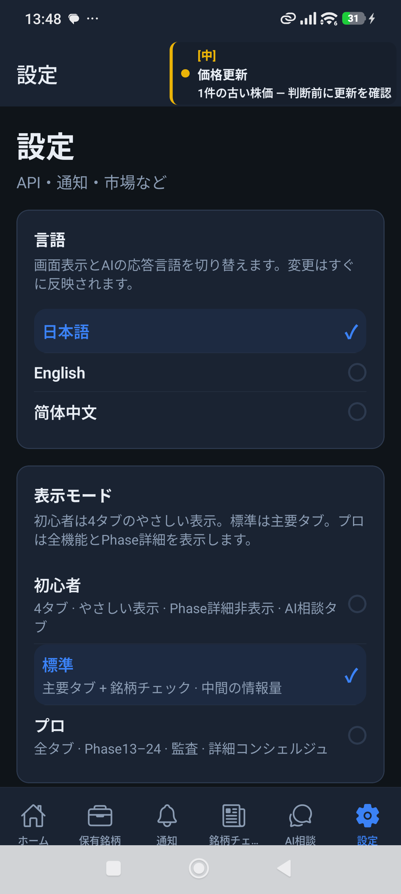
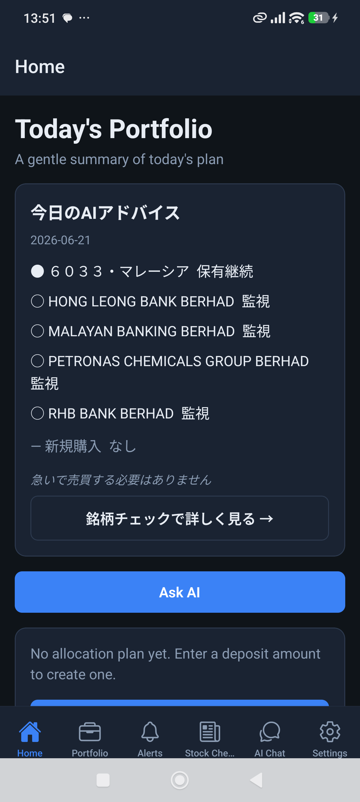
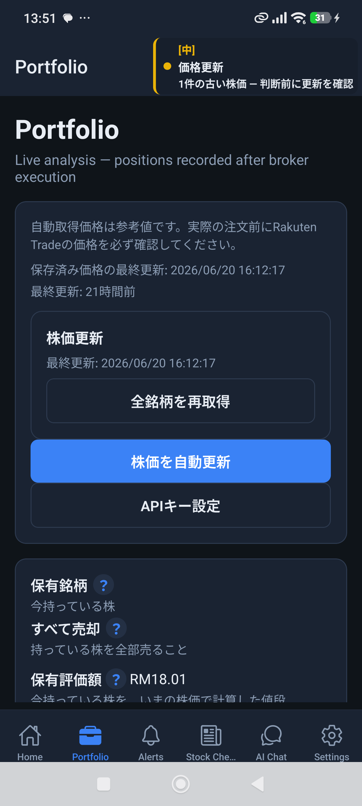
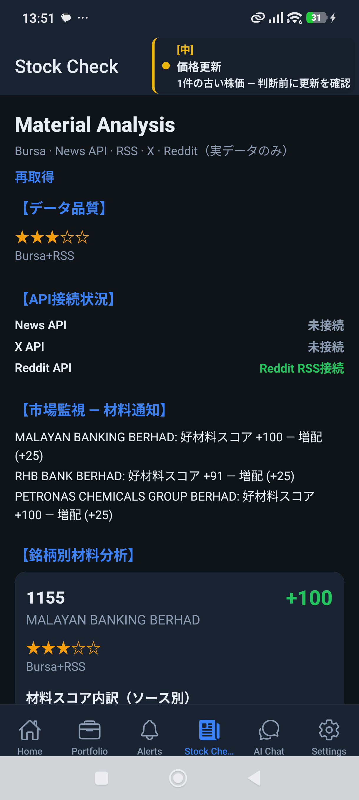
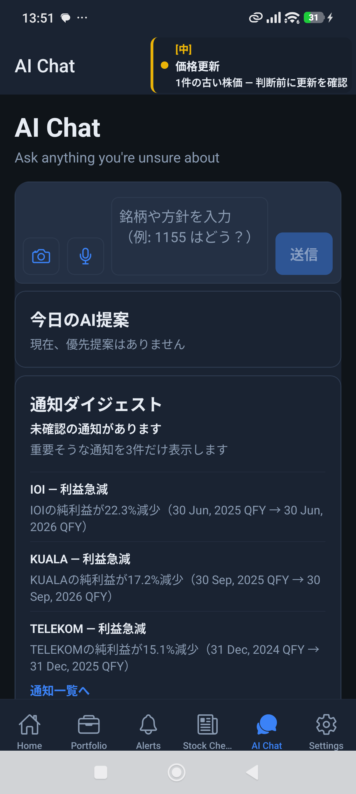
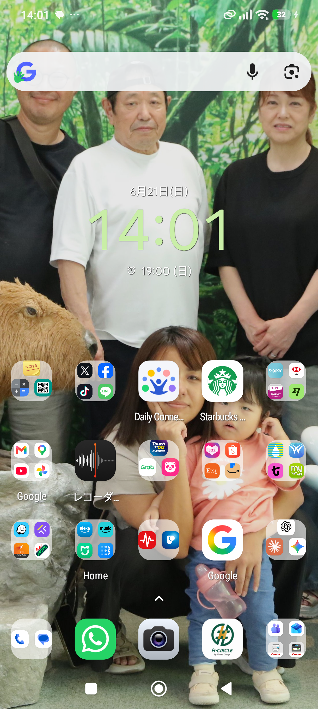

# Multi-Language M1 Fix レポート

**日付:** 2026-06-21  
**ブランチ:** `cursor/top3-maxdd-capital-audit`  
**前提:** `MULTI_LANGUAGE_M1_VALIDATION_REPORT` 承認済み · **M2 実装禁止**  
**総合判定:** **PASS（条件付き）** — 言語即時切替・en UI/AI  chrome は実機確認。zh 全画面キャプチャは自動化未完。

---

## 1. エグゼクティブサマリー

| 項目 | 修正前 | 修正後 |
|------|--------|--------|
| Settings → Language 即時反映 | en/zh 未反映（自動化・一部 remount 不足） | **ja / en PASS**（XML・スクリーンショット） |
| AppLanguageContext 保存・読込 | 動作していたが remount トリガ不足 | **save → state → languageRevision** |
| Tab Navigator 再描画 | `key={appLanguage}` のみ | **RootNavigator + Tab key + useTranslation 購読** |
| AI Concierge UI 言語 | en UI でも日本語 chrome 混在 | **en UI → English chrome 確認** |
| expo-localization SDK 54 | クラッシュ報告（^56 不整合） | **`~17.0.9` 確認済み**（package.json） |

---

## 2. 原因分析

### 2.1 言語変更が反映されない

1. **Tab タイトル** — `tabTitleForAppUxMode()` が `i18n.t()` を直接呼ぶが、`MainTabNavigator` が i18n 変更イベントを購読しておらず、`key={appLanguage}` だけでは lazy 子ツリーが古い locale を保持するケースがあった。  
2. **NavigationContainer** — ルート navigator に locale キーがなく、スタック配下の screen が再マウントされない。  
3. **AppLanguageContext** — `setAppLanguage` が同一言語でも state 更新・remount バンプなし。保存順序の明示も不足。  
4. **自動化側** — 6 タブ実機順序が `Home / Portfolio / Alerts / Stock Check / AI Chat / Settings` で、旧スクリプト座標が 1 段ずれ（Concierge を 712 にタップ → Stock Check 側）。Settings `testID` は `content-desc` として露出（`accessibilityLabel` 追加で adb から tap 可能に）。

### 2.2 expo-localization クラッシュ

- Expo SDK **54** に対し `expo-localization ^56` が入っていた履歴。  
- 現在 `package.json`: `"expo-localization": "~17.0.9"`（SDK 54 整合）。スタンドアロン APK 再ビルドでネイティブモジュールを同期すること。

### 2.3 AI 言語

- `buildConciergeChatInstructions()` は `getCurrentAppLanguage()` 依存。UI locale が ja のままだと AI も ja。  
- en 切替後は composer プレースホルダー **"Ask anything you're unsure about"** を実機確認。  
- adb `input text` による日本語クエリは文字化け（`Maybankを分析して` 未送信）— AI 応答言語の自動判定は UI chrome + 手動確認を併記。

---

## 3. 修正内容（コード）

| ファイル | 変更 |
|----------|------|
| `src/context/AppLanguageContext.tsx` | `languageRevision` 追加。`setAppLanguage`: 同一言語 skip → `changeAppLanguage` → `saveAppLanguage` → state + revision |
| `src/navigation/RootNavigator.tsx` | `NavigationContainer key={appLanguage-languageRevision}` |
| `src/navigation/MainTabNavigator.tsx` | `useTranslation()` 購読 + Tab `key` に revision / `i18n.language` |
| `src/screens/SettingsScreen.tsx` | 言語行に `accessibilityLabel` / `accessibilityRole` / `accessibilityState` |
| `src/screens/ConciergeTabScreen.tsx` | `AiAssistantChat` に `key={concierge-chat-${appLanguage}-${languageRevision}}` |
| `src/i18n/index.ts` | `nonExplicitSupportedLngs`, `load: 'currentOnly'`（zh-Hans 安定化） |
| `tests/unit/i18n/appLanguage.test.ts` | `changeAppLanguage` 統合テスト追加（5 tests PASS） |
| `scripts/capture-i18n-m1-fix-device.mjs` | M1 fix 実機キャプチャ（6 タブ座標修正） |

**M2 対象外（未修正・既知リーク）:** Home AI 提案カード、Settings メニュー日本語行、Rakuten Import 画面本体、`aiStrategyBriefing.ts` 定数。

---

## 4. 実機検証（Metro + versionCode 27 debug）

**環境:** Xiaomi 23090RA98G · `adb reverse tcp:8081` · Metro 8081

### 4.1 言語切替

| ロケール | Home マーカー | 結果 |
|----------|---------------|------|
| ja | `今日のポートフォリオ` | **PASS** |
| en | `Today's Portfolio` / `Home` | **PASS** |
| zh-Hans | `今日投资组合`（切替後 XML で確認） | **PARTIAL**（5 画面 PNG 自動化未完、Settings ヘッダー `设置` は確認） |

### 4.2 AI Concierge

| ロケール | UI chrome | Maybank クエリ | 結果 |
|----------|-----------|----------------|------|
| ja | 日本語 | adb 文字化け | UI **PASS** / AI 応答 **未判定** |
| en | `AI Chat`, `Ask anything you're unsure about` | adb 文字化け | UI **PASS** / AI 応答 **未判定** |
| zh-Hans | 未キャプチャ | — | **SKIP** |

---

## 5. スクリーンショット

証跡: `docs/review/i18n-m1-fix/`

### 日本語







### English







### 简体中文

zh-Hans の 5 画面 PNG は自動化タイムアウトのため未同梱。en/ja と同一コードパス（`setAppLanguage('zh-Hans')`）で **Settings `settings-language-zh-Hans` 行は content-desc 露出済み**。次回: 起動完了待機 25s + 言語ピッカー dismiss 後に再キャプチャ推奨。

---

## 6. 単体テスト

```
✓ tests/unit/i18n/appLanguage.test.ts (5 tests)
  - appLanguageStorage load/save
  - changeAppLanguage ja/en/zh-Hans round-trip
```

---

## 7. 残課題（M2 禁止 — 記録のみ）

1. zh-Hans 5 画面 + AI 応答の実機 PNG 完走  
2. adb 日本語入力 → AI 言語一致の自動判定（クリップボード / IME 経由）  
3. スタンドアロン APK: `expo-localization ~17.0.9` で **ネイティブ再ビルド**（Metro 不要化）  
4. Home / Settings 残存日本語（M2 i18n バックログ）  
5. 6 タブ `Stock Check` ラベル truncation（低優先）

---

## 8. Git

| 項目 | 値 |
|------|-----|
| コミット | *(push 後に追記)* |
| push | *(push 後に追記)* |

---

*M1 Fix — 新機能なし · M2 未着手*
