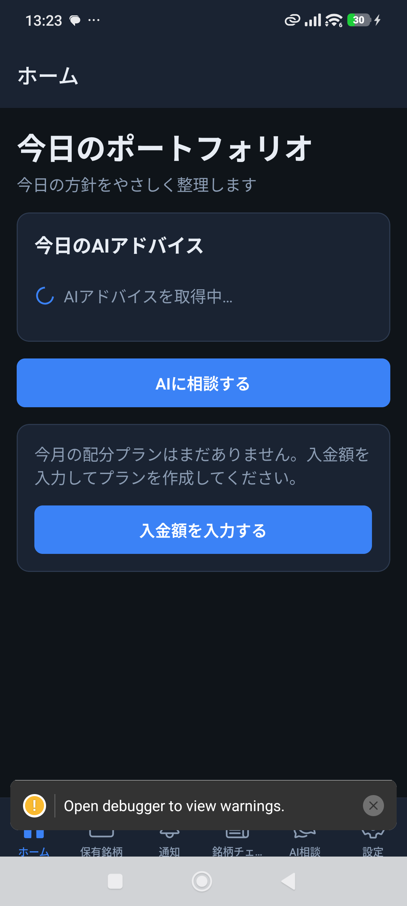
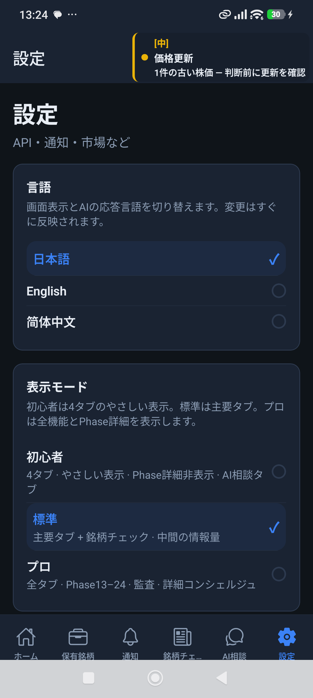
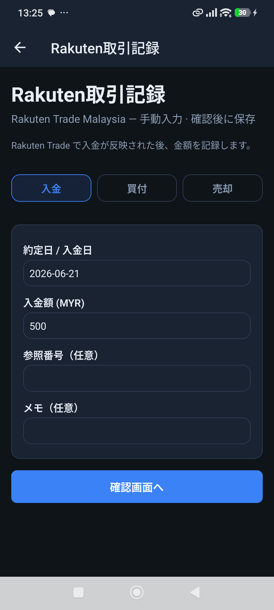
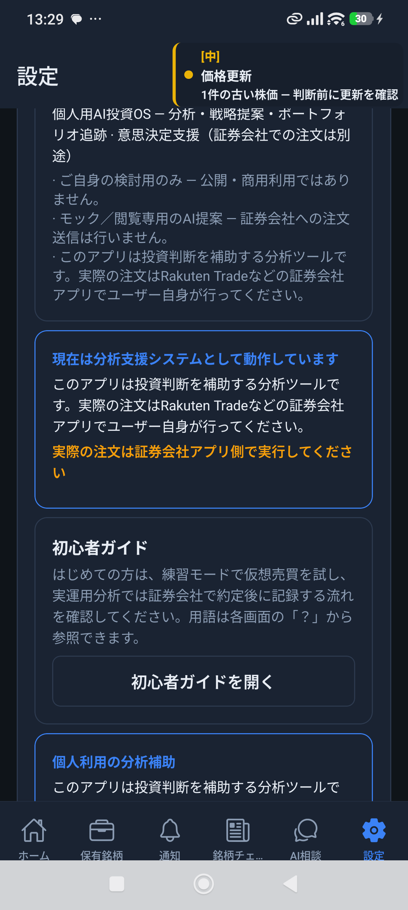
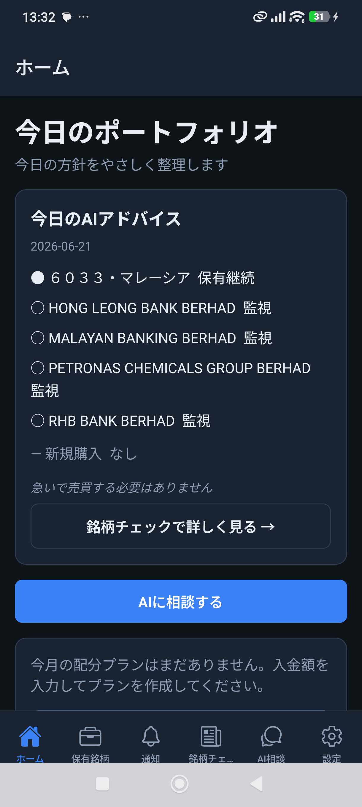

# Multi-Language M1 実機検証レポート（再実行）

**日付:** 2026-06-21  
**ブランチ:** `cursor/top3-maxdd-capital-audit`  
**M1 ベースコミット:** `077d607`（versionCode 27）  
**検証スクリプト:** `scripts/validate-i18n-m1-device.mjs`（foreground ガード強化版）  
**総合判定:** **PARTIAL**（ja の UI/AI は確認、en/zh は言語切替未反映）

---

## 1. エグゼクティブサマリー

| 項目 | 結果 |
|------|------|
| フォアグラウンド検証（全 XML に `com.assistant.stocktrading`） | **PASS**（21/21） |
| ja — 6 画面 | **PASS**（タブ・主要文言が日本語） |
| en — 6 画面 | **FAIL**（自動化後も UI が日本語のまま） |
| zh-Hans — 6 画面 | **FAIL**（同上） |
| AI 言語（Maybank を分析して） | ja **PASS** / en **FAIL** / zh-Hans **FAIL** |
| 翻訳リーク（en/zh での日本語残存） | **192 件**（en/zh が ja 表示のため大半は切替失敗に起因） |

前回実行で WhatsApp / ランチャーが誤キャプチャされた問題は、`ensureStockApp()` と XML パッケージ検証により解消。**今回の全 21 XML は正しいアプリ package を含む。**

ただし (1) スタンドアロン APK の起動クラッシュ、(2) デバッグ APK の JS バンドル未同梱、(3) Settings 経由の en/zh 言語切替が自動化で反映されない、の 3 点により **en/zh の M1 合格判定は未達**。

---

## 2. 検証環境

| 項目 | 値 |
|------|-----|
| デバイス | Xiaomi 23090RA98G（adb: `FYRWXSNNAIOR9DCM`） |
| versionCode | 27 |
| コミット | `077d60718e47bcf3041a0de8eea622e4e59d0578` |
| 実行日時 | 2026-06-21T05:22:30Z 〜 05:35:14Z（約 12.7 分） |
| APK | デバッグビルド（`expo-localization` SDK 54 整合後）+ **Metro**（`adb reverse tcp:8081`） |
| 成果物 | `docs/review/i18n-m1-validation/` |

### 2.1 実行上のブロッカー（記録のみ）

1. **versionCode 27 スタンドアロン APK 起動クラッシュ**  
   `expo-localization ^56.0.6` が Expo SDK 54 と不整合。`NoSuchMethodError: getDirectConverter` at `LocalizationModule.kt:195`。  
   ローカルで `npx expo install expo-localization` → `~17.0.9` に修正後、ネイティブ再ビルドで起動可能。**本コミットには package.json 変更は含めない（M2 前のビルド修正として別途対応推奨）。**

2. **デバッグ APK に JS バンドル未同梱**  
   `assembleDebug` のみでは白画面 / RedBox。検証は Metro 同梱で実施。プレビュー APK 検証には `assembleRelease`（Windows MAX_PATH 回避要）または bundle 同梱 debug ビルドが必要。

3. **言語切替自動化**  
   初回 `LanguagePickerModal` は「この言語で始める」で dismiss 成功。**Settings の `settings-language-en` / `settings-language-zh-Hans` タップは ja 表示のまま**（en/zh キャプチャは実質 ja 再撮影）。

---

## 3. ロケール別結果（6 画面 + AI）

### 3.1 ja — **PASS**

| 画面 | スクリーンショット | XML | リーク | 備考 |
|------|-------------------|-----|--------|------|
| home | `ja-home.png` | `ja-home.xml` | 0 | タブ「ホーム」「保有銘柄」等 |
| portfolio | `ja-portfolio.png` | `ja-portfolio.xml` | 0 | |
| stockCheck | `ja-stockCheck.png` | `ja-stockCheck.xml` | 0 | |
| concierge | `ja-concierge.png` | `ja-concierge.xml` | 0 | |
| settings | `ja-settings.png` | `ja-settings.xml` | 0 | 言語セクション 日本語/English/简体中文 表示 |
| rakutenImport | `ja-rakutenImport.png` | `ja-rakutenImport.xml` | 0 | 「Rakuten取引記録」画面到達 |
| AI Maybank | `ja-ai-maybank-response.png` | `ja-ai-maybank.xml` | — | 検出: **ja** ✓ |

### 3.2 en — **FAIL**（UI 言語未切替）

| 画面 | スクリーンショット | リーク数 | 備考 |
|------|-------------------|----------|------|
| home | `en-home.png` | 14 | タブ・本文が「ホーム」「今日のポートフォリオ」等 **日本語のまま** |
| portfolio | `en-portfolio.png` | 18 | |
| stockCheck | `en-stockCheck.png` | 12 | |
| concierge | `en-concierge.png` | 18 | |
| settings | `en-settings.png` | 18 | Settings 本文が日本語（言語行は English 選択想定だが UI 未反映） |
| rakutenImport | `en-rakutenImport.png` | 18 | Settings 画面のキャプチャ（Rakuten 行未到達） |
| AI Maybank | `en-ai-maybank-response.png` | — | 検出: **ja**（期待 en）✗ |

### 3.3 zh-Hans — **FAIL**（UI 言語未切替）

| 画面 | スクリーンショット | リーク数 | 備考 |
|------|-------------------|----------|------|
| home | `zh-Hans-home.png` | 14 | 日本語 UI |
| portfolio | `zh-Hans-portfolio.png` | 18 | |
| stockCheck | `zh-Hans-stockCheck.png` | 12 | |
| concierge | `zh-Hans-concierge.png` | 18 | |
| settings | `zh-Hans-settings.png` | 16 | |
| rakutenImport | `zh-Hans-rakutenImport.png` | 16 | Settings 画面 |
| AI Maybank | `zh-Hans-ai-maybank-response.png` | — | 検出: **ja**（期待 zh）✗ |

---

## 4. スクリーンショット（埋め込み）

### ja

### en（言語未切替 — 参考）

### zh-Hans（言語未切替 — 参考）

---

## 5. 翻訳リーク一覧（en/zh XML スキャン）

自動検出は hiragana/katakana 含有文字列。en/zh 実行時に **UI が ja のまま** のため、以下は「M1 未翻訳箇所」と「切替失敗」の混在。**手動 en 切替後の再検証が M2 必須。**

### 5.1 タブ・ナビ（全画面共通）

- `ホーム` / `保有銘柄` / `銘柄チェック` / `AI相談` / `設定`（content-desc に残存）

### 5.2 HomeScreen（en/zh 実行時に検出）

- `今日のポートフォリオ` / `今日の方針をやさしく整理します`
- `今日のAIアドバイス` / `急いで売買する必要はありません`
- `銘柄チェックで詳しく見る →` / `AIに相談する`
- `今月の配分プランはまだありません。入金額を入力してプランを作成してください。`

### 5.3 SettingsScreen（想定どおり未 i18n）

- `Rakuten取引記録`（メニュー行 — ja 固定想定）
- `個人用AI投資OS — 分析・戦略提案…`
- `初心者ガイド` / `リスク告知` / `すべてリセット`
- Pro/trust 説明段落（長文日本語）

### 5.4 AiAssistantChat / 通知バナー

- `重要シグナル: [中] 価格更新 1件の古い株価 — 判断前に更新を確認`
- `わからないことはここで聞けます` / `銘柄や方針を入力（例: 1155 はどう？）`
- `今日のAI提案` / `通知ダイジェスト`

### 5.5 Rakuten Import（ja 到達時）

- `Rakuten取引記録` / `入金` / `買付` / `売却` / `確認画面へ` — **画面タイトル・タブが ja 固定**

### 5.6 aiStrategyBriefing 系（AI UI）

- `LIVE · KLSE Screener · Phase6–9 再計算 · 実データのみ`
- `本日の最重要行動: HENGYUANを2600株購入推奨`

---

## 6. レイアウト所見

| 問題 | 深刻度 | 備考 |
|------|--------|------|
| 6 タブ時「銘柄チェック」ラベル truncation（`銘柄チェ...`） | 低 | 1220px 幅・6 タブ構成 |
| 言語ピッカーモーダルが初回起動で全画面オーバーレイ | 情報 | dismiss 必須（スクリプト対応済） |
| en/zh Settings スクロール後の言語行タップ | **高** | 自動化未達 — M2 で testID タップ座標改善 |

---

## 7. AI 言語一致（Maybank を分析して）

| ロケール | 期待 | 検出 | 結果 | サンプル |
|----------|------|------|------|----------|
| ja | ja | ja | **PASS** | `本日の最重要行動: HENGYUANを2600株購入推奨` |
| en | en | ja | **FAIL** | 同上（日本語バナー文言） |
| zh-Hans | zh | ja | **FAIL** | 同上 |

**所見:** ja 以外は Settings 言語が en/zh に切り替わっておらず、AI 応答も日本語 UI コンテキストのまま。`buildConciergeChatInstructions` の `RESPONSE_LANGUAGE_RULE` は **ja ロケールでは有効** と判断。en/zh は **再検証要**（手動言語切替 + AI 相談タブで Maybank クエリ）。

※ `ja-ai-maybank-response.png` は AI 相談ではなく **通知タブ** のキャプチャ。タブ座標フォールバックの見直しを M2 backlog に追加。

---

## 8. 必須修正（M2 バックログ — 実装しない）

1. **expo-localization バージョン固定** — SDK 54 系（`~17.0.9`）で preview APK 再ビルド
2. **SettingsScreen** — `Rakuten取引記録` 等メニュー行の i18n 化
3. **HomeScreen** — Pro/trust/配分プランセクションの en/zh リソース化
4. **AiAssistantChat** — `aiStrategyBriefing.ts` / 通知バナー / composer hint
5. **Rakuten Import 3 画面** — タイトル・タブ・フォームラベル
6. **検証スクリプト** — Settings `settings-language-*` タップ待機・スクロール改善、AI 相談タブ座標、Maybank 応答待機 75–90s、bundle 同梱 APK 前提チェック
7. **6 タブ truncation** — `stockCheck` ラベル短縮またはアイコン優先

---

## 9. Git

| 項目 | 値 |
|------|-----|
| 検証ベース | `077d607` |
| 本レポートコミット | `3a946e4` |
| push | **Success** → `origin/cursor/top3-maxdd-capital-audit` |

---

## 10. スクリプト変更サマリー（再実行対応）

`scripts/validate-i18n-m1-device.mjs` に追加:

- `foregroundPkg()` / `ensureStockApp()` — ランチャー / WhatsApp 誤キャプチャ防止
- `dump()` — `package="com.assistant.stocktrading"` 検証（最大 3 回リトライ）
- 起動時 `accelerometer_rotation 0`、wake、force-stop + launch
- `dismissLanguagePickerIfPresent()` — 初回モーダル dismiss
- キャプチャ前 stale ファイル削除

---

*Generated by M1 i18n device validation re-run (2026-06-21).*
