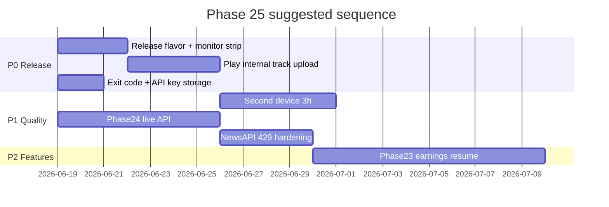

# Next Phase Recommendation

**Date:** 2026-06-19  
**Context:** HyperOS V15 12h validation **GO** (`20260618-202947`)  
**Branch:** `cursor/top3-maxdd-capital-audit`

---

## Recommended umbrella: **Phase 25 — Production Release Hardening**

Goal: move from validated preview APK on one HyperOS device to **Play Store internal testing** with live intelligence features and multi-device confidence.

---

## Prioritized implementation candidates

### P0 — Blockers for internal Play release

| # | Item | Rationale | Effort | Dependencies |
|---|------|-----------|--------|--------------|
| 1 | **Release build flavor** — strip `EXPO_PUBLIC_TWELVE_HOUR_TEST_MONITOR`, separate preview vs release signing | Test monitor must not ship to users | M | EAS/build config |
| 2 | **Google Play internal testing upload** — AAB, listing, privacy policy, data safety | Store gate for any external user | M | P0-1, listing materials |
| 3 | **Orchestrator exit code fix** — `process.exitCode=0` when all gates PASS | CI false-negative on long runs | S | None |
| 4 | **API key secure storage completion** (Commit24 remainder) | Keys must persist safely across reinstall | M | SecureStore audit |

### P1 — Quality gates before wider beta

| # | Item | Rationale | Effort | Dependencies |
|---|------|-----------|--------|--------------|
| 5 | **Second-device 3h screen-off run** (non-Redmi or stock Android) | Single-OEM risk | M | Device access |
| 6 | **Phase24 live analyst consensus API** — replace mock fixture with live fetch + error handling | Material analysis value prop incomplete offline | L | API source selection |
| 7 | **Phase24 device smoke** — 6-stock consensus UI on preview APK | Validates end-to-end after live API | S | P1-6 |
| 8 | **NewsAPI 429 hardening** — backoff, cache, quota telemetry | Known 429 under load | M | Prior diagnosis report |

### P2 — Feature depth and intelligence

| # | Item | Rationale | Effort | Dependencies |
|---|------|-----------|--------|--------------|
| 9 | **Phase23 earnings revision intelligence** — resume audit items | Prior phase partially staged | L | Phase23 audit report |
| 10 | **Bursa disclosure pipeline** (Phase13–16 split) | Regulatory news completeness | L | Dependency fix commit6 |
| 11 | **Adaptive runtime learning engine** | Long-term personalization | XL | Design doc exists |
| 12 | **Top-3 MaxDD capital audit** (branch theme) | Portfolio risk UX | M | Current branch scope |

### P3 — Operational excellence

| # | Item | Rationale | Effort | Dependencies |
|---|------|-----------|--------|--------------|
| 13 | **Automated logcat cleanup post-run** | 2+ GB per 12h run | S | Cleanup manifest pattern |
| 14 | **12h run playbook in CI** (optional scheduled nightly on farm device) | Regression catch for FGS/doze | L | Device farm |
| 15 | **HyperOS power audit diff tool** — compare audits across OS versions | OS update regression | S | Existing audit JSON |

---

## Suggested sprint sequence

---

## What NOT to do next

- **Do not** start another 12h run unless OS update or major FGS code change — evidence is sufficient for HyperOS V15.
- **Do not** expand mock-only Phase24 to users — live API first.
- **Do not** commit multi-GB logcat files — summaries + evidence JSON only.

---

## Decision requested

| Option | Description |
|--------|-------------|
| **A (Recommended)** | Phase 25 P0 → Play internal testing within 1–2 weeks |
| **B** | Continue feature depth (Phase23/24 live) before any store upload |
| **C** | Second-device validation only; defer store until Phase24 live |

---

## GitHub sync

_(filled after commit/push)_
