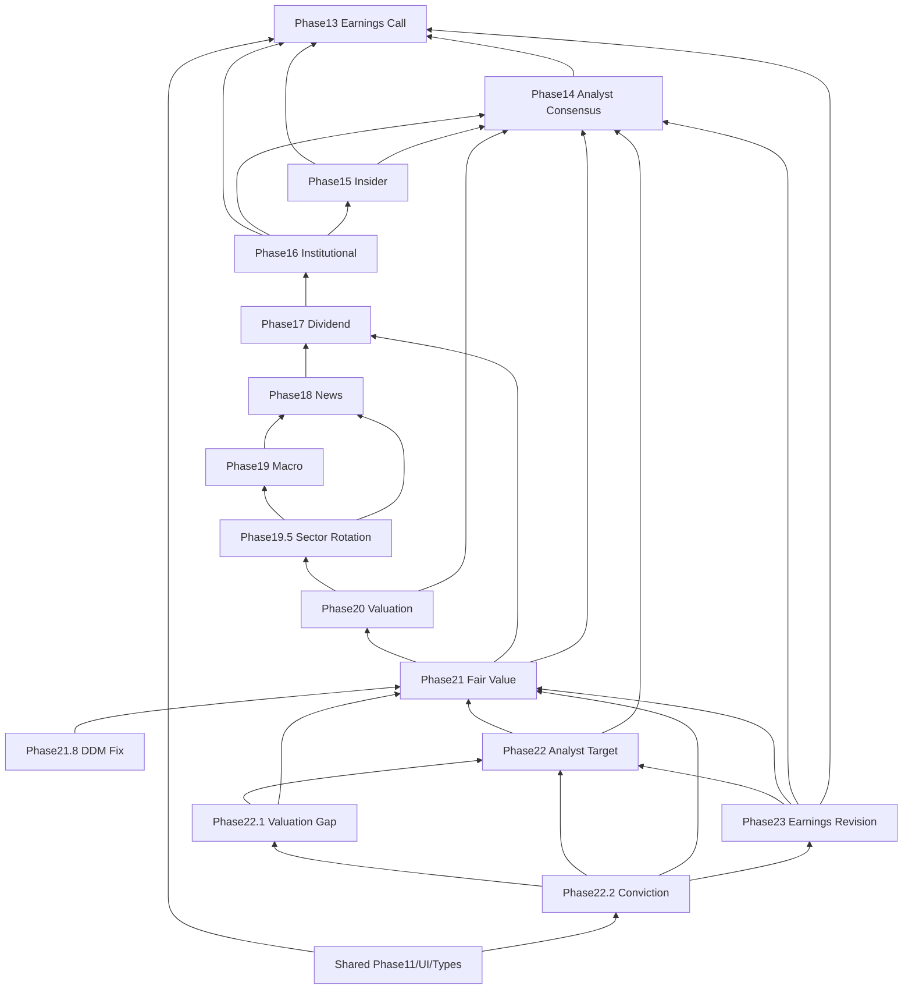

# Phase13–23 Commit Strategy Report

監査日: 2026-06-02  
現状 HEAD: `44f1a2b`（Phase23 先行コミット済み・**push 未実施**）  
方針: **本レポート時点では commit / push 禁止** — 保存戦略の設計のみ

---

## エグゼクティブサマリー

| 項目 | 値 |
|------|-----|
| working tree 総数 | **855**（除外 215 + Phase外 471 + Phase関連 **169**） |
| Phase13–23 関連ファイル | **169** |
| 未コミット候補（Phase関連） | **約 151**（docs 含む） |
| 既コミット（`44f1a2b` 内） | **20**（Phase23/22.2/配線） |
| **推奨コミット数** | **5〜6**（+ docs 任意 1） |
| **最終戦略** | **`44f1a2b` を一旦解消 → Phase順コミット → 一括 push** |

---

## 1. Phase別件数

### 1.1 変更ファイル数（src / test / script / doc 合計）

| Phase | 総ファイル | src+test+script | docs等 | 未コミット候補 | 既コミット(`44f1a2b`) | 依存Phase |
|-------|-----------|-----------------|--------|---------------|---------------------|-----------|
| **Phase13** | 16 | 10 | 6 | **16** | 0 | — |
| **Phase14** | 7 | 5 | 2 | **7** | 0 | 13 |
| **Phase15** | 7 | 5 | 2 | **7** | 0 | 13, 14 |
| **Phase16** | 25 | 18 | 7 | **25** | 0 | 13–15 |
| **Phase17** | 10 | 7 | 3 | **10** | 0 | 16 |
| **Phase18** | 22 | 17 | 5 | **22** | 0 | 17 |
| **Phase19** | 12 | 12 | 0 | **6** | 6 | 18 |
| **Phase19.5** | 7 | 6 | 1 | **7** | 0 | 19, 18 |
| **Phase20** | 12 | 9 | 3 | **12** | 0 | 19.5, 14 |
| **Phase21** | 20 | 16 | 4 | **19** | 1 | 20, 17, 14 |
| **Phase21.8** | 3 | 2 | 1 | **3** | 0 | 21 |
| **Phase22** | 7 | 7 | 0 | **7** | 0 | 21, 14 |
| **Phase22.1** | 7 | 6 | 1 | **7** | 0 | 22, 21 |
| **Phase22.2** | 7 | 6 | 1 | **3** | **4** | 22.1, 22, 21, 23 |
| **Phase23** | 22 | 7 | 15 | **15** | **7** | 22, 21, 14, 13 |
| **Shared** | 22 | 22 | 0 | **8** | **14** | Phase13–23 全般 |
| **合計** | **169** | **~137** | **~32** | **~151** | **~18** | |

> **注**: Phase19 の 6 ファイルは HEAD 以前からブランチに存在（macro 基盤）。Phase21 の 1 件は `bursaFairValue.ts` が既追跡。

### 1.2 commit候補件数（コード優先）

| 区分 | 件数 |
|------|------|
| **コード commit 必須** | **~120**（src + tests + audit scripts） |
| **docs/review（任意）** | **~32** |
| **`44f1a2b` 解消後の再コミット** | **20**（Phase23 先行分を順序内に統合） |

---

## 2. 依存関係

### 2.1 パイプライン順（Phase11 オーケストレータ）

```
Phase13 → Phase14 → Phase15 → Phase16* → Phase17 → Phase18
  → Phase19 → Phase19.5 → Phase20 → Phase21 → Phase21.8
  → Phase22 → Phase22.1 → Phase23 → Phase22.2
```

\* Phase16 = 16 / 16Historical / 16Basket / 16Trend

### 2.2 依存チェーン（監査用）

```
Phase23
  → Phase22, Phase21, Phase14, Phase13（データ型・consensus）

Phase22.2
  → Phase22.1, Phase22, Phase21, Phase23（earningsRevisionIntelligence 入力）

Phase22.1
  → Phase22, Phase21（Analyst Target + Fair Value）

Phase22
  → Phase21, Phase14（Analyst Target + Consensus）

Phase21.8
  → Phase21（DDM 補正・検証）

Phase21
  → Phase20, Phase17, Phase14

Phase20
  → Phase19.5, Phase14

Phase19.5
  → Phase19, Phase18

Phase19
  → Phase18

Phase18
  → Phase17

Phase17
  → Phase16

Phase16
  → Phase13, Phase14, Phase15

Phase15
  → Phase13, Phase14

Phase14
  → Phase13

Phase13
  → （なし — Earnings Call / Financial Report 起点）
```

### 2.3 依存関係図



---

## 3. 現状の問題（`44f1a2b`）

| 問題 | 影響 |
|------|------|
| Phase23 を Phase13–22 より先にコミット | 隔離 checkout で typecheck **89 errors** |
| push すると新規 clone がビルド不可 | [PHASE23_PUSH_READINESS_REPORT.md](./PHASE23_PUSH_READINESS_REPORT.md) 判定 **C** |
| Shared 配線が Phase23 コミットに分散 | Phase11 が未存在 Phase13–22 を import |

**結論**: そのまま push 禁止。**Phase順の再コミット**が必要。

---

## 4. 推奨コミット順

### 方針

1. **`git reset --soft 338ebc4`** で `44f1a2b` を解消（変更は working tree に残す）
2. 以下の順で **分割 stage → typecheck → commit**
3. 全 commit 完了後に **1回だけ push**

### Commit 1 — Phase13–16（Institutional 基盤）

**message**: `phase13-16: earnings call through institutional intelligence`

| 含める | 件数目安 |
|--------|---------|
| Phase13 全ファイル | 16 |
| Phase14 | 7 |
| Phase15 | 7 |
| Phase16 | 25 |
| Shared の一部: `bursaDisclosure.ts`（Phase13 型）, `bursaPayloadNormalize` | 2–3 |

**依存**: なし（起点）  
**検証**: `npm run typecheck` + `tests/unit/bursaPhase13*.test.ts` … Phase16

---

### Commit 2 — Phase17–19.5（Dividend / News / Macro）

**message**: `phase17-19.5: dividend, news intelligence, macro and sector rotation`

| 含める | 件数目安 |
|--------|---------|
| Phase17 | 10 |
| Phase18 | 22 |
| Phase19（未コミット分） | 6 |
| Phase19.5 | 7 |

**依存**: Commit 1  
**検証**: Phase17–19.5 unit tests

---

### Commit 3 — Phase20–21.8（Valuation / Fair Value）

**message**: `phase20-21.8: valuation and fair value intelligence with validation`

| 含める | 件数目安 |
|--------|---------|
| Phase20 | 12 |
| Phase21 | 19 |
| Phase21.8 | 3 |

**依存**: Commit 1–2  
**検証**: Phase20–21.8 unit tests

---

### Commit 4 — Phase22–22.1（Target / Gap）

**message**: `phase22-22.1: analyst target and valuation gap intelligence`

| 含める | 件数目安 |
|--------|---------|
| Phase22 | 7 |
| Phase22.1 | 7 |

**依存**: Commit 3  
**検証**: `bursaPhase22*.test.ts`

---

### Commit 5 — Phase23 + Phase22.2 + Shared 配線

**message**: `phase22.2-23: conviction and earnings revision intelligence with pipeline wiring`

| 含める | 件数目安 |
|--------|---------|
| Phase23（src/test/script） | 7 |
| Phase22.2（残り test/script） | 3 |
| Shared 全量: Phase11, MaterialSentiment, UI, Concierge, MaterialAnalysis | ~15 |
| `yahooQuoteSummaryClient`, `bursaMaterialWeightCalibration` 等 | 3 |

**依存**: Commit 1–4  
**検証**: 全量 `npm run typecheck` + `npm run test:unit`

---

### Commit 6（任意）— 監査レポート

**message**: `docs: add phase13-23 audit reports`

| 含める | 件数 |
|--------|------|
| `docs/review/PHASE13_*` … `PHASE23_*` 公式レポート | ~32 |
| **除外**: `phase12-5-long-run/**`, evidence ログ, `*.png` | — |

**依存**: なし（CI 非影響）  
**push**: Commit 5 成功後に任意

---

## 5. 推定コミット数

| パターン | コミット数 | 用途 |
|----------|-----------|------|
| **推奨（上記）** | **5 + 1 optional** | バランス型・レビュー可能 |
| 最小（4分割） | 4 | ユーザー例に近い |
| 最大（Phase単位） | 15 | 最大粒度・レビュー容易 |

### 4分割（簡略版）

| Commit | 範囲 | 件数目安 |
|--------|------|---------|
| 1 | Phase13–16 | ~55 |
| 2 | Phase17–19.5 | ~45 |
| 3 | Phase20–21.8 | ~34 |
| 4 | Phase22–23 + Shared | ~40 |

---

## 6. 最終 GitHub 保存戦略

### 6.1 手順（commit / push フェーズ — 別タスク）

```
1. git reset --soft 338ebc4          # 44f1a2b 解消、変更保持
2. Commit 1 → typecheck → unit test
3. Commit 2 → typecheck → unit test
4. Commit 3 → typecheck → unit test
5. Commit 4 → typecheck → unit test
6. Commit 5 → typecheck → test:unit 全件
7. （任意）Commit 6 docs
8. git push origin cursor/top3-maxdd-capital-audit
```

### 6.2 push 前ゲート

| ゲート | 条件 |
|--------|------|
| 隔離 checkout typecheck | **0 errors** |
| `npm run test:unit` | **0 failed** |
| stage 対象 | Phase関連 + Shared のみ（855件一括禁止） |
| 自動除外 | `*.png`, `phase12-5-long-run/**`, `openai-*.json`, device verify 成果物 |

### 6.3 push 後の新規 clone 想定

```bash
git clone <repo>
cd stock-trading-assistant
git checkout cursor/top3-maxdd-capital-audit
npm ci
npm run typecheck   # 0 errors 必須
npm run test:unit   # 0 failed 必須
```

Commit 1–5 完了後は **ビルド可能** となる見込み（現ローカル full tree で PASS 済み）。

### 6.4 禁止事項（継続）

- Phase23 **単独 push** — 中止（承認済み）
- 855件 **一括 commit**
- `44f1a2b` のまま push

---

## 7. Shared（横断）ファイル — Commit 5 でまとめて投入

```
src/services/bursa/bursaPhase11Analysis.ts
src/services/bursa/bursaMaterialSentiment.ts
src/types/bursaDisclosure.ts
src/services/bursa/bursaMaterialAnalysisService.ts
src/screens/MaterialAnalysisScreen.tsx
src/services/buildConciergeEnhancedAnalysis.ts
src/types/conciergeEnhancedAnalysis.ts
src/components/concierge/ConciergeEnhancedAnalysisBlock.tsx
src/context/BursaConciergeContext.tsx
src/services/bursa/bursaMaterialWeightCalibration.ts
src/services/bursa/bursaPayloadNormalize.ts
src/services/quoteProviders/yahooQuoteSummaryClient.ts
tests/unit/buildConciergeEnhancedAnalysis.test.ts
tests/unit/bursaMaterialWeightCalibration.test.ts
tests/unit/bursaPhase11.test.ts
```

---

## 8. 除外一覧（全 Phase commit から外す）

- `docs/review/phase12-5-long-run/**`（75件）
- `scripts/openai-*.json`, walkforward 監査（500件超）
- `scripts/*device-verify*`, `*.png`, `*.log`
- `.cursorignore`, `.vscode/settings.json`（Phase 無関係）
- `docs/review/evidence/**`（監査ログ — 任意）

---

## 9. 必須項目チェックリスト

| 必須項目 | 内容 |
|----------|------|
| **Phase別件数** | §1 表 |
| **依存関係図** | §2.3 mermaid |
| **推奨コミット順** | §4（5+1） / §5（4分割簡略） |
| **推定コミット数** | **5〜6**（推奨） |
| **最終GitHub保存戦略** | §6 |
| **PASS/FAIL** | **戦略設計 PASS** / **現状 push FAIL**（44f1a2b 順序問題） |

---

## 証拠ファイル

| ファイル | 内容 |
|----------|------|
| `docs/review/evidence/phase13-23-git-status.txt` | git status 855行 |
| `docs/review/evidence/phase13-23-classify-v2.json` | Phase別分類 JSON |

---

## 【監査サマリー】

- Phase13–23 関連 **169 ファイル**を 15 Phase + Shared に分類
- **`44f1a2b` 先行コミットは順序違反** — push 前に soft reset 推奨
- **推奨 5 commit + docs 1** で GitHub 安全保存
- 本タスク: **commit / push 未実施**
