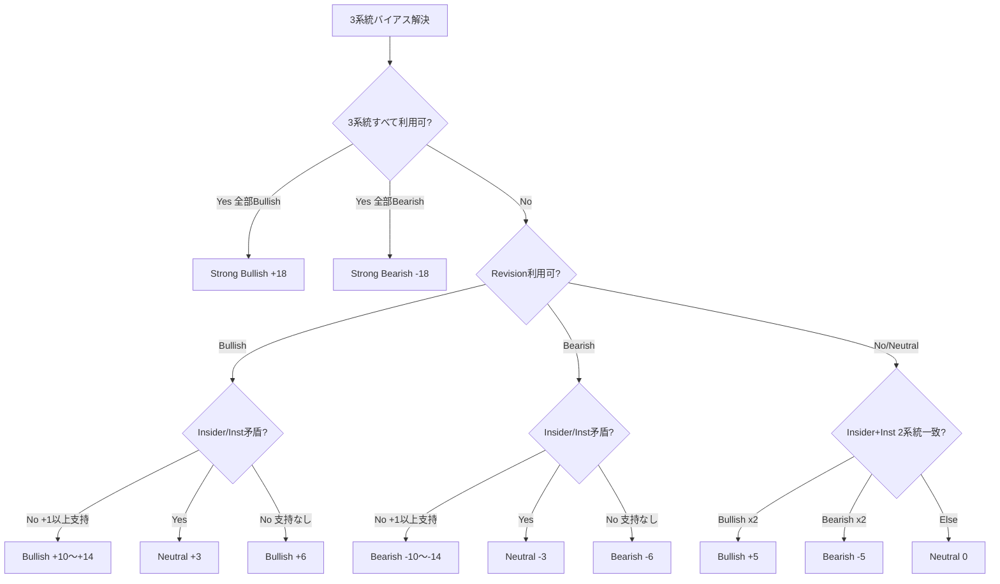

# PHASE23_1_DESIGN_REPORT

## 概要

Phase23.1 **Earnings Revision × Insider/Institutional Cross Signal** は、Phase23（Earnings Revision）、Phase15（Insider Trading）、Phase16（Institutional Ownership）の3系統を統合し、材料分析スコアへ反映するクロスシグナル層である。

- 作成日: 2026-06-13
- 前提: Phase24 完了承認済み（Analyst Consensus Intelligence Live API）
- 統合先: Phase11 材料分析オーケストレータ（Phase23 の直後、Phase22.2 Conviction の直前）

---

## 1. 現状監査

### 1.1 Earnings Revision（Phase23）

| 項目 | 内容 |
|------|------|
| オーケストレータ | `bursaPhase23Analysis.ts` |
| サービス | `bursaEarningsRevisionIntelligenceService.ts` |
| 主要フィールド | `revisionDirection`, `revisionScore`, `upgradeCount`, `downgradeCount` |
| 材料スコア | `round(revisionScore × 0.35)`、上限 ±8 |
| ヘルパー | `isUpwardRevision()`, `isDownwardRevision()` |

### 1.2 Insider Trading（Phase15）

| 項目 | 内容 |
|------|------|
| オーケストレータ | `bursaPhase15Analysis.ts` |
| サービス | `bursaInsiderTradingService.ts` |
| 主要フィールド | `netInsiderActivity`（買い優勢 / 売り優勢 / 中立） |
| 材料スコア | 買い優勢 +4〜+12、売り優勢 -3〜-8 |

### 1.3 Institutional Flow（Phase16）

| 項目 | 内容 |
|------|------|
| オーケストレータ | `bursaPhase16Analysis.ts` |
| サービス | `bursaInstitutionalOwnershipService.ts` |
| 主要フィールド | `netInstitutionalFlow`（Strong Buying → Strong Selling） |
| 材料スコア | Strong Buying +15、Buying +8、Selling -8、Strong Selling -15 |

### 1.4 ギャップ

- Phase22.2 Conviction は Revision × Valuation のみ（Insider/Institutional 未統合）
- Revision / Insider / Institutional は個別に材料スコアへ加算済みだが、**方向一致（クロスシグナル）** の明示的ルールが未実装
- `bursaPhase23_1*` 関連コードは Phase23.1 着手前に存在せず

---

## 2. Cross Signal 設計

### 2.1 コンポーネントバイアス

各系統を `-1 / 0 / +1` 相当の離散ラベルに正規化する。

| 系統 | Bullish | Bearish | Neutral | Unavailable |
|------|---------|---------|---------|-------------|
| Revision | Upward / Strong Upward | Downward / Strong Downward | Stable | 未取得 |
| Insider | 買い優勢 | 売り優勢 | 中立 / データ不足 | unavailable |
| Institutional | Buying / Strong Buying | Selling / Strong Selling | Neutral | unavailable |

### 2.2 方向判定ルール

```
Revision↑ + Insider Buy↑ + Institutional Buy↑  → Strong Bullish  (+18)
Revision↓ + Insider Sell↑ + Institutional Sell↑ → Strong Bearish  (-18)

Revision↑ + (Insider Buy OR Inst Buy) かつ矛盾なし → Bullish (+10〜+14)
Revision↓ + (Insider Sell OR Inst Sell) かつ矛盾なし → Bearish (-10〜-14)

Revision↑ + Insider Sell OR Inst Sell（矛盾）     → Neutral (+3 乖離)
Revision↓ + Insider Buy OR Inst Buy（矛盾）       → Neutral (-3 乖離)

Revision のみ Bullish/Bearish                     → ±6
Insider + Institutional のみ（Revision 未取得）   → ±5（2系統一致時）

データ1系統のみ                                   → Unavailable（材料反映なし）
```

### 2.2.1 判定フロー



### 2.3 材料スコア反映

| 項目 | 式 |
|------|-----|
| Cross Signal Score | -20 〜 +20（ルール表に準拠） |
| 材料加算 | `round(crossSignalScore × 0.55)`、上限 ±12 |
| 材料アイテム | `Phase23.1 Earnings Revision Cross Signal` 1件追加 |
| 重複排除 | `phase23_1-earnings-revision-cross-signal` ID でフィルタ |

### 2.4 信頼度

| Confidence | 条件 |
|------------|------|
| High | 3系統利用可 + alignment ≥ 2 + Revision Confidence = High |
| Medium | 2系統以上利用可、または alignment ≥ 2 |
| Low | 2系統利用可だが alignment 弱い |

### 2.5 利用可能判定

- `hasExtractableData = true` の条件: **2系統以上** 利用可 かつ direction ≠ Unavailable
- Phase11 `fetchedFields`: `phase23_1.earnings_revision_cross_signal`

---

## 3. Phase11 統合

### 3.1 パイプライン位置

```
Phase13 Earnings Call
→ Phase14 Analyst Consensus
→ Phase24 Analyst Consensus Intelligence
→ Phase15 Insider
→ Phase16 Institutional (+ Historical / Basket / Trend)
→ Phase17-21 Valuation stack
→ Phase22 / 22.1 Target & Gap
→ Phase23 Earnings Revision
→ **Phase23.1 Cross Signal**  ← NEW
→ Phase22.2 Conviction
```

### 3.2 新規ファイル

| ファイル | 役割 |
|----------|------|
| `src/types/bursaEarningsRevisionCrossSignal.ts` | ドメイン型 |
| `src/constants/bursaEarningsRevisionCrossSignal.ts` | 定数・監査銘柄 |
| `src/services/bursa/bursaEarningsRevisionCrossSignalService.ts` | 判定・材料変換 |
| `src/services/bursa/bursaPhase23_1Analysis.ts` | オーケストレータ |
| `tests/unit/bursaPhase23_1.test.ts` | ユニットテスト |
| `scripts/bursa-phase23_1-verify.ts` | 6銘柄 Live 検証 |

### 3.3 型拡張

`BursaStockMaterialAnalysis.earningsRevisionCrossSignal?: BursaEarningsRevisionCrossSignalAnalysis`

---

## 4. 検証計画（6銘柄）

| Code | Label | 期待 |
|------|-------|------|
| 1155 | Maybank | Cross Signal 算出 + 材料反映 |
| 1023 | CIMB | 乖離ケース（Insider Buy vs Inst Sell） |
| 1295 | Public Bank | 乖離ケース |
| 5347 | Tenaga | Insider + Inst 強気一致 |
| 4707 | Nestle | Insider + Inst 強気一致 |
| 6033 | Petronas Gas | Insider + Inst 強気一致 |

合格基準: 6銘柄中 **4銘柄以上** で `hasExtractableData = true`、エラー 0 件。

---

## 5. リスクと制約

- Revision が Stable の銘柄では Strong Bullish/Bearish は発火しない（Insider+Inst のみで Partial Bullish/Bearish）
- KLSE HTML 未取得時は Insider/Institutional が unavailable → Cross Signal 不可
- 既存 Phase15/16/23 の個別材料加算は維持（Phase23.1 は追加レイヤー）

---

## 6. 次フェーズ候補

- Phase23.2: Institutional Trend を Cross Signal 第4入力へ拡張
- Phase23.3: Cross Signal を Conviction Intelligence へフィードバック
