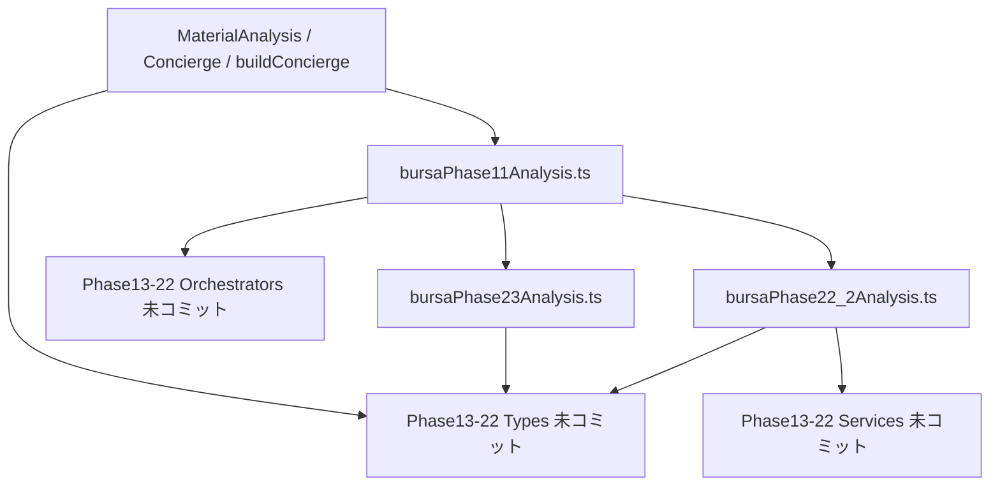

# Phase23 Push Readiness Report

監査日: 2026-06-02  
対象 commit: `44f1a2b5ddc84b6531ad093a9f471476ecf1bb34`  
ブランチ: `cursor/top3-maxdd-capital-audit`

---

## 最終判定

| 項目 | 結果 |
|------|------|
| **判定カテゴリ** | **C — push 禁止** |
| **PASS/FAIL** | **FAIL** |
| **GitHub push 実行** | **未実施**（FAIL のため） |

**理由**: commit `44f1a2b` 単体（`npm ci` 後）で `npm run typecheck` が **89 errors / exit 2**。新規 clone 想定で **ビルド不可**。

---

## 1. 隔離 checkout での typecheck

### 検証方法

```bash
git worktree add ../stock-trading-assistant-phase23-isolated 44f1a2b
cd ../stock-trading-assistant-phase23-isolated
npm ci
npm run typecheck
```

（親リポジトリの working tree とは独立した detached HEAD `44f1a2b` のみ）

### 結果

| 項目 | 値 |
|------|-----|
| **typecheck** | **FAIL** |
| **exit code** | **2** |
| **error 件数** | **89** |

### 代表エラー（先頭）

```
src/services/bursa/bursaPhase11Analysis.ts — Cannot find module './bursaPhase13Analysis'
src/services/bursa/bursaPhase11Analysis.ts — Cannot find module './bursaPhase22_1Analysis'
src/services/bursa/bursaEarningsRevisionIntelligenceService.ts — Cannot find module '../../types/bursaAnalystConsensus'
src/services/bursa/bursaConvictionIntelligenceService.ts — Cannot find module '../../types/bursaValuationGapIntelligence'
src/services/buildConciergeEnhancedAnalysis.ts — Cannot find module '../types/bursaEarningsCall'
...（計89件）
```

**ログ保存先**: `docs/review/evidence/phase23-isolated-typecheck-v2.log`

---

## 2. Phase13〜22 未コミットファイルへの依存

### 結論: **強く依存している**

commit 内 20 ファイルのうち、特に以下が Phase13–22 未コミット資産に依存:

| 依存元（commit 内） | 依存先 |
|---------------------|--------|
| `bursaPhase11Analysis.ts` | Phase13–22 オーケストレータ **15ファイル** |
| `bursaEarningsRevisionIntelligence*.ts` | `bursaAnalystConsensus`, `bursaFinancialReportAnalysis` 型・providers |
| `bursaConvictionIntelligenceService.ts` | `bursaAnalystTargetIntelligence`, `bursaFairValueIntelligence`, `bursaValuationGapIntelligence` 型 |
| `bursaMaterialAnalysisService.ts` | Phase13–22 各 intelligence 型 **多数** |
| `buildConciergeEnhancedAnalysis.ts` | Phase13–22 各 intelligence 型 **多数** |
| `bursaDisclosure.ts` | `bursaEarningsCall` 型 |
| `scripts/bursa-phase23-audit-verify.ts` | Phase13–22 分析サービス |

### Phase11 直接 import 不足（commit に無い）

```
src/services/bursa/bursaPhase13Analysis.ts
src/services/bursa/bursaPhase14Analysis.ts
src/services/bursa/bursaPhase15Analysis.ts
src/services/bursa/bursaPhase16Analysis.ts
src/services/bursa/bursaPhase16HistoricalAnalysis.ts
src/services/bursa/bursaPhase16BasketAnalysis.ts
src/services/bursa/bursaPhase16TrendAnalysis.ts
src/services/bursa/bursaPhase17Analysis.ts
src/services/bursa/bursaPhase18Analysis.ts
src/services/bursa/bursaPhase19Analysis.ts
src/services/bursa/bursaPhase19_5Analysis.ts
src/services/bursa/bursaPhase20Analysis.ts
src/services/bursa/bursaPhase21Analysis.ts
src/services/bursa/bursaPhase22Analysis.ts
src/services/bursa/bursaPhase22_1Analysis.ts
```

### トランジティブ不足ファイル（commit ツリーに無い — 主要分）

**types（未コミット）**

```
src/types/bursaAnalystConsensus.ts
src/types/bursaAnalystTargetIntelligence.ts
src/types/bursaDividendIntelligence.ts
src/types/bursaEarningsCall.ts
src/types/bursaFairValueIntelligence.ts
src/types/bursaFinancialReportAnalysis.ts
src/types/bursaFixedInstitutionalBasket.ts
src/types/bursaHistoricalOwnership.ts
src/types/bursaInsiderTrading.ts
src/types/bursaInstitutionalOwnership.ts
src/types/bursaInstitutionalTrend.ts
src/types/bursaMacroIntelligence.ts
src/types/bursaNewsIntelligence.ts
src/types/bursaSectorRotation.ts
src/types/bursaValuationGapIntelligence.ts
src/types/bursaValuationIntelligence.ts
```

**services / constants（未コミット — 抜粋）**

```
src/services/bursa/bursaAnalystConsensusService.ts
src/services/bursa/bursaAnalystConsensusProviders.ts
src/services/bursa/bursaAnalystTargetIntelligenceService.ts
src/services/bursa/bursaValuationGapIntelligenceService.ts
src/services/bursa/bursaFairValueIntelligenceService.ts
src/services/bursa/bursaFinancialReportAnalysis.ts
src/services/bursa/bursaNewsIntelligenceService.ts
src/services/bursa/bursaValuationIntelligenceService.ts
src/constants/bursaValuationGapIntelligence.ts
src/constants/bursaFairValueIntelligence.ts
src/services/quoteProviders/yahooQuoteSummaryClient.ts
src/services/bursa/bursaAnalysisDiagnostics.ts
...（他 Phase13–22 関連 service/parser/provider 多数）
```

**トランジティブ不足 総数（解析）**: **85 パス**（`dependencyEdgeCount: 364`）

**完全リスト**: `docs/review/evidence/phase23-dependency-analysis-full.json`

---

## 3. 新規 clone 想定のビルド可否

| シナリオ | 判定 |
|----------|------|
| `git clone` → checkout `44f1a2b` → `npm ci` → `npm run typecheck` | **不可**（89 errors） |
| push 後に第三者が clone | **typecheck 失敗** |
| ローカル working tree 全体（未コミット Phase13–22 含む） | **PASS**（前回検証済み） |

**結論**: push 後の新規 clone 状態では **ビルド不可**。

---

## 4. 判定（A / B / C）

| 選択肢 | 意味 | 該当 |
|--------|------|------|
| **A** | そのまま push OK | **否** |
| **B** | 追加ファイルが必要 | **是**（Phase13–22 スタック + 関連 types/services） |
| **C** | push 禁止 | **是**（現状の 20 ファイル commit のまま） |

**最終: C（push 禁止）**  
※ B の追加作業完了後に再判定すれば A へ移行可能。

---

## 5. 依存関係（概要）



---

## 6. 推奨対応

### 即時（push 前）

1. **push しない** — 本レポート FAIL のため `git push` は実行しない。
2. **方針選択**（いずれか）:
   - **(推奨) Phase13→23 順次コミット**: 未コミット Phase13–22 を Phase 番号順に分割 commit し、最後に Phase23 を push。
   - **(代替) Phase23 コミットの縮小**: `bursaPhase11Analysis.ts` を Phase23 接続のみに限定し、Phase13–22 import を含まない版に amend（大規模リファクタ）。

### 再検証手順（B 完了後）

```bash
git worktree add ../verify-isolated HEAD
cd ../verify-isolated && npm ci && npm run typecheck && npm run test:unit
```

PASS 後に `PHASE23_PUSH_READINESS_REPORT.md` を更新 → push 可。

---

## 7. 必須項目チェックリスト

| 必須項目 | 内容 |
|----------|------|
| **不足ファイル一覧** | §2（Phase11 直接15 + types 16 + services 抜粋、完全版 JSON 参照） |
| **依存関係** | §5 — Phase11/配線/UI が Phase13–22 未コミット資産に依存 |
| **push 可否** | **不可（C）** |
| **推奨対応** | §6 — Phase13–22 先行 commit または Phase11 縮小 |
| **PASS/FAIL** | **FAIL** |

---

## 8. push 実行結果

| 項目 | 値 |
|------|-----|
| `git push origin cursor/top3-maxdd-capital-audit` | **未実行**（FAIL のためスキップ） |
| 現在 HEAD | `44f1a2b`（ローカルのみ、remote 未更新） |

---

## 【監査サマリー】

- 隔離 `44f1a2b` + `npm ci` → typecheck **89 errors**
- Phase13–22 未コミットファイルへ **強依存**
- 判定 **C: push 禁止** / **FAIL**
- push は実施していない
