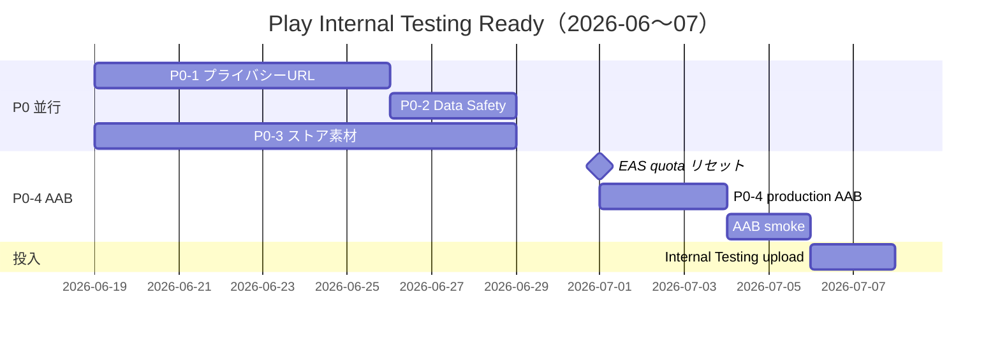

# PLAY_INTERNAL_TESTING_EXECUTION_PLAN

## 概要

Phase19 · Phase23 Revenue 完了を承認したうえで、次サイクルの目標 **Play Internal Testing Ready** に向けた実行計画である。新規分析 Phase の追加は行わない。

| 項目 | 値 |
|------|-----|
| 策定日 | 2026-06-19 |
| ブランチ | `cursor/top3-maxdd-capital-audit` |
| 策定ベースコミット | `b6a8471` |
| レポート提出コミット | `a2f4d2b` |
| アプリ | Rakuten Trade MY 助手 · `com.assistant.stocktrading` |
| 最新 preview APK | versionCode **17** · `artifacts/preview-v17-local.apk` |
| 目標状態 | Play Internal Testing track へ **初回 AAB upload 可能** |

**スコープ外（Play IT 完了まで保留）:** Multi-AI Review Layer 実装 M1–M5 — 設計は `MULTI_AI_REVIEW_DESIGN_REPORT.md`（**M0 クローズ**）

---

## 1. 現在の blockers

### 1.1 投入可否サマリー

| 判定 | 状態 |
|------|------|
| Play Internal Testing Ready | **NO** |
| P0 blocker 数 | **4 件**（本計画の P0-1〜P0-4） |
| 完了済み基盤 | **8/15**（`PLAY_INTERNAL_TESTING_READINESS_REPORT.md`） |

### 1.2 P0 blocker 詳細

| ID | blocker | 状態 | 影響 |
|----|---------|------|------|
| **P0-1** | プライバシーポリシー URL 未公開 | **未** | Play Console 必須項目 · 審査不可 |
| **P0-2** | Play Console Data Safety 未入力 | **未** | ストア公開必須 · ポリシー URL と整合必須 |
| **P0-3** | ストア素材未作成 | **未** | スクリーンショット · Feature Graphic · アイコン最終確認 |
| **P0-4** | production AAB 未生成 | **BLOCKED** | EAS Free quota exhausted · **2026-07-01** リセット |

### 1.3 付随 blocker（P0 直後）

| # | 項目 | 状態 |
|---|------|------|
| P1-1 | コンテンツレーティング questionnaire | 未 |
| P1-2 | サポート連絡先メール | 未 |
| P1-3 | production AAB 実機スモーク（monitor=0） | 未 |
| P1-4 | Internal Testing テスター登録 | 未 |
| P1-5 | ストア正式アプリ名（Rakuten 表記リスク） | 要確認 |

### 1.4 完了済み（再作業不要）

| 項目 | 証跡 |
|------|------|
| Release flavor 分離 · production monitor=0 設定 | `eas.json` · Phase 25 |
| プライバシーポリシー **草案**（日英） | `PRIVACY_POLICY_REPORT.md` §4/§5 |
| Data Safety **整理表** | `PRIVACY_POLICY_REPORT.md` §3 |
| API Key SecureStore 監査 | Commit24 |
| npm production ビルドコマンド | `npm run build:android:production` |
| versionCode 17 準備 | `app.json` |
| EAS remote keystore | `Build Credentials MB3l4Jyy6N` |
| 分析パイプライン完成度 | Phase19 12/12 · Phase23 Revenue 6/6 · 完成率 89% |

---

## 2. 解消手順（P0 優先順）

### P0-1: プライバシーポリシー URL 公開

**目的:** Play Console に登録可能な HTTPS 公開 URL を用意する。

| Step | 作業 | 担当 | 成果物 |
|------|------|------|--------|
| 1.1 | `PRIVACY_POLICY_REPORT.md` §4（日本語）· §5（英語）を単一 HTML または Markdown ページ化 | Dev / Owner | `docs/legal/privacy-policy.html` または GitHub Pages 用 md |
| 1.2 | プレースホルダ置換 | Owner | `[EFFECTIVE_DATE]` → 公開日 · `[CONTACT_EMAIL]` → サポートメール |
| 1.3 | ホスト先を選定・公開 | Owner | 推奨: **GitHub Pages**（repo `settings → Pages`）または Notion 公開リンク |
| 1.4 | URL 動作確認（HTTPS · モバイル表示） | Dev | curl / ブラウザ確認ログ |
| 1.5 | Play Console → App content → Privacy policy に URL 登録 | Owner | Console スクリーンショット |

**推奨 URL 例:**

```
https://k416my-blip.github.io/stock-trading-assistant/privacy-policy.html
```

**GitHub Pages 手順（推奨）:**

1. `docs/legal/privacy-policy.html` を main / release ブランチに配置
2. Repository Settings → Pages → Source: `/docs` または `/docs/legal`
3. デプロイ完了後 URL を `PRIVACY_POLICY_REPORT.md` に追記
4. 英語版は同一ページ内アンカーまたは `/privacy-policy-en.html`

**完了条件:** HTTPS で 200 応答 · 日英いずれかまたは両方が読める · Play Console に URL 入力済み

---

### P0-2: Play Console Data Safety 作成

**目的:** `PRIVACY_POLICY_REPORT.md` §3 の整理表を Console フォームへ正確に転記する。

| Step | 作業 | 参照 |
|------|------|------|
| 2.1 | Play Console → **App content → Data safety** を開く | Google Play Console |
| 2.2 | 「データ収集あり」を選択（Financial info · Personal info 等） | §3.1 |
| 2.3 | 収集しないデータを申告 | §3.2（Email · Location · Device ID 等 = No） |
| 2.4 | 第三者 SDK セクション | §3.3（Expo · SecureStore · FCM 通知） |
| 2.5 | データ削除方法 | §3.4 · アプリ内リセット · アンインストール |
| 2.6 | プライバシーポリシー URL を **P0-1 と同一** に設定 | P0-1 完了後 |
| 2.7 | エクスポート · 自己レビュー | Console 完了チェック |

**Data Safety 入力チェックリスト（§3 転記用）**

| Google Data type | Collected | Shared | Purpose | Notes |
|------------------|-----------|--------|---------|-------|
| Financial info — Other financial info | Yes | No | App functionality | 端末ローカルのポートフォリオ |
| Personal info — Other (API keys) | Yes | With third parties | App functionality | ユーザー任意 · SecureStore |
| App activity — In-app search history | Partial | No | App functionality | ローカルのみ |
| Email / Name / Phone / Location / Photos | **No** | — | — | アカウントなし |
| Device ID / Advertising ID | **No** | — | — | 広告 SDK なし |

**完了条件:** Data Safety フォーム **Submitted** · プライバシー URL と矛盾なし

---

### P0-3: ストア素材作成

**目的:** Play Console Store listing に必要な視覚素材を揃える。

#### 3.1 アイコン確認

| 項目 | 要件 | 現状 |
|------|------|------|
| アプリアイコン | 512×512 PNG（Play upload） | `app.json` → `./assets/icon.png` |
| Adaptive icon | foreground + background | `./assets/adaptive-icon.png` · `#0f1419` |
| 確認事項 | 512 相当の解像度 · 透明背景なし（Play 要件） | **要実ファイル確認 · 必要なら 512 export** |

**手順:**

1. `assets/icon.png` · `assets/adaptive-icon.png` を開き解像度確認
2. 512×512 未満なら Expo adaptive icon から export またはデザイナー再出力
3. Play Console → Main store listing → App icon に upload

#### 3.2 Feature Graphic（1024×500）

| 項目 | 内容 |
|------|------|
| サイズ | **1024 × 500 px** · JPG または PNG |
| 内容案 | ダーク背景（`#0f1419`）· アプリ名 · 「Bursa 分析支援 · AI コンシェルジュ · 非公式ツール」 |
| 禁止 | 成果保証 · 提携誤認 · 注文執行文言（`GOOGLE_PLAY_STORE_LISTING_MATERIALS_REPORT.md` §7） |
| 保存先（提案） | `docs/store-assets/feature-graphic-1024x500.png` |

#### 3.3 スクリーンショット

| 項目 | 要件 |
|------|------|
| 最低枚数 | **2 枚**（Play 必須）· **7 枚以上推奨** |
| 解像度 | phone: 16:9 または 9:16 · min 320px · max 3840px |
| 7" tablet | 推奨 1 セット |
| 取得元 | versionCode **17** 実機 · または `docs/review/final-evidence-device/` 等をベースに再キャプチャ |

**推奨 7 枚（優先順）** — `GOOGLE_PLAY_STORE_LISTING_MATERIALS_REPORT.md` §5

| # | 画面 | ファイル名案 |
|---|------|-------------|
| 1 | 保有銘柄 | `screenshot-01-portfolio.png` |
| 2 | 材料分析（Phase24 表示） | `screenshot-02-material.png` |
| 3 | AIコンシェルジュ + Enhanced Analysis | `screenshot-03-concierge.png` |
| 4 | AI四季報 | `screenshot-04-stock-report.png` |
| 5 | 市場監視 | `screenshot-05-market.png` |
| 6 | 設定（分析支援 · 非執行） | `screenshot-06-settings.png` |
| 7 | 初心者ガイド / リスク告知 | `screenshot-07-guide.png` |

**保存先（提案）:** `docs/store-assets/screenshots/phone/`

**完了条件:** アイコン · Feature Graphic · スクリーンショット ≥2 枚が Play Console に upload 済み

---

### P0-4: production AAB 生成手順確立（2026-07-01 以降）

**目的:** EAS quota 回復後に再現可能な production AAB ビルド · 検証 · 提出フローを確立する。

#### 4.1 前提（確立済み）

| 項目 | 値 |
|------|-----|
| コマンド | `npm run build:android:production` |
| EAS profile | `production` · `buildType: app-bundle` · `distribution: store` |
| monitor | `EXPO_PUBLIC_TWELVE_HOUR_TEST_MONITOR=0` |
| 署名 | EAS remote keystore |
| versionCode | `autoIncrement: true`（EAS が bump · `app.json` と同期確認） |
| ローカル Gradle | **Windows MAX_PATH で不可** — EAS cloud のみ |

#### 4.2 2026-07-01 実行手順

```powershell
# 1. 作業ディレクトリ
cd c:\Users\k416m\Documents\Projects\stock-trading-assistant

# 2. 最新コード pull · app.json versionCode 確認
git pull origin cursor/top3-maxdd-capital-audit
git log -1 --oneline

# 3. EAS ログイン確認
npx eas-cli whoami

# 4. production AAB ビルド（非対話）
npm run build:android:production -- --non-interactive --wait

# 5. artifact ダウンロード
npx eas-cli build:download --platform android --profile production --latest

# 6. 成果物を repo 外または artifacts/ に保存（git 非追跡推奨）
# 例: artifacts/production-v18.aab
```

#### 4.3 ビルド後検証（P1 · AAB 取得直後）

| Step | 作業 | スクリプト / レポート |
|------|------|----------------------|
| V1 | `bundletool` または `adb install` で実機インストール | — |
| V2 | logcat で `[12H-MONITOR]` **0 行** 確認 | `PRODUCTION_AAB_SMOKE_REPORT.md` |
| V3 | API キー永続化 smoke | `verify-production-aab-smoke.mjs` |
| V4 | 株価更新 · 材料分析 · Concierge end-to-end | 手動または device script |
| V5 | versionCode · package 名確認 | `adb shell dumpsys package` |

#### 4.4 Play Internal Testing upload

```powershell
# オプション A: EAS Submit
npx eas-cli submit -p android --profile production --latest

# オプション B: Play Console 手動 upload
# Release → Testing → Internal testing → Create new release → Upload AAB
```

**完了条件:**

- production AAB ファイル存在（`.aab` · EAS 署名）
- `PRODUCTION_AAB_BUILD_REPORT.md` 更新（成功ログ · versionCode · artifact URL）
- `PRODUCTION_AAB_SMOKE_REPORT.md` PASS
- Internal Testing track に upload 済み

---

## 3. 必要ファイル一覧

### 3.1 既存（repo 内）

| ファイル | 用途 |
|----------|------|
| `PRIVACY_POLICY_REPORT.md` | ポリシー草案 · Data Safety §3 |
| `eas.json` | production / preview profiles |
| `app.json` | package · versionCode · icon paths |
| `package.json` | `build:android:production` |
| `GOOGLE_PLAY_STORE_LISTING_MATERIALS_REPORT.md` | スクショ候補 · 文案 · 禁止表現 |
| `PLAY_INTERNAL_TESTING_READINESS_REPORT.md` | 現状 blocker 台帳 |
| `PRODUCTION_AAB_BUILD_REPORT.md` | 前回 EAS FAIL 記録 |
| `assets/icon.png` | アプリアイコン |
| `assets/adaptive-icon.png` | Android adaptive icon |

### 3.2 新規作成（本サイクル）

| ファイル | P0 | 説明 |
|----------|-----|------|
| `docs/legal/privacy-policy.html`（または Pages 用 md） | P0-1 | 公開ポリシー |
| `docs/store-assets/feature-graphic-1024x500.png` | P0-3 | Feature Graphic |
| `docs/store-assets/screenshots/phone/*.png` | P0-3 | スクリーンショット |
| `artifacts/production-v*.aab` | P0-4 | production AAB（git 非追跡推奨） |
| `docs/review/PRODUCTION_AAB_BUILD_REPORT.md`（更新） | P0-4 | ビルド成功記録 |
| `docs/review/PRODUCTION_AAB_SMOKE_REPORT.md`（更新） | P0-4 | 実機 smoke |
| `docs/review/PLAY_INTERNAL_TESTING_READINESS_REPORT.md`（更新） | 全 P0 完了後 | NO → YES |

---

## 4. 必要アカウント · 権限

| アカウント / サービス | 用途 | 状態 |
|----------------------|------|------|
| **Google Play Console** | アプリ作成 · Data Safety · Internal Testing upload | Owner 確認要 |
| **Google 開発者アカウント** | Play Console 前提（$25 一回） | Owner 確認要 |
| **Expo / EAS** (`owner: k416my`) | cloud build · submit · keystore | 設定済 |
| **GitHub** (`k416my-blip/stock-trading-assistant`) | Pages ホスト · ソース管理 | 利用可 |
| **サポートメール** | Play Console 必須 · ポリシー §10 | **未設定** |
| **（任意）ドメイン** | カスタム URL | 未 · GitHub Pages で代替可 |

**EAS プロジェクト ID:** `70000a9b-cffc-4738-b615-3e10edb0b865`

---

## 5. 想定スケジュール

| 期間 | 作業 | 依存 | 担当 |
|------|------|------|------|
| **2026-06-19 〜 06-25** | P0-1 ポリシー HTML 化 · GitHub Pages 公開 | なし | Dev + Owner |
| **2026-06-19 〜 06-25** | P0-2 Data Safety Console 入力 | P0-1 URL | Owner |
| **2026-06-19 〜 06-28** | P0-3 アイコン確認 · Feature Graphic · スクショ 7 枚 | v17 実機 | Dev + Design |
| **2026-06-25 〜 06-30** | P1 コンテンツレーティング · サポートメール · ストア文案確定 | P0-1 | Owner |
| **2026-07-01** | EAS Free Android builds quota **リセット** | — | — |
| **2026-07-01 〜 07-03** | P0-4 production AAB ビルド · ダウンロード | quota 回復 | Dev |
| **2026-07-03 〜 07-05** | production AAB 実機 smoke · レポート更新 | P0-4 AAB | Dev |
| **2026-07-05 〜 07-07** | Internal Testing 初回 upload · テスター招待 | P0 全完了 | Owner |
| **2026-07-07 〜 07-14** | テスターフィードバック · hotfix preview | upload 後 | Dev |



**クリティカルパス:** P0-1 → P0-2 → P0-4（Jul 01）→ smoke → upload  
**並行可能:** P0-3（素材）は P0-1 と並行開始可

---

## 6. 投入可能判定（ゴール）

以下 **全項目完了** で `Play Internal Testing Ready: YES`

- [ ] P0-1 プライバシーポリシー URL 公開 · Console 登録
- [ ] P0-2 Data Safety フォーム Submitted
- [ ] P0-3 アイコン · Feature Graphic · スクリーンショット ≥2
- [ ] P0-4 production AAB 生成 · 署名 · versionCode 記録
- [ ] production AAB 実機 smoke PASS（monitor=0）
- [ ] コンテンツレーティング完了
- [ ] サポートメール登録
- [ ] Internal Testing track へ AAB upload
- [ ] `PLAY_INTERNAL_TESTING_READINESS_REPORT.md` を **YES** に更新

---

## 7. リスク · 注意事項

| リスク | 緩和 |
|--------|------|
| EAS quota 再 exhaust | Jul 01 直後に 1 回のみ production build · 失敗時は有料プラン検討 |
| Rakuten 表記の商標リスク | ストア名変更案を `GOOGLE_PLAY_STORE_LISTING_MATERIALS_REPORT.md` §8.1 参照 · 法務確認 |
| プライバシー URL と Data Safety 不整合 | §3 転記チェックリストをそのまま使用 |
| preview APK（monitor=1）を production と混同 | **Internal Testing は production AAB のみ** |
| Windows ローカル AAB 不可 | EAS cloud 一本化 · WSL2 は fallback のみ |

---

## 8. 参照レポート

| レポート | 内容 |
|----------|------|
| `PLAY_INTERNAL_TESTING_READINESS_REPORT.md` | 現状 NO · 8/15 完了 |
| `PRIVACY_POLICY_REPORT.md` | 草案 · Data Safety §3 |
| `PRODUCTION_AAB_BUILD_REPORT.md` | EAS quota FAIL 記録 |
| `GOOGLE_PLAY_STORE_LISTING_MATERIALS_REPORT.md` | 素材 · 文案 · 禁止表現 |
| `FINAL_PROJECT_AUDIT_REPORT.md` | 完成率 89% · Play NO |
| `CONCIERGE_ENHANCED_ANALYSIS_FINAL_REPORT.md` | v17 Concierge PASS（スクショ候補） |

---

## 9. GitHub 同期結果

| 項目 | 値 |
|------|-----|
| 策定ベースコミット | `b6a8471` |
| レポート提出コミット | `a2f4d2b` |
| ブランチ | `cursor/top3-maxdd-capital-audit` |
| Push | **SUCCESS** |
