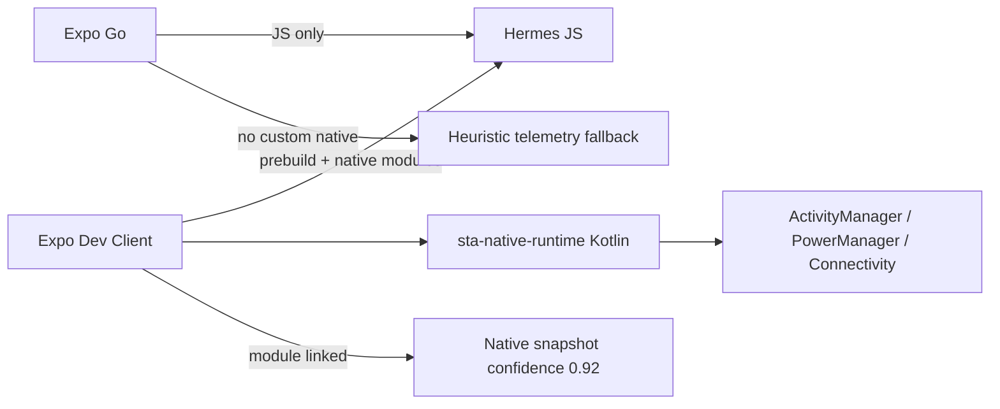

# Project Structure (Review Snapshot)

## Root layout

| Path | Role |
|------|------|
| `App.tsx` | Expo entry, providers (App, PerformanceCost, ProactiveConcierge, AiConcierge) |
| `app.json` | Expo 54 config (Android package, notifications plugin) |
| `package.json` | Scripts: `expo start`, `typecheck`, `test:unit`, verify scripts |
| `modules/sta-native-runtime/` | Local Expo module — Android Kotlin native metrics bridge |
| `src/` | Application source |
| `tests/` | Vitest unit/integration tests |
| `docs/` | Architecture and operational notes |

## `src/` major folders (included in review ZIP subset)

| Folder | Role |
|--------|------|
| `src/runtime/orchestrator/` | Dynamic runtime state machine (STABLE→SURVIVAL), policy, async scheduler hooks |
| `src/native/runtime/` | Native Runtime Bridge (TS): Android module wrapper, MIUI reclaim, kill predictor, ANR layer |
| `src/context/` | React contexts — `ProactiveConciergeContext` wires telemetry → orchestrator → survival |
| `src/screens/` | Navigation screens (Home, Portfolio, Settings, diagnostics) |
| `src/components/` | UI including `concierge/*` dashboard panels |
| `src/services/` | Business/runtime services (telemetry, websocket, AI, market data, survival) |
| `src/types/` | Shared TypeScript contracts |

Not in ZIP (by design): `src/constants/`, `src/hooks/`, `src/navigation/`, `src/utils/`, `src/verify/` — referenced indirectly via services/types.

## Expo Go vs Dev Client vs Android native

- **Expo Go**: Cannot load `StaNativeRuntime`; bridge falls back to heuristics (`source: heuristic`).
- **Dev Client**: Run `expo prebuild` + `expo run:android` to link `modules/sta-native-runtime`.
- **Android native**: `StaNativeRuntimeModule.kt` exposes `getSnapshot`, `onTrimMemory` events.

## GitHub

- Remote: `https://github.com/k416my-blip/stock-trading-assistant.git`
- Branch: `main`
- `realTradingEnabled`: hard-coded `false` in telemetry/dashboard bundles (paper-only observation mode).
