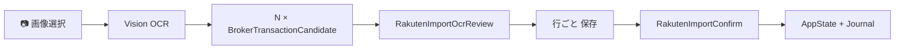

# Rakuten Transaction Import R3 (OCR) — 実装レポート

| 項目 | 内容 |
|------|------|
| フェーズ | **R3 実装（Transaction History スクショ OCR）** |
| ブランチ | `cursor/top3-maxdd-capital-audit` |
| 日付 | 2026-06-20 |
| versionCode | **26** |
| スコープ | OpenAI Vision OCR · 6種別候補 · バッチレビュー · 自動保存禁止 |

---

## 実装内容

### 1. 依存関係

- `expo-image-picker` (~17) · `expo-file-system` (~19) — Expo SDK 54 互換
- `app.json` — `expo-image-picker` プラグイン · `READ_MEDIA_IMAGES` 権限
- `android/app/build.gradle` — `versionCode 26`

### 2. 型拡張

- `BrokerTransactionCandidate.imageLocalUri` · `ImportBatch.imageLocalUri`
- `OcrTransactionRow` / `OcrVisionResponse`（`src/types/rakutenImport.ts`）
- `ExecutionJournalEntry.recordSource`: `rakuten_import_ocr`

### 3. Vision OCR サービス

| ファイル | 役割 |
|----------|------|
| `transactionHistoryVisionOcr.ts` | 画像 base64 → OpenAI Responses API (vision) |
| `ocrVisionJsonParser.ts` | JSON 解析（ユニットテスト安全） |
| `ocrRowToCandidate.ts` | OCR 行 → `BrokerTransactionCandidate` + 信頼度 |
| `bursaSymbolResolver.ts` | Maybank→1155 等 |
| `buildOcrImportBatch.ts` | N 行 → N 候補 · 重複検出 |
| `pickTransactionHistoryImage.ts` | `expo-image-picker` ラッパー |

### 4. コンテキスト / ステージング

- `stageRakutenImportOcrScreenshot(imageUri)` — practice ブロック · 監査 `candidate_created` × N
- 戻り値: `{ ok, batchId, candidateIds }`

### 5. UI 入口

- **設定** — 「履歴スクショを読み取る」（OpenAI キー未設定時は案内のみ）
- **AI コンシェルジュ** — コンポーザ横 📷 ボタン（同一フロー）

### 6. レビュー画面（新規）

- `RakutenImportOcrReviewScreen` — バッチ内候補一覧
- 各行: 種別 · サマリー · 信頼度（高/要確認/保存不可）· 重複警告
- アクション: **保存**（→ `RakutenImportConfirm`）· **修正** · **スキップ**
- **一括自動保存なし** — 「自動保存は行いません」表示

### 7. 確認画面

- OCR ソースラベル: 「スクショ読み取り」（manual/NL 回帰なし）

### 8. 監査

- バッチ作成: 候補ごと `candidate_created` + OCR detailJa
- 確定/却下: 既存 `commitRakutenImportCandidate` / `rejectRakutenImportCandidate`
- ジャーナル: `recordSource: rakuten_import_ocr`

---

## OCR 設計（§4–§6 準拠）



| 制約 | 実装 |
|------|------|
| 自動保存禁止 | レビュー → 確認画面のみ commit |
| API キー必須 | 入口 disabled + Alert（手動/NL 誘導） |
| 6 種別 | deposit / withdrawal / buy / sell / dividend / fee |
| R1/R2/R2.5 非変更 | manual/NL パス未触 · OCR 追加のみ |

---

## ユニットテスト結果

```
npx vitest run tests/unit/rakutenImport

 Test Files  8 passed (8)
      Tests  50 passed (50)
```

新規: `ocrRowToCandidate.test.ts` · `buildOcrImportBatch.test.ts` · `transactionHistoryVisionOcr.test.ts`（JSON 解析）

---

## v26 APK

| 項目 | 値 |
|------|-----|
| パス | `artifacts/preview-v26-rakuten-import-r3.apk` |
| サイズ | 36,415,620 bytes |
| ビルド経路 | `C:\p\sta` 短パス · `gradlew assembleRelease -PreactNativeArchitectures=arm64-v8a` |
| Git 追跡 | `artifacts/` は `.gitignore` 対象（ローカル成果物） |

---

## 実機スクリーンショット

| ファイル | 内容 |
|----------|------|
| `docs/review/rakuten-import-r3-screenshots/01-settings-ocr-entry.png` | 設定 · 履歴スクショ入口 |
| `docs/review/rakuten-import-r3-screenshots/02-concierge-camera-button.png` | コンシェルジュ 📷 ボタン |

取得: `node scripts/capture-rakuten-import-r3-screenshots.mjs`

---

## Git

| 項目 | 値 |
|------|-----|
| コミット | `6f2dcab` |
| push | `origin/cursor/top3-maxdd-capital-audit` |
