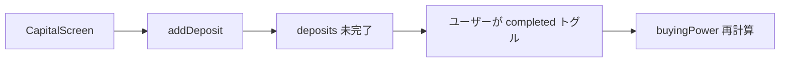
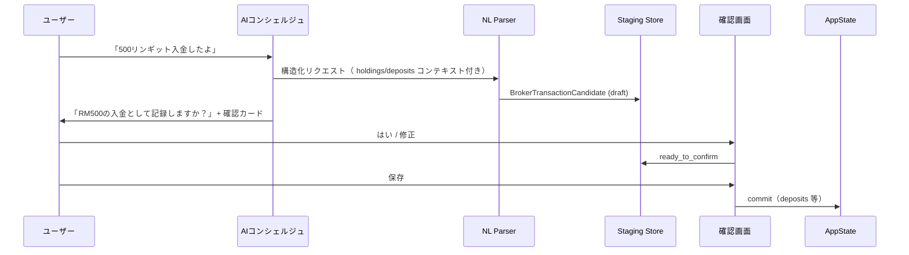

# Rakuten Trade 入金・取引履歴インポート — 設計監査レポート

| 項目 | 内容 |
|------|------|
| フェーズ | **設計監査のみ（実装なし）** |
| ブランチ | `cursor/top3-maxdd-capital-audit` |
| 日付 | 2026-06-20 |
| 方針 | Rakuten Trade **API 不使用** · **自動発注なし** · **成立結果のみ記録** · **自動保存禁止** |

---

## 0. 目的

ユーザーが次の2経路で、Rakuten Trade で**実際に成立した**入出金・取引をアプリに反映できるようにする。

| 経路 | 入力例 | 期待結果 |
|------|--------|----------|
| **自然文** | 「500リンギット入金したよ」 | 入金履歴 · 現金残高 · 買付余力へ反映 |
| **Transaction History スクショ** | Rakuten Trade 履歴画面の画像 | 入金/買付/売却/配当/手数料/出金を候補として提示 |

いずれも **AIコンシェルジュ中心 UX** とし、**保存前に必ず確認画面**を通す。

---

## 1. 現状構造監査

### 1.1 永続化レイヤ

| ストア | キー | 内容 |
|--------|------|------|
| **AppState（単一 blob）** | `@sta/app_state` | portfolio, trades, deposits, dividends, manualOrderList, settings, practice |
| ポートフォリオバックアップ | `@sta/portfolio_backup_v1` | 保有 + practice チェックサム |
| 執行ジャーナル | `@sta/execution_journal_v1` | 不変監査ログ（AppState 外） |
| AI チャット | `@sta/ai_chat_history_v1` | コンシェルジュ会話 |

**依存関係:** ほぼすべての Rakuten 手動記録は `AppState` → `storage.ts` → `useAppPortfolioActions` 経由。ジャーナルは `executionOrderService` が副次書き込み。

### 1.2 ドメインモデル（現状）

#### portfolio / holdings

```132:145:src/types/index.ts
export interface TradeRecord { /* buy | sell */ }
export interface PortfolioPosition {
  id, symbol, market, currency, shares, averageBuyPrice, currentPrice, ...
}
```

- 保有: `AppState.portfolio[]`
- 更新: `applyTradeToPortfolio`（`portfolio.ts`）、`applyManualHoldingToState`（`portfolioHoldings.ts`）、`confirmManualOrderInState`（`manualOrderConfirmation.ts`）

#### cash balance / 買付余力

**手動（live）モードに `cashBalanceMYR` フィールドは存在しない。** 買付余力は派生値:

```12:44:src/services/buyingPower.ts
baseCapital = max(settings.totalCapitalMYR, sum(completedDeposits))
buyingPowerMYR = max(0, baseCapital - investedMYR)
```

- `investedMYR` = 保有の取得コスト合計（時価ではない）
- **入金完了** = `DepositPlan.completed === true` の合計が `baseCapital` に反映
- `totalCapitalMYR` 自体は入金トグルでは自動増加しない

#### transaction history

| モデル | 保存先 | 備考 |
|--------|--------|------|
| `TradeRecord` | `AppState.trades[]` | buy/sell, fee, executedAt; **manual 売却に realizedPnLMYR なし** |
| `DepositPlan` | `AppState.deposits[]` | 計画 + completed フラグ |
| `DividendRecord` | `AppState.dividends[]` | 配当金額のみ; **現金残高非連動** |
| `ManualOrderItem` | `AppState.manualOrderList[]` | アプリ生成チェックリスト → ユーザー確認で約定記録 |
| `ExecutionJournalEntry` | 別ストア | `recordSource`: execution / manual_record / practice / **rakuten_trade_manual** |

#### realized P/L

| モード | 状態 |
|--------|------|
| Practice | `TradeRecord.realizedPnLMYR` あり |
| Manual (live) | **未計算・未保存** |

#### dividends

- `AddDividendScreen` → `addDividend` で `dividends[]` に追加
- ポートフォリオ画面で合計表示; **buyingPower には未反映**

### 1.3 既存 Rakuten 関連コード

| 種別 | パス | 役割 |
|------|------|------|
| 定数 | `src/constants/rakutenTrade.ts` | ブローカー名, FX, 手数料概算 |
| フロー状態 | `src/services/realAccountPortfolio.ts` | matched vs pending orders |
| 手動約定確認 | `src/screens/ManualOrderListScreen.tsx` | チェックリスト → 約定入力 |
| 監査スクリプト | `forwardValidationMalaysiaV4RakutenRegisterAudit.ts` 等 | **本番 import ではない** |

**ギャップ:** CSV/API import · OCR · 自然文構造化 · ブローカー参照番号 · 重複判定 · 確認 UI · コンシェルジュ実行アクション — **すべて未実装**。

### 1.4 現状フロー（入金）



自然文「500リンギット入金」は **CapitalScreen を経由しない** ため、現状では対応不可。

### 1.5 監査結論（ギャップ一覧）

| # | ギャップ | インポート設計への影響 |
|---|----------|------------------------|
| G1 | ステージング層なし | 候補 → 確認 → 保存の中間モデルが必要 |
| G2 | ブローカー参照番号なし | 重複判定キーが弱い |
| G3 | 出金モデルなし | `withdrawal` タイプ新設が必要 |
| G4 | 手数料単独記録なし | fee 行のマッピング先要設計 |
| G5 | manual realized P/L なし | 売却 import 時に計算追加 |
| G6 | 配当が現金に非連動 | 方針決定: 配当も baseCapital に含めるか |
| G7 | OCR/画像ライブラリ未導入 | 新規依存追加（後述） |
| G8 | コンシェルジュは助言のみ | 実行可能アクション型が必要 |

---

## 2. 提案データモデル

### 2.1 設計原則

1. **既存 `TradeRecord` / `DepositPlan` 等は削除・置換しない** — import は既存型へマッピング
2. **候補（Candidate）と確定（Committed）を分離** — 自動保存禁止
3. **すべて ExecutionJournal に `rakuten_import_*` で追記**
4. **画像・生 OCR テキストは端末内のみ**（SecureStore / ファイルシステム、Git 非コミット）

### 2.2 新規型（提案: `src/types/rakutenImport.ts`）

```typescript
/** Rakuten Transaction History で観測される種別 */
export type BrokerTransactionType =
  | 'deposit'
  | 'withdrawal'
  | 'buy'
  | 'sell'
  | 'dividend'
  | 'fee';

export type ImportSource = 'natural_language' | 'ocr_screenshot' | 'manual_form';

export type ImportCandidateStatus =
  | 'draft'           // 構造化直後
  | 'user_editing'    // 修正 UI 中
  | 'ready_to_confirm'
  | 'confirmed'       // 保存済み
  | 'rejected'        // ユーザー却下
  | 'duplicate_blocked';

/** フィールド単位の信頼度（OCR / NL 共通） */
export type FieldConfidenceMap = Partial<
  Record<
    | 'executedAt'
    | 'symbol'
    | 'companyName'
    | 'type'
    | 'quantity'
    | 'price'
    | 'fee'
    | 'total'
    | 'currency'
    | 'referenceNumber',
    number // 0.0 – 1.0
  >
>;

export interface BrokerTransactionCandidate {
  id: string;
  batchId: string;
  source: ImportSource;
  type: BrokerTransactionType;
  status: ImportCandidateStatus;

  executedAt?: string;       // ISO date
  symbol?: string;
  companyName?: string;
  market?: Market;
  currency: Currency;
  quantity?: number;
  price?: number;
  fee?: number;
  totalMYR?: number;
  referenceNumber?: string;

  fieldConfidence: FieldConfidenceMap;
  overallConfidence: number;   // 0.0 – 1.0
  lowConfidenceFields: string[];

  rawInputText?: string;       // NL 原文 or OCR 生テキスト
  imageLocalUri?: string;      // OCR 元画像（端末内）

  duplicateHint?: {
    matchedEntryId: string;
    matchedOn: ('date' | 'symbol' | 'quantity' | 'amount' | 'referenceNumber')[];
    score: number;
  };

  mappedRecordIds?: {
    depositId?: string;
    tradeId?: string;
    dividendId?: string;
    withdrawalId?: string;
  };

  createdAt: string;
  confirmedAt?: string;
  rejectedAt?: string;
  userNote?: string;
}

export interface ImportBatch {
  id: string;
  source: ImportSource;
  conciergeSessionId?: string;
  candidates: BrokerTransactionCandidate[];
  createdAt: string;
  imageLocalUri?: string;
}
```

### 2.3 永続化（提案）

| キー | 内容 |
|------|------|
| `@sta/rakuten_import_batches_v1` | `ImportBatch[]`（未確定のみ; confirmed 後は prune 可） |
| `@sta/rakuten_import_audit_v1` | 確定・却下・取消の監査ログ（不変） |

AppState 本体は **確認保存時のみ** 更新（既存 `deposits` / `trades` / `dividends` / `portfolio`）。

### 2.4 新規: WithdrawalRecord（出金）

```typescript
export interface WithdrawalRecord {
  id: string;
  amountMYR: number;
  withdrawnAt: string;
  note?: string;
  referenceNumber?: string;
  source: ImportSource;
}
```

`AppState.withdrawals?: WithdrawalRecord[]` を追加し、`baseCapital` 計算を拡張:

```
effectiveCapital = max(totalCapitalMYR, completedDeposits) - sum(withdrawals)
buyingPowerMYR = max(0, effectiveCapital - investedMYR)
```

**代替案（より小さい diff）:** 出金を `DepositPlan` の負数/`note: 'withdrawal'` で表現 — **非推奨**（型安全性・UI 混乱）。

### 2.5 既存型へのマッピング

| Candidate.type | 保存先 | 関数（既存ベース） |
|----------------|--------|-------------------|
| deposit | `DepositPlan` (completed: true) | `addDeposit` + 即 completed |
| withdrawal | `WithdrawalRecord` | **新規** `addWithdrawal` |
| buy | `TradeRecord` + `portfolio` | `applyManualHoldingToState` 相当 |
| sell | `TradeRecord` + `portfolio` | `submitTradeWithExecutionSafety` |
| dividend | `DividendRecord` | `addDividend` |
| fee | `TradeRecord.brokerageFee` へ merge または `FeeAdjustmentRecord` | 同一日同一銘柄の trade に紐付け |

**売却時 realized P/L（新規計算）:**

```
realizedPnLMYR = (sellPrice - avgBuyPrice) * shares * fx - brokerageFee
```

manual モードでも `TradeRecord.realizedPnLMYR` を populate（practice と同等ロジックを共通化）。

### 2.6 ExecutionJournal 拡張

```typescript
recordSource?:
  | ... existing
  | 'rakuten_import_nl'
  | 'rakuten_import_ocr';
brokerReferenceNumber?: string;
importBatchId?: string;
importCandidateId?: string;
```

---

## 3. 自然文入力設計

### 3.1 対応例

| ユーザー入力 | 構造化結果 |
|-------------|-----------|
| 500リンギット入金した | type: deposit, total: 500, currency: MYR |
| RM500 deposit | 同上 |
| Maybankを100株買った | type: buy, symbol: 1155, quantity: 100, company: Malayan Banking |
| MaybankをRM9.20で100株買った | buy + price: 9.20 |
| CIMBを売った | type: sell, symbol: 1023（要確認） |
| 配当が入った | type: dividend, symbol/amount 要確認 |

### 3.2 パイプライン



### 3.3 パーサ実装方針

| 項目 | 方針 |
|------|------|
| エンジン | 既存 OpenAI コンシェルジュ API + **JSON schema 強制出力** |
| 新規ファイル | `src/services/rakutenImport/naturalLanguageTransactionParser.ts` |
| コンテキスト | `buildConciergeChatContext` に deposits/trades 直近 N 件を追加 |
| 銘柄解決 | `stockSearchCore` + 保有銘柄エイリアス（Maybank → 1155） |
| 不明項目 | `lowConfidenceFields` に列挙 → 確認 UI で必須入力 |

**自動保存禁止:** パーサは **常に** `status: 'draft'` の Candidate のみ生成。`commitImportCandidate` は確認画面の明示ボタンのみ。

### 3.4 確認カード（コンシェルジュ内）

```
┌─────────────────────────────────────┐
│ 入金の記録                          │
│ RM 500 · 2026-06-20                 │
│ 信頼度: 高 (92%)                    │
│                                     │
│ [修正する]  [記録しない]  [記録する] │
└─────────────────────────────────────┘
```

「記録する」→ フルスクリーン確認画面（§6）へ遷移。

---

## 4. Transaction History OCR 設計

### 4.1 対象画面（Rakuten Trade アプリ）

Transaction History 一覧スクリーンショットから以下を抽出:

| Type | 抽出項目 |
|------|----------|
| Deposit | Date, Total, Currency, Reference |
| Withdrawal | 同上 |
| Buy | Date, Symbol, Company, Qty, Price, Fee, Total |
| Sell | 同上 |
| Dividend | Date, Symbol, Amount |
| Fee | Date, Amount, 関連銘柄（あれば） |

### 4.2 抽出スキーマ

| フィールド | 必須 | 備考 |
|-----------|------|------|
| Date | ○ | DD/MM/YYYY or YYYY-MM-DD |
| Symbol | △ | Bursa 4桁; US ticker |
| Company | △ | OCR 補助 |
| Type | ○ | 6分類 |
| Quantity | △ | buy/sell |
| Price | △ | 単価 |
| Fee | △ | 手数料行 |
| Total | ○ | 金額 |
| Currency | ○ | MYR/USD/HKD |
| Reference Number | △ | 重複判定用 |

### 4.3 OCR エンジン候補

| 方式 | メリット | デメリット | 推奨 |
|------|----------|------------|------|
| **OpenAI Vision（既存 API キー）** | 表構造理解が強い · 追加ネイティブ依存なし | コスト · 画像がクラウド送信 | **Phase 1 推奨** |
| Google ML Kit On-device | オフライン · プライバシー | 表レイアウトの後処理が重い | Phase 2 検討 |
| Tesseract (RN) | OSS | 精度・メンテコスト | 非推奨 |

**方針:** 初版は **OpenAI Vision + 構造化 JSON**（API キー未設定時は OCR 入口を disabled + 手動フォーム誘導）。

### 4.4 画像取得

| 項目 | 方針 |
|------|------|
| ライブラリ | `expo-image-picker`（新規依存） |
| 入口 | AI相談コンポーザ横「📷 履歴を読み取る」+ 設定（Pro）サブメニュー |
| 保存 | 端末キャッシュのみ; 確認後に画像削除オプション |

**現状:** `package.json` に image-picker / OCR 依存 **なし** — 実装フェーズで追加。

---

## 5. OCR ワークフロー

```mermaid
flowchart TD
  A[スクショ選択] --> B[画像前処理<br/>crop/rotate optional]
  B --> C[Vision OCR + 表解析]
  C --> D[BrokerTransactionCandidate[]]
  D --> E[信頼度・低信頼フィールド标注]
  E --> F[重複チェック]
  F --> G{duplicate?}
  G -->|Yes| H[警告バッジ + ユーザー判断]
  G -->|No| I[一覧プレビュー]
  H --> I
  I --> J[行単位修正 UI]
  J --> K[保存確認画面]
  K --> L{ユーザー承認}
  L -->|保存| M[AppState commit + Journal]
  L -->|キャンセル| N[staging rejected]
```

### 5.1 信頼度表示ルール

| overallConfidence | UI |
|-------------------|-----|
| ≥ 0.85 | 緑「信頼度: 高」 |
| 0.60 – 0.84 | 黄「要確認」+ 低信頼フィールドを ⚠ 表示 |
| < 0.60 | 赤「誤読の可能性大」+ 該当フィールド編集必須 |

### 5.2 ユーザー修正 UI

- 一覧: チェックボックスで import 対象行を選択（デフォルト全選択）
- 詳細: 各フィールド TextInput + 種別 Picker
- 「この行をスキップ」→ `status: rejected`

---

## 6. 確認画面 UI 設計

### 6.1 単一候補確認（自然文）

| セクション | 内容 |
|-----------|------|
| ヘッダ | 「記録内容の確認」 |
| サマリ | 種別アイコン + 人間可読要約 |
| 詳細表 | 日付 / 銘柄 / 数量 / 単価 / 手数料 / 合計 |
| 影響プレビュー | 「保存後の買付余力: RM ___ → RM ___」 |
| 警告 | 重複検出 · 低信頼フィールド |
| アクション | **記録する（Primary）** · 修正 · キャンセル |

### 6.2 バッチ確認（OCR）

- テーブル形式で N 行
- 行ごとに信頼度バッジ
- 一括「選択行を記録」— 各行も個別確認可能
- **一括自動保存は禁止** — 最低1回のレビュー画面必須

### 6.3 导航

| 入口 | 遷移 |
|------|------|
| コンシェルジュ確認カード | `RakutenImportConfirmScreen` |
| OCR プレビュー | 同上（batch mode） |
| 設定（Pro） | `RakutenImportHistoryScreen`（過去 batch 監査） |

---

## 7. 重複防止

### 7.1 判定キー

| 優先度 | キー | 一致条件 |
|--------|------|----------|
| 1 | referenceNumber | 完全一致（存在時） |
| 2 | composite | date ±1日 AND type AND symbol AND quantity AND total ±0.01 |
| 3 | fuzzy | Levenshtein on company + amount |

### 7.2 参照データソース

- `AppState.trades[]`
- `AppState.deposits[]`
- `AppState.dividends[]`
- `AppState.withdrawals[]`（新規）
- `ExecutionJournalEntry[]`（brokerReferenceNumber）

### 7.3 動作

| duplicate score | 動作 |
|-----------------|------|
| ≥ 0.95 | `duplicate_blocked` — 保存ボタン disabled、上書きは **明示二次確認** |
| 0.70 – 0.94 | 警告表示、ユーザーが「それでも記録」可能 |
| < 0.70 | 通常フロー |

### 7.4 実装

`src/services/rakutenImport/duplicateDetector.ts` — 純関数 + ユニットテスト必須。

---

## 8. AIコンシェルジュ統合

### 8.1 UX 原則

- **主入口:** AI相談タブ（UX2.0b 完了状態を維持）
- 自然文・画像添付はコンポーザから
- 助言（actionGuide）と **記録アクション（importAction）** を分離

### 8.2 新規型（提案）

```typescript
export type ConciergeImportAction =
  | { kind: 'confirm_deposit'; candidateId: string; amountMYR: number }
  | { kind: 'confirm_trade'; candidateId: string; summaryJa: string }
  | { kind: 'open_ocr_review'; batchId: string }
  | { kind: 'prompt_clarification'; fields: string[]; questionJa: string };

export interface ConciergeChatImportEnvelope {
  replyTextJa: string;
  importActions?: ConciergeImportAction[];
  pendingCandidates?: BrokerTransactionCandidate[];
}
```

### 8.3 会話例

```
ユーザー: 500リンギット入金したよ

AI: RM500の入金（本日）として記録候補を作成しました。
    保存前に内容をご確認ください。

    [確認して記録する]  [金額を修正]  [キャンセル]

ユーザー: はい

→ RakutenImportConfirmScreen → 保存 → 「記録しました。買付余力は RM18 → RM518 です。」
```

### 8.4 変更ファイル（実装時）

| ファイル | 変更 |
|----------|------|
| `AiAssistantChat.tsx` | importAction ボタン描画 |
| `conciergeChatContextBuilder.ts` | 財務コンテキスト拡張 |
| `sendAiStrategyChat` 系 | import envelope パース |
| `ConciergeActionPanel.tsx` | 記録系 CTA（読み取り専用と分離） |

### 8.5 Quick Action 追加（将来）

`BEGINNER_CONCIERGE_QUICK_ACTIONS` に:

- 「入金を記録したい」
- 「取引履歴のスクショを読み取って」

---

## 9. 安全設計

| 要件 | 設計 |
|------|------|
| 自動保存禁止 | Candidate は staging のみ; commit は確認画面の明示操作 |
| OCR 信頼度表示 | §5.1 |
| 不明項目要確認 | `lowConfidenceFields` → 保存ボタン disabled |
| 誤読修正 UI | §5.2 |
| 削除・取消 | `ImportAuditLog` に cancel イベント; AppState は逆操作関数（deposit 削除等） |
| 読み取り専用モード | 既存 `personalKillSwitches.readOnlyMode` で commit ブロック |
| 画像プライバシー | 端末内保存 · 設定で「import 画像を保存しない」トグル |
| 発注禁止 | import パイプラインに broker order API 呼び出し **なし**（コードレビュー gate） |

---

## 10. リスク

| リスク | 影響 | 緩和 |
|--------|------|------|
| OCR 誤読 | 誤った保有/残高 | 信頼度 + 必須確認 + 重複検出 |
| 自然文曖昧性 | 銘柄誤解決 | 確認 UI + 保有/検索コンテキスト |
| buyingPower モデル乖離 | 実 Rakuten 残高と差 | UI に「概算」明示 · 将来 broker 残高手入力 |
| 配当・出金の資本計算 | 二重計上 | マッピング表とテストで固定 |
| Vision API コスト | 運用費 | 1 batch あたり行数上限 · Pro 限定オプション |
| 既存 manual フロー競合 | UX 混乱 | import は concierge 主 · ManualOrderList は従来維持 |

---

## 11. 工数見積（人日 · 1名想定）

| 項目 | 見積 |
|------|------|
| データモデル + staging 永続化 | 2.0 |
| 確認 UI（単一 + バッチ） | 3.0 |
| 自然文パーサ + コンシェルジュ統合 | 3.5 |
| OCR（Vision + image-picker） | 4.0 |
| 重複検出 + 監査ログ | 2.0 |
| buyingPower / realized P/L 拡張 | 2.0 |
| ユニットテスト + 実機 smoke | 2.5 |
| **合計** | **~19 人日（約4週間）** |

---

## 12. 実装フェーズ案

| フェーズ | 内容 | 成果物 | 依存 |
|--------|------|--------|------|
| **R1** | 型定義 · staging · duplicateDetector · confirm UI（手動入力） | 自然文なしでフォームから deposit 記録 | なし |
| **R2** | NL パーサ · コンシェルジュ confirm カード · deposit/buy/sell commit | 「500リンギット入金」E2E | R1 |
| **R3** | OCR batch · Vision · 行修正 UI | スクショ → 候補一覧 | R1 |
| **R4** | withdrawal/fee · realized P/L manual · 監査画面 | 全6種別 | R2,R3 |
| **R5** | 実機証跡 · ドキュメント · Play 前 hardening | import smoke report | R4 |

**スコープ外（本設計）:** Rakuten API · 自動発注 · Play Internal Testing · 新分析 Phase。

---

## 13. 推奨アンカーファイル（実装時）

| 優先 | パス |
|------|------|
| 1 | `src/types/rakutenImport.ts`（新規） |
| 2 | `src/services/rakutenImport/`（parser, ocr, duplicate, commit） |
| 3 | `src/context/app/useAppPortfolioActions.ts` |
| 4 | `src/services/buyingPower.ts` |
| 5 | `src/screens/RakutenImportConfirmScreen.tsx`（新規） |
| 6 | `src/components/concierge/ConciergeImportActionCard.tsx`（新規） |
| 7 | `src/types/execution.ts`（recordSource 拡張） |
| 8 | `tests/unit/rakutenImport/` |

---

## 14. GitHub

| 項目 | 値 |
|------|-----|
| commit | `f9d62e7` |
| push | `origin/cursor/top3-maxdd-capital-audit` — **成功** (`26fb025..f9d62e7`) |

---

## 15. 制約遵守チェック

| 制約 | 本レポート |
|------|-----------|
| 実装しない | ✓ 設計監査のみ |
| Rakuten API 不使用 | ✓ |
| 自動発注なし | ✓ |
| 成立結果のみ | ✓ |
| 自動保存禁止 | ✓ |
| 確認画面必須 | ✓ |
| AIコンシェルジュ中心 | ✓ |
| 新分析 Phase 追加なし | ✓ |
| Play Internal Testing 着手なし | ✓ |
