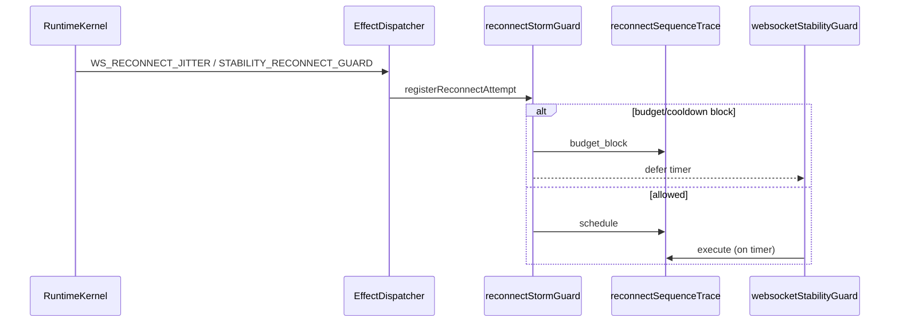

# Reconnect Stability Analysis (Redmi Note 13 Pro / MIUI)

## Sequence (post-finalization)

## Protection stack

| Layer | Parameter |
|-------|-----------|
| Effect queue dedupe | 400ms / dedupeKey |
| Dispatcher debounce | 32ms |
| Reconnect budget | 6 / minute |
| Cooldown on storm | 8s |
| Exponential backoff | 2.5s → 45s max |
| Duplicate socket detector | `RuntimeReconnectTracker` active keys |
| Offline debounce | 5–8s via effect |
| Heartbeat drift | `noteHeartbeatDrift` in trace |

## MIUI battery reclaim → resume reconnect

1. App background → `miuiBatteryDiagnostics.noteAppBackground`
2. MIUI kills timers / suspends WS → silent disconnect counter
3. Foreground resume → high `resumeLatencyMs` → `resume_race` / `miui_battery_kill` anomaly
4. Kernel emits `STABILITY_RECONNECT_GUARD` + `STABILITY_MIUI_DIAGNOSTIC`
5. Executor: lightweight WS + jitter + offline debounce — **not** immediate parallel reconnects

**Risk:** If resume handler also calls legacy reconnect outside effect path, duplicate reconnect still possible — audit call sites of `scheduleWebsocketReconnectWithJitter`.

## Tracing API

- `getReconnectSequenceTrace()` — last 32 events
- `getLastReconnectTrace()` — latest phase

Phases: `defer` | `budget_block` | `schedule` | `execute` | `stable`
