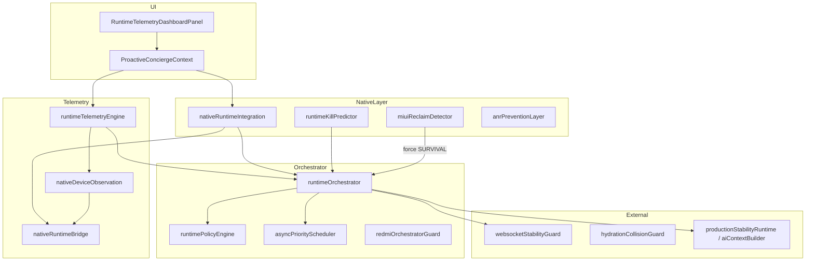

# Runtime Architecture

## Pipeline order (ProactiveConcierge refresh)

1. Cross-layer cascade evaluation
2. **Runtime telemetry** (`runtimeTelemetryEngine`) — JS/render/WS/hydration/long-session metrics
3. **Native runtime cycle** (`nativeRuntimeIntegration`) — merge native snapshot, kill prediction, MIUI escalation
4. **Dynamic orchestrator** (`runtimeOrchestrator`) — STABLE / DEGRADED / CRITICAL / SURVIVAL with hysteresis
5. **Async runtime** evaluation + policy application (FPS cap, WS heartbeat, AI gates)
6. **Runtime survival** bundle (optional, user preference) — governance/strategy *observation* only

Entry: `ProactiveConciergeContext` → `evaluateRuntimeTelemetry` → `evaluateAndApplyRuntimeOrchestrator`.

## Component relationships

## Runtime telemetry

- Observes FPS, event loop latency, async queue depth, WS RTT, hydration/resume, thermal/memory heuristics.
- Classifies: `TELEMETRY_OK` | `TELEMETRY_DEGRADED` | `TELEMETRY_CRITICAL`.
- Drives `adaptiveRuntimeTuning` (dashboard compact, concurrency, sampling).

## Native bridge

- `StaNativeRuntime` (Android): memory pressure, trim memory, thermal, battery saver, network quality, Xiaomi family detection.
- Fallback when module missing: `heuristic` snapshot (`confidence ~0.48`).
- **Telemetry confidence map** weights orchestrator decisions when `source=native`.
- **MIUI aggressive reclaim**: short background + reconnect storm + hydration spikes → instant SURVIVAL candidate.
- **Kill predictor**: LOW / MODERATE / HIGH / IMMINENT — IMMINENT triggers proactive pause, WS safe mode, async clamp, hydration defer.

## Orchestrator

- States: STABLE → DEGRADED (20s min) → CRITICAL / SURVIVAL (45s min).
- Outputs `RuntimeOrchestratorPolicy`: compact dashboard, max FPS, suspend proactive AI, WS batching, queue limits.
- `redmiOrchestratorGuard`: compact-first, staged resume on Redmi/Xiaomi.

## Survival mode

- `runtimeSurvivalEngine` builds mobile resilience bundle after orchestrator finalize.
- Does not enable live trading; integrates with governance/strategy *observation* paths only.

## AI concierge

- `aiContextBuilder` injects `runtimeHealthSummaryJa` into conversation hints.
- Orchestrator gates: `shouldOrchestratorPauseConciergeAi`, throttle proactive via `setOrchestratorProactiveGates`.

## WebSocket stability

- Heartbeat interval from policy; lightweight mode under pressure.
- Reconnect jitter via `mobileRedmiRuntime`; telemetry feeds reconnect storm detection.
