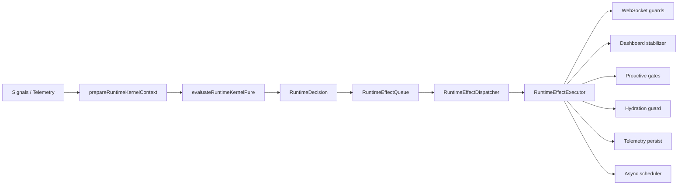

# Runtime Effect Isolation Layer

## Purpose

Separate all runtime side effects from `RuntimeKernel` so evaluation stays pure: state transitions, policy resolution, confidence aggregation, and snapshot assembly only. Mutations run through `RuntimeEffectDispatcher` after `RuntimeDecision` is produced.

## Architecture



## Effect lifecycle

1. **Emit** — `assembleRuntimeDecision()` builds `effects[]` (command pattern, dedupe keys).
2. **Stage** — `stageRuntimeEffects()` enqueues with ~400ms dedupe per `dedupeKey`.
3. **Flush** — `flushRuntimeEffectQueue(dropLow)` sorts by priority; in `SURVIVAL` / `CRITICAL`, `LOW` effects are dropped.
4. **Execute** — `executeRuntimeEffect()` runs one effect; failures are caught and traced, never thrown to kernel.
5. **Trace** — `RuntimeEffectDispatchResult.traces` records `ok` | `failed` per effect.

## Queue ownership

| Component | Owns |
|-----------|------|
| `RuntimeEffectQueue` | Pending buffer, dedupe timestamps, priority sort |
| `RuntimeEffectDispatcher` | Debounce (32ms default), batch orchestration |
| `RuntimeEffectRegistry` | Kind → default priority |
| `RuntimeEffectExecutor` | Imperative adapters to services |

## Async isolation

- Kernel path is synchronous after preparation.
- `TELEMETRY_PERSIST` and native refresh use `void` / fire-and-forget inside executor only.
- `prepareRuntimeKernelContext()` may await native refresh **before** pure eval; not part of `evaluateRuntimeKernelPure`.

## Failure handling

| Failure site | Kernel state | User-visible |
|--------------|--------------|--------------|
| Single effect executor | Unchanged | Prior snapshot/guards remain |
| Dispatch debounce overlap | Queued for next flush | None |
| Dropped LOW in SURVIVAL | Unchanged | Survival policy still applied via higher-priority effects |

Executor wraps each effect in try/catch; trace `status: 'failed'` increments `failed` count only.

## Retry policy

- No automatic retry in v1 — dedupe window prevents storming identical commands.
- Re-evaluation on next orchestrator tick re-emits policy effects with fresh dedupe keys where state changed.

## Debounce policy

- Dispatcher: 32ms between full flush batches; overlapping calls stage then flush pending.
- Queue: 400ms dedupe per `dedupeKey` (same command coalesced).

## Effect kinds (command pattern)

| Kind | Priority | Target |
|------|----------|--------|
| `KERNEL_GUARD_SYNC` | HIGH | In-memory guard mirror |
| `DASHBOARD_POLICY` | NORMAL | FPS cap, compact mode, sampling |
| `WS_HEARTBEAT_MS` / `WS_LIGHTWEIGHT_MODE` / `WS_BATCH_MODE` | NORMAL–HIGH | WebSocket stability guard |
| `PROACTIVE_COOLDOWN` / `PROACTIVE_PAUSE` | NORMAL | Concierge proactive gates |
| `HYDRATION_DEFER` / `HYDRATION_SERIALIZE` | HIGH | Hydration pause window |
| `QUEUE_COMPACTION` | NORMAL | Async scheduler policy |
| `SURVIVAL_MINIMAL_UI` | HIGH | Compact dashboard |
| `TELEMETRY_PERSIST` | LOW | Storage cycle (droppable in SURVIVAL) |
| `IMMINENT_KILL_MITIGATION` | CRITICAL | Multi-guard survival bundle |
| `MEMORY_PRESSURE_OBSERVE` | NORMAL | Memory pressure guardian |
| `LONG_SESSION_PASS` | LOW | Long session survivability |
| `NATIVE_EXTENSION_BUILD` | LOW | Native dashboard extension |

## Old vs new side-effect graph

### Before (kernel path)

```
evaluateRuntimeKernel
  ├─ setDashboard*
  ├─ setWebsocket*
  ├─ setOrchestratorProactiveGates
  ├─ beginHydrationPauseWindow
  ├─ applyAsyncSchedulerPolicy
  ├─ persistTelemetryCycle
  └─ observeMemoryPressure / native build
```

### After

```
prepareRuntimeKernelContext (I/O)
evaluateRuntimeKernelPure → effects[]
dispatchRuntimeEffects → RuntimeEffectExecutor → services
```

## Kernel purity report

| Concern | In pure kernel? |
|---------|-----------------|
| State transition | Yes (`RuntimeReducer`) |
| Policy / guards (data) | Yes (`buildGuardStateFromPolicy`) |
| Snapshot assembly | Yes |
| Effect command emit | Yes (no execution) |
| Dashboard / WS mutation | No |
| Telemetry persist | No |
| Async scheduler apply | No |
| Hydration pause | No |

## Runtime replay flow

1. Capture `RuntimeKernelInput` + prepared metrics at tick T.
2. Call `evaluateRuntimeKernelPure(prepared)` → deterministic `RuntimeDecision` (given frozen inputs).
3. Optionally replay `dispatchRuntimeEffects(decision.effects, { kernelState })` in a test harness with mocked executor.
4. Compare `decision.snapshot` and `decision.transitions` across replays without touching production services.

## Render isolation

- `RuntimeTelemetryDashboardPanel` reads `selectRuntimeKernelSnapshot()` only — no scheduler/reconnect/dashboard mutations from UI.
- Render tracing: kernel snapshot is immutable for the tick; UI re-renders when snapshot reference updates after orchestrator apply.

## Effect failure containment

| Effect class | On failure |
|--------------|------------|
| Dashboard / WS | Last good guard sync may be stale; next tick re-emits |
| Proactive gates | Concierge uses last gates until next dispatch |
| Hydration defer | Window may not open; risk mitigated on next HIGH effect |
| Telemetry persist | Data loss for cycle only; kernel snapshot still valid |
| Imminent kill bundle | Partial apply possible; CRITICAL effects run first in batch |

## Integration entry

- `evaluateAndApplyRuntimeKernel` = prepare → pure → dispatch.
- `evaluateAndApplyRuntimeOrchestrator` (legacy export) aliases the same path via `runtimeOrchestratorIntegration.ts`.

## Files

- `src/runtime/effects/` — queue, dispatcher, registry, executor, types
- `src/runtime/kernel/RuntimeDecision.ts` — effect assembly
- `src/runtime/kernel/RuntimeKernel.ts` — `evaluateRuntimeKernelPure`
- `src/types/runtimeKernel.ts` — `RuntimeDecision` type

## Validation

```bash
npm run typecheck
npx vitest run tests/unit/runtimeKernel.test.ts tests/unit/runtimeEffectDispatcher.test.ts
```
