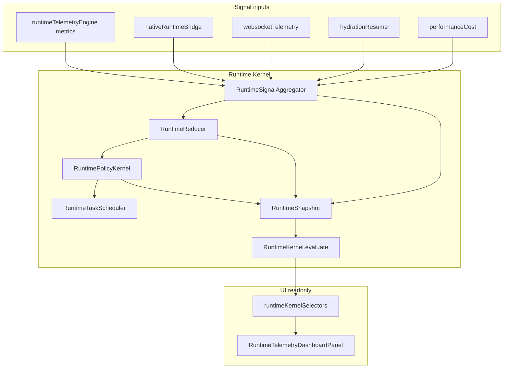

# Runtime Core Consolidation — Deliverables

## 1. Consolidation architecture diagram



## 2. Old vs new dependency graph

### Before (dual path)

```
ProactiveConciergeContext
  → evaluateRuntimeTelemetry → applyAdaptiveRuntimeTuning ❌
  → evaluateAndApplyRuntimeOrchestrator
       → native merge
       → runtimeOrchestrator (own machine)
       → applyAsyncSchedulerPolicy
       → setDashboard / setWebsocket / setProactiveGates
  → evaluateAsyncRuntime → apply knobs again ❌
```

### After (kernel path)

```
ProactiveConciergeContext
  → evaluateRuntimeTelemetry (derive tuning only; apply no-op)
  → evaluateAndApplyRuntimeOrchestrator → evaluateRuntimeKernel
       → signal aggregate → reducer → policy dispatch → task scheduler
  → UI: runtimeKernelSelectors only
```

## 3. Removed / deduplicated logic

| Duplication | Resolution |
|-------------|------------|
| Orchestrator `computeCandidate` + reducer machine | Single `RuntimeReducer` |
| `applyAdaptiveRuntimeTuning` knobs | No-op when `RUNTIME_KERNEL_OWNS_POLICY` |
| Telemetry + orchestrator both set WS/dashboard | Only `RuntimePolicyKernel.dispatchRuntimePolicy` |
| Native inline policy in `refreshNativeRuntimeCycle` | Signals feed reducer; policy from `resolveRuntimePolicy` |
| Guard pause state scattered | `RuntimeGuardKernelState` + hydration reads kernel |
| Dual async policy writers | `RuntimeTaskScheduler.applyRuntimeTaskPolicy` unifies |

## 4. State transition ownership

| State | Owner | Hysteresis |
|-------|-------|------------|
| STABLE | `RuntimeReducer` | downgrade hold per `minHoldMs` |
| LIGHT_PRESSURE | `RuntimeReducer` | upgrade confirm 2.5s |
| DEGRADED | `RuntimeReducer` | 20s min hold |
| CRITICAL | `RuntimeReducer` | 45s min hold |
| SURVIVAL | `RuntimeReducer` | 45s min hold; MIUI force bypass |

Telemetry `TELEMETRY_OK/DEGRADED/CRITICAL` remains observability-only (not runtime control state).

## 5. Runtime event flow

1. Refresh cycle builds telemetry metrics (no policy apply).
2. `evaluateRuntimeKernel` refreshes native snapshot.
3. `aggregateRuntimeSignals` merges native confidence + heuristic.
4. `reduceRuntimeState` selects kernel state.
5. `dispatchRuntimePolicy` applies guards + dashboard + WS + proactive + async policy once.
6. `RuntimeSnapshot` published; UI reads selectors.
7. Long-session / memory guardian observe as side effects (non-policy).

## 6. Render impact estimation

| Area | Impact |
|------|--------|
| Proactive refresh | Neutral — one kernel tick replaces orchestrator apply (same work, less duplicate setter churn) |
| Dashboard panel | +1 selector read per render (`selectRuntimeKernelSnapshot`) — negligible |
| Async tasks | Unchanged API (`runCoordinatedTask` via scheduler re-export) |
| Re-renders | Slightly fewer conflicting knob toggles → fewer FPS spikes from policy fights |
| Bundle size | +~12 KB TS (kernel modules) |

## 7. Module index

| File | Role |
|------|------|
| `src/runtime/kernel/RuntimeKernel.ts` | Entry `evaluateRuntimeKernel` |
| `src/runtime/kernel/RuntimeSnapshot.ts` | Unified snapshot assembly |
| `src/runtime/kernel/RuntimeReducer.ts` | State machine |
| `src/runtime/kernel/RuntimePolicyKernel.ts` | Policy dispatch |
| `src/runtime/kernel/RuntimeSignalAggregator.ts` | Native/heuristic merge |
| `src/runtime/kernel/RuntimeTaskScheduler.ts` | Async unify |
| `src/runtime/kernel/runtimeKernelSelectors.ts` | UI readonly API |
| `src/runtime/kernel/runtimeKernelIntegration.ts` | Facade for ProactiveConcierge |

## 8. Non-changed constraints

- `realTradingEnabled=false` preserved on kernel snapshot
- No API schema / broker / portfolio / notification contract changes
