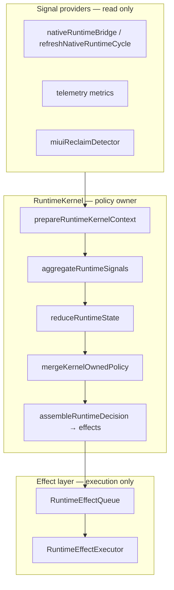

# Runtime Policy Ownership Unification

## Single source of truth

| Layer | Role |
|-------|------|
| **RuntimeKernel** | `mergeKernelOwnedPolicy` + `RuntimeDecision.effects[]` |
| **Native bridge** | `fetchNativeRuntimeSnapshot`, `mergeNativeIntoTelemetryMetrics` only |
| **Effect executor** | WS/dashboard/proactive/hydration/async adapters |
| **Dashboard UI** | `selectRuntimeKernelSnapshot()` readonly |

## Policy merge inputs

1. `resolveRuntimePolicy(state)` — base table
2. `MemoryClassPolicyHints` — low-RAM / small memory class
3. `RuntimeUnifiedSignals` — MIUI reclaim, WS storm, jitter, kill risk

## WebSocket commands (kernel → effects)

| Effect | When |
|--------|------|
| `WS_HEARTBEAT_MS` | Every tick |
| `WS_LIGHTWEIGHT_MODE` | Policy / guards |
| `WS_HEARTBEAT_BACKOFF` | High jitter or elevated multiplier |
| `WS_RECONNECT_JITTER` | Reconnect storm or suppress-on-storm policy |
| `WS_RECONNECT_DEFER` | Safe mode, non-STABLE |
| `WS_OFFLINE_DEBOUNCE` | Background / safe mode |
| `WS_BATCH_MODE` | Batching or safe mode |

## Legacy removal

- `applyImminentKillMitigations` — no-op; use `IMMINENT_KILL_MITIGATION` effect
- `applyMemoryClassAwareness` — no-op; use `mergeKernelOwnedPolicy`
- `refreshNativeRuntimeCycle` — native fetch only
- `applyAdaptiveRuntimeTuning` — no-op when `RUNTIME_KERNEL_OWNS_POLICY`
- `evaluateAsyncRuntime` dashboard/WS knobs — gated by same flag
- `memoryPressureGuardian` telemetry persist — gated by same flag

## Replay / debug

1. Freeze `PreparedRuntimeKernelContext` + signals.
2. `evaluateRuntimeKernelPure` → deterministic `RuntimeDecision` (policy + effects).
3. Replay effects with mocked executor to verify WS/proactive ordering without device I/O.

## Render impact

- Dashboard does not apply policy; compact/FPS follow kernel snapshot after effect dispatch.
- Duplicate `setDashboardCompactMode` from native/async paths removed when kernel owns policy.
