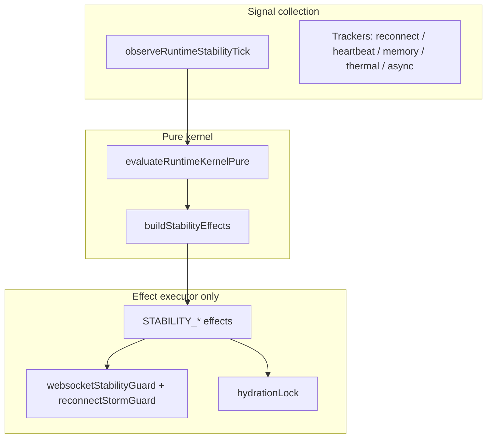
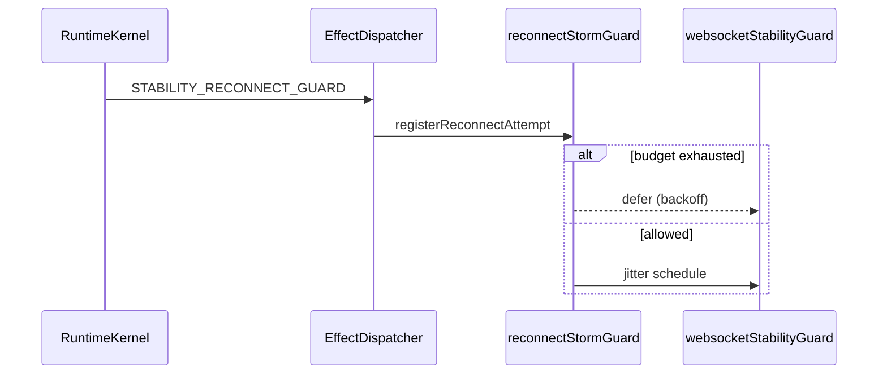

# Runtime Stability Validation Layer

## Purpose

Observe, validate, and auto-mitigate long-session failures on Redmi Note 13 Pro without breaking RuntimeKernel purity or Effect Isolation.

## Architecture



## Runtime event flow

1. `prepareRuntimeKernelContext` — native signal refresh (no policy mutation)
2. `observeRuntimeStabilityTick` — update trackers, build snapshot
3. `evaluateRuntimeKernelPure` — reducer + `mergeKernelOwnedPolicy` + `buildStabilityEffects`
4. `dispatchRuntimeEffects` — executor applies reconnect clamp / hydration lock / warnings

## Reconnect sequence



Protection stack:

| Layer | Mechanism |
|-------|-----------|
| Queue dedupe | 400ms per dedupeKey |
| Dispatcher debounce | 32ms batch |
| reconnectStormGuard | budget 6/min, cooldown 8s, exponential backoff |
| Duplicate detector | active socket key set |

## Async queue diagram

```mermaid
flowchart LR
  Q[Task queue depth] --> O[RuntimeAsyncQueueTracker]
  L[Executor lag ms] --> O
  O --> H[RECONNECT_STORM threshold?}
  H -->|yes| A[STABILITY_ASYNC_STARVATION_WARN effect]
  A --> E[RuntimeEffectExecutor → lifecycle trim_memory event]
```

## Redmi Note 13 Pro risk analysis

| Scenario | Detection | Mitigation |
|----------|-----------|------------|
| MIUI aggressive reclaim | miuiReclaimDetector + signals | kernel SURVIVAL + WS lightweight |
| Background kill | resume latency + heartbeat gap | STABILITY_MIUI_DIAGNOSTIC |
| Reconnect storm | reconnect/min ≥ 4 | budget + backoff + offline debounce |
| Hydration cascade | overlap count ≥ 2 | HydrationLock + HYDRATION_DEFER |
| Async starvation | queue ≥ 42 or lag ≥ 280ms | warning effect + QUEUE_COMPACTION |
| Thermal throttle | severe/critical thermal | policy merge + compact dashboard |
| Silent WS disconnect | miui diagnostics counter | reconnect guard effect |

## Mitigation matrix

| Anomaly | Severity | Kernel effect | Executor action |
|---------|----------|---------------|-----------------|
| reconnect_storm | critical | STABILITY_RECONNECT_GUARD | lightweight WS, jitter, debounce |
| ws_duplicate | medium-high | STABILITY_RECONNECT_GUARD | same |
| hydration_collision | high | STABILITY_HYDRATION_ENFORCE | lock + pause window |
| async_starvation | high | STABILITY_ASYNC_STARVATION_WARN | lifecycle warning |
| miui_battery_kill | critical | STABILITY_MIUI_DIAGNOSTIC | offline debounce |
| heartbeat_gap | medium | STABILITY_MIUI_DIAGNOSTIC | debounce |
| memory_pressure | medium | MEMORY_PRESSURE_OBSERVE (existing) | guardian cleanup |

## Files

- `src/runtime/stability/` — trackers, guards, integration, selectors
- `src/types/runtimeStability.ts` — snapshot types
- `src/constants/runtimeStability.ts` — thresholds
- `src/components/concierge/RuntimeStabilityDashboardPanel.tsx` — readonly UI

## Validation

```bash
npm run typecheck
npx vitest run tests/unit/runtimeStability/
```

## Constraints preserved

- RuntimeKernel: pure evaluation + effect emit
- Dashboard: selector readonly only
- `realTradingEnabled=false`
